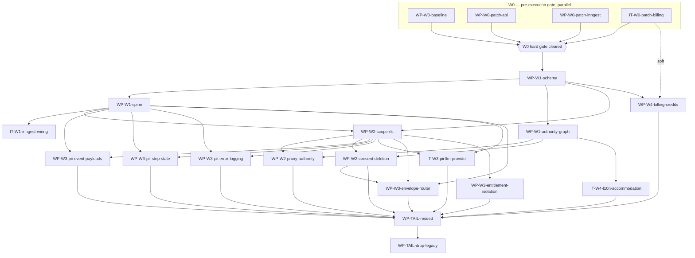

# Phase O — Identity-Foundation Master Plan

> **What this is.** The capstone of the identity-foundation runway (pre-execution phases
> A–P). O turns the ratified **`N.1` — five-wave sequencing skeleton (waves W0–W4 + clean-cut
> tail, critical path W1→W2→W3)** into named, PR-sized **work packages (WPs)**, formally disposes
> the out-of-scope audit findings, and defines the handoff contract to Cosmo. It is the last
> artifact before **Phase P** slices these WPs into Cosmo work items.
>
> **O adds no new audit analysis.** The what / order / scope was decided in K–N; O is
> *consolidation + decomposition* into an executable plan. Every WP, disposition, and dependency
> below traces to a ratified upstream artifact.

## 0. How to read this — the six exit-gate components

The ROADMAP Phase-O exit gate names six components. They map to sections here:

| # | Exit-gate component | Section |
|---|---|---|
| 1 | scope (in-scope work packages) | **§1** + Appendix A (coverage) |
| 2 | out-of-scope workstreams (named, with rationale) | **§2** |
| 3 | sequenced work packages | **§3** |
| 4 | dependency map | **§4** |
| 5 | bundle grouping | **§5** |
| 6 | Cosmo-enablement interface (posture; first dogfood) | **§6** |

Four planning decisions taken in this phase are recorded in **§7**.

---

## 1. Scope — in-scope work packages (17 WPs + 4 solo Items)

The 49 in-scope ("clear-in", bucket-2) obligations + the clean-cut build-items + the two tail
operations, decomposed into **17 work packages + 4 solo Items** (21 planning units). Each multi-
finding **WP** fits the ZDX `Altitude = WP` shape (Bundle Rationale / Strategy / Scope / Findings /
Acceptance Criteria / Risk & Blast Radius / Notes) and is **PR-sized**. Four units bundle a single
finding each; per the ZDX rule "no articulable bundle ⇒ solo Item, not WP", they are marked
**`Altitude = Item`** and carry an `IT-W{n}-<slug>` id (`IT-W0-patch-billing`, `IT-W1-inngest-wiring`,
`IT-W3-pii-llm-provider`, `IT-W4-l10n-accommodation`) — they stay in the wave tables for sequencing
legibility but instantiate as Cosmo **Items**, not empty WP containers. Naming idiom `WP-W{n}-<slug>` / `IT-W{n}-<slug>` —
deliberately distinct from the A-vs-B memo's already-consumed `WP-1…WP-10` namespace. Phase P
instantiates each as a Cosmo entry (WP template: `nexus:zdx/standard/templates/work-package.md` —
the ZDX standard lives in the **Nexus parent repo**, not in this checkout; only `zdx-config.yaml`
is local here).

### Summary

| WP | Wave | Bundles | Size | Blast | Upstream dep |
|---|---|---|---|---|---|
| WP-W0-baseline | W0 | baseline reset (MMT-ADR-0012) | S | risky | — |
| WP-W0-patch-api | W0 | F-117, F-118, F-122, F-130, F-133, F-144, F-145 | M | risky | — |
| WP-W0-patch-inngest | W0 | F-019, F-020, F-092 | S | risky | — |
| IT-W0-patch-billing | W0 | F-121 | XS | standard | — |
| WP-W1-schema | W1 | 8-table schema + F-032 | M | risky | WP-W0-baseline (+ W0 gate) |
| WP-W1-spine | W1 | F-003 + engine/router/judge scaffold | M | risky | WP-W1-schema |
| WP-W1-authority-graph | W1 | F-004, F-029 (structural) | M | standard | WP-W1-schema |
| IT-W1-inngest-wiring | W1 | F-005 | S | standard | WP-W1-spine |
| WP-W2-scope-rls | W2 | F-097, F-078, F-152, F-125, F-153, F-021 | M | risky | WP-W1-schema, WP-W1-spine |
| WP-W2-proxy-authority | W2 | F-126, F-023 *(subsumes F-117, F-144)* | S | standard | WP-W1-authority-graph, WP-W2-scope-rls |
| WP-W2-consent-deletion | W2 | F-093, F-029 (semantic) *(subsumes F-118, F-122, F-130, F-145)* | M | risky | WP-W1-authority-graph, WP-W2-scope-rls |
| WP-W3-pii-event-payloads | W3 | F-073, F-083, F-084, F-095 (4) | M | risky | WP-W1-spine, WP-W2-scope-rls |
| WP-W3-pii-step-state | W3 | F-075, F-085, F-086, F-087, F-088, F-089 (6) | M | risky | WP-W1-spine, WP-W2-scope-rls |
| WP-W3-pii-error-logging | W3 | F-018, F-074, F-140 (3) | S | standard | WP-W1-spine, WP-W2-scope-rls |
| IT-W3-pii-llm-provider | W3 | F-076 (1) | XS | standard | WP-W1-spine, WP-W2-scope-rls |
| WP-W3-envelope-router | W3 | F-025, F-131, F-136, F-137, F-141 *(subsumes F-133, F-019, F-020, F-092)* | M | risky | WP-W1-spine, WP-W2-scope-rls, WP-W2-consent-deletion |
| WP-W3-entitlement-isolation | W3 | F-134, F-135 | S | standard | WP-W2-scope-rls |
| WP-W4-billing-credits | W4 | F-124, F-096 | S | standard | WP-W1-schema; soft-after IT-W0-patch-billing |
| IT-W4-l10n-accommodation | W4 | F-163 | XS | tiny | WP-W1-authority-graph |
| WP-TAIL-reseed | tail | re-seed live data | M | risky | all W2 ∧ W3 ∧ W4 |
| WP-TAIL-drop-legacy | tail | delete legacy tables/readers | S | risky | WP-TAIL-reseed |

### WP detail blocks

#### W0 — pre-execution / stop-the-bleeding *(parallel; independent of the rewrite; a HARD GATE before W1)*

**WP-W0-baseline — migration baseline reset**
- **Bundle rationale:** one coherent migration-chain surgery under one ADR (`MMT-ADR-0012` —
  pre-launch one-time collapse of the migration chain to a fresh baseline); all steps mutate the
  same artifact (the effective chain) and land atomically.
- **Strategy:** remove migration `0106` (`identity_t1_org_membership` — the sole shipped artifact
  of the abandoned T1→T6 staged-identity plan: empty `organizations`/`memberships`, zero
  readers/writers) **from the effective chain — not undone with a follow-up revert migration**
  (ADR-0012 explicitly rejects the prior "forward-only revert"). Then reset dev + staging DBs and
  land the **single** clean baseline migration that creates the 8 target tables from empty
  (`docs/canon/identity/data-model.md` §1; later `data-model.md §N` cites are to that same file).
- **Scope:** in — migration chain + dev/staging DB reset. out — any reader/writer code (that is W1+).
- **Findings:** build-item (no F-ID).
- **Acceptance criteria:** `0106` absent from the effective chain; dev + staging reset; the 8
  tables exist from a single baseline migration; `drizzle-kit migrate` clean on staging.
- **Risk & blast radius:** S / **risky** — resets shared dev + staging DBs; irreversible chain edit.
  Pre-launch (zero production data) is what makes the one-time reset safe.
- **Notes:** this is the clean-cut's first implementation step. Migration-rollback note required per
  repo schema-safety rules (rollback = re-run baseline; no data loss, pre-launch).

**WP-W0-patch-api — patch-now gate, api security defects**
- **Bundle rationale:** the bundling driver is **sequencing + file-scope**, not a shared fix pattern:
  all seven are gated by the **W0 hard gate** (must land before W1) and sit on the one
  `security-pii-api` file surface. The Strategy is deliberately per-defect (the seven fixes differ);
  the ZDX-permitted bundle reason here is the gate + shared scope, not a common change.
- **Strategy:** each defect resolved **before W1 begins** by EITHER (a) a standalone patch with a
  break-test, OR (b) an architect-ratified *"not exposed in the current deploy"* proof. **Never
  deferred.** The rewrite rebuilds 6 of the 7 by construction (see subsumption note), but that does
  **not** authorize deferral of live exposure.
- **Scope:** in — F-117 (proxy write authority, P1), F-118 (consent-authority IDOR, P1), F-122
  (deletion atomicity, P0), F-130 (age-gate birthYear-only, P2), F-133 (policy-blocked Gemini
  fail-over, P2), F-144 (proxy mutates child progress, P1), F-145 (age-gate fail-open, P1). out —
  any non-blocking `security-pii-api` remainder (that is the out-of-scope `security-pii-api`
  workstream, §2).
- **Findings:** 7 (table above).
- **Acceptance criteria:** for each — live exposure closed (patch + passing break-test, per repo
  "security fixes require a break test" rule) OR a ratified not-exposed proof recorded; no silent
  recovery without escalation.
- **Risk & blast radius:** M / **risky** — P0/P1 IDOR + deletion-atomicity + age-gate + fail-open
  paths on the live auth surface.
- **Notes:** F-122 is **P0**. These are throwaway-or-kept depending on the rewrite-successor column
  in N.1 — but disposition is patch-vs-ratified-proof, never defer.

**WP-W0-patch-inngest — patch-now gate, inngest security defects**
- **Bundle rationale:** same HARD-GATE obligation on the `security-pii-inngest` surface; distinct
  file-scope from api warrants its own PR.
- **Strategy:** as WP-W0-patch-api (patch-or-ratified-proof, never defer); rebuilt by construction
  in W3.
- **Scope:** in — F-019 (freeform-filing skips GDPR check, P2), F-020 (cross-account minor-name
  leak, P1), F-092 (child report to wrong parent, P2). out — non-blocking inngest remainder (§2).
- **Findings:** 3.
- **Acceptance criteria:** each — live exposure closed (patch + break-test) OR ratified not-exposed
  proof; minor-PII / cross-account leak provably closed.
- **Risk & blast radius:** S / **risky** — PII exposure + cross-account leak.
- **Notes:** —

**IT-W0-patch-billing — trial-expiry standalone patch** *(Altitude = Item)*
- **Why solo (Altitude = Item):** one finding (F-121), a P0 billing defect **explicitly not
  superseded by the rewrite** — ships as an isolated standalone patch. A solo Item by the ZDX rule;
  kept in the wave table for gate legibility but instantiated as a Cosmo Item, not a WP container.
- **Strategy:** standalone fix + break-test; no by-construction successor.
- **Scope:** in — F-121 (trial-expiry downgrades a paid sub, P0). out — broader billing correctness
  (that is WP-W4-billing-credits).
- **Findings:** 1.
- **Acceptance criteria:** a trial expiring on a paid subscription no longer downgrades it;
  red-green break-test; silent-recovery escalation metric emitted if any fallback path fires.
- **Risk & blast radius:** XS / **standard** — paid-sub downgrade path; orthogonal store-delegation surface.
- **Notes:** the only W0 patch with no rewrite successor — it survives into and is re-confirmed by W4.

#### W1 — structural foundation *(critical-path ROOT)*

**WP-W1-schema — 8-table identity/tenancy/consent schema**
- **Bundle rationale:** the schema and the per-table `profileId` scoping rule are the same
  data-model artifact (`data-model.md` §5.1) and ship in lockstep — scoping is meaningless without
  the tables.
- **Strategy:** build the 8 target tables direct (person, organization, membership, subscription,
  guardianship, supportership, consent_grant, person_retain set) — no dual-model, no backfill — and
  enforce `profileId` on every scoped single-table read (F-032: `createScopedRepository`; parent-
  chain pattern where joins are needed, per repo rules).
- **Scope:** in — the 8 tables + scoped-repo wiring. out — readers that consume them (later WPs).
- **Findings:** F-032 + build-item (schema).
- **Acceptance criteria:** 8 tables present per `data-model.md` §1; every scoped single-table read
  goes through `createScopedRepository(profileId)`; no unscoped raw `db.select()` on a scoped table.
- **Risk & blast radius:** M / **risky** — the foundational data model everything binds to.
- **Notes:** depends on the **W0 hard gate** — all four W0 units (WP-W0-baseline + the three
  patch-now units IT-W0-patch-billing / WP-W0-patch-api / WP-W0-patch-inngest) must clear before W1;
  WP-W0-baseline specifically provides the clean baseline chain this WP builds on.

**WP-W1-spine — session-exchange carve + engine scaffolding**
- **Bundle rationale:** F-003 *is* the carve that produces the router/spine/judge slices; the
  scaffolding fills those exact slices — one architectural cut under one ADR triple
  (`MMT-ADR-0013/0014/0016`).
- **Strategy:** carve `session-exchange.ts` into router / spine / judge slices; scaffold the policy
  engine + router + safety/judge so W2/W3 obligations can be satisfied by construction on it.
- **Scope:** in — F-003 + engine/router/judge scaffold. out — the per-domain enforcement that rides
  on the spine (W2/W3).
- **Findings:** F-003 + build-item (engine scaffold).
- **Acceptance criteria:** `session-exchange.ts` decomposed into the three slices; engine/router/
  judge spine exists and is unit-exercised; structured envelope (`llmResponseEnvelopeSchema`) parse
  path present.
- **Risk & blast radius:** M / **risky** — the request-handling spine; root of by-construction
  satisfaction for W2/W3.
- **Notes:** depends on WP-W1-schema.

**WP-W1-authority-graph — break the 4-node SCC + consent cycle**
- **Bundle rationale:** F-029 explicitly folds into F-004; both are the same dependency-graph
  refactor establishing inv-22 three-layer authority. The cycle cannot be broken without breaking
  the SCC — single coherent change.
- **Strategy:** decompose the {settings, family-access, consent, notifications} strongly-connected
  component into the three-layer authority model; sever the consent⇄notifications cycle (structural
  half; the *semantic* consent-gate lands in WP-W2-consent-deletion).
- **Scope:** in — F-004 + F-029 (structural). out — consent-gate runtime semantics (W2).
- **Findings:** F-004, F-029 (structural part).
- **Acceptance criteria:** the 4-node SCC is broken (no cyclic import/authority edge); module-
  boundary lint clean; behavior preserved (no functional regression in settings/family/consent/
  notifications).
- **Risk & blast radius:** M / **standard** — module-boundary refactor, behavior-preserving.
- **Notes:** F-029 is **split** — structural here, semantic in WP-W2-consent-deletion. The only
  intentional split in the cut.

**IT-W1-inngest-wiring — registration wired-and-triggered** *(Altitude = Item)*
- **Why solo (Altitude = Item):** one finding (F-005), a distinct event-registration subsystem
  (`MMT-ADR-0009`) with its own file-scope; no other W1 item shares its pattern, so it is a solo
  Item — kept in the wave table for sequencing legibility, instantiated as a Cosmo Item.
- **Strategy:** convert silent registration-sync to wired-and-triggered — every Inngest function
  registered is provably dispatched in production code (end-to-end feature-tracing rule).
- **Scope:** in — F-005. out — the authority enforcement inside the functions (W3).
- **Findings:** F-005.
- **Acceptance criteria:** no registered-but-untriggered Inngest function; a production dispatch
  site exists for each; durable async work routes through Inngest (no fire-and-forget).
- **Risk & blast radius:** S / **standard** — event-registration plumbing.
- **Notes:** depends on WP-W1-spine (triggers route through the spine).

#### W2 — identity / consent / proxy / age *(critical path; `security-pii-api` L)*

**WP-W2-scope-rls — ownership, RLS, JWT-transport**
- **Bundle rationale:** all enforce the same row-level scope/ownership boundary — IDOR checks +
  two-layer RLS + owner-gates + the JWT claims that transport age/consent into that boundary.
  Shared enforcement pattern and file-scope.
- **Strategy:** apply person-scope ownership (`data-model.md` §5.1) + the IF two-layer RLS contract
  (`MMT-ADR-0011` T3) across the surfaced routes; carry age/consent in JWT claims (`MMT-ADR-0001`).
- **Scope:** in — F-097 (IDOR ownership), F-078 (RLS two-layer), F-152 (latent cross-profile IDOR),
  F-125 (deletion-status owner gate), F-153 (consent-restore divergence), F-021 (JWT-claims
  age/consent transport). out — proxy and consent-authority specifics (sibling W2 WPs).
- **Findings:** 6.
- **Acceptance criteria:** every surfaced read/write enforces person-scope; negative-path break-test
  per CRITICAL/HIGH finding (attempt the exact IDOR); RLS two-layer contract holds.
- **Risk & blast radius:** M / **risky** — cross-profile data isolation.
- **Notes:** depends on WP-W1-schema + WP-W1-spine.

**WP-W2-proxy-authority — proxy authority guards**
- **Bundle rationale:** the same proxy-write-authority guard applied across the remaining unguarded
  routes (library-filing, unmetered route), on the W1 authority model.
- **Strategy:** central guardian-act-for authority check (`MMT-ADR-0008`, inv 7/8) at each proxy
  mutation site.
- **Scope:** in — F-126 (library-filing proxy guard), F-023 (unmetered-route proxy-guard skip).
  out — the W0-patched proxy defects (subsumed, below).
- **Findings:** 2 new. **Subsumes by construction:** F-117, F-144 (patched in WP-W0-patch-api).
- **Acceptance criteria:** every proxy mutation passes the central authority check; **regression AC —
  the WP-W0-patch-api break-tests for F-117/F-144 still pass against the rebuilt model**; do not
  re-implement the W0 patches.
- **Risk & blast radius:** S / **standard** — proxy mutation paths.
- **Notes:** depends on WP-W1-authority-graph + WP-W2-scope-rls.

**WP-W2-consent-deletion — consent authority + account-isolated deletion + age-gate**
- **Bundle rationale:** consent-authority, account-isolated deletion, and the central age-gate are
  the same consent/deletion state-machine surface on the new three-layer model.
- **Strategy:** enforce consent authority (`MMT-ADR-0015`) and account isolation on consent delete
  (`MMT-ADR-0001`); land the consent-gate **semantics** (F-029's semantic half); rebuild the central
  age-gate (C-1) so it is fail-closed and not birthYear-only.
- **Scope:** in — F-093 (account-isolation on consent delete), F-029 (semantic consent-gate). out —
  structural SCC break (W1).
- **Findings:** 1 new (F-093). **F-029 continuation:** F-029's new-work home is WP-W1-authority-graph
  (structural); its *semantic* half lands here as a continuation, **not** a second new finding —
  so it is not double-counted (see §7 continuation rule). **Subsumes by construction:** F-118
  (consent-authority IDOR), F-122 (deletion atomicity), F-130 (age-gate birthYear-only), F-145
  (age-gate fail-open) — all patched in W0.
- **Acceptance criteria:** consent delete is account-isolated; deletion is atomic (inv 21);
  age-gate is central + fail-closed (inv 29/30); **regression ACs — the WP-W0-patch-api break-tests
  for F-118/F-122/F-130/F-145 still pass against the rebuilt model.**
- **Risk & blast radius:** M / **risky** — deletion atomicity + account isolation + age gating.
- **Notes:** depends on WP-W1-authority-graph + WP-W2-scope-rls. The age-gate group (F-130/F-145)
  is folded here as verification ACs rather than a separate empty WP (see §7, decision 1).

#### W3 — PII-handling + envelope/router *(critical path; `security-pii-inngest` M + api)*

> **Minor-PII egress** — the 14 PII findings were one oversized bundle in the draft; an `L-gap-delta`
> surface analysis splits them cleanly into PR-sized units by egress surface (4 event-payload · 6
> memoized-step-state · 3 error/observability-logging · 1 LLM-provider). All four share the same redaction discipline
> (pass an opaque handle/ID across the trust boundary; rehydrate PII server-side) — extracted once as
> a shared scrubber and asserted by a bundle-level "scrubber exported from a canonical home" AC — but
> they touch distinct code sites, so they are distinct units. All four depend on WP-W1-spine +
> WP-W2-scope-rls.

**WP-W3-pii-event-payloads — minor-PII out of dispatched Inngest event payloads**
- **Bundle rationale:** same fix at the event-construction site — never place raw minor-PII into a
  dispatched Inngest event payload (Inngest persists it in its event store); pass an ID and rehydrate.
- **Strategy:** replace raw transcript/freeform text in event payloads with a reference; the consuming
  function rehydrates from the scoped repo.
- **Scope:** in — F-073, F-083, F-084, F-095 (4). out — memoized step-state + the schema-drift
  *logging* path (F-018 lives in `WP-W3-pii-error-logging`, not here).
- **Findings:** 4.
- **Acceptance criteria:** no raw minor-PII in any dispatched event payload; break-test asserting a
  known minor identifier never lands in the event store.
- **Risk & blast radius:** M / **risky** — third-party (Inngest event-store) persistence of minor-PII.
- **Notes:** depends on WP-W1-spine + WP-W2-scope-rls.

**WP-W3-pii-step-state — minor-PII out of memoized step return values**
- **Bundle rationale:** same fix at the step-return site across sibling Inngest functions — memoize an
  ID/handle, not the minor's name/topics/birth-year (a memoized step return is persisted by Inngest).
- **Strategy:** change each offending step's return to carry a reference; rehydrate downstream.
- **Scope:** in — F-075, F-085, F-086, F-087, F-088, F-089 (6). out — event payloads (sibling WP).
- **Findings:** 6.
- **Acceptance criteria:** no minor-PII in any memoized step return; break-test per function.
- **Risk & blast radius:** M / **risky** — memoized step-state persistence across 6 functions.
- **Notes:** depends on WP-W1-spine + WP-W2-scope-rls. **P-batching hint:** P may slice the 6 into
  2 batches if a single PR is too large; the pattern is identical, so the split is mechanical.

**WP-W3-pii-error-logging — minor-PII out of logs + Sentry (the error/observability path)**
- **Bundle rationale:** same fix at the error/observability boundary — never emit raw minor-derived
  text via `logger.*`, `captureException` extras, or Sentry breadcrumbs. Covers both the Sentry-extra
  leaks and the schema-drift error path that logs/captures the raw event payload.
- **Strategy:** strip/replace `extra.rawSlice` / `rawResponseTrunc`, the fallback-catch subject
  forwarding, **and the schema-drift `logger.error(…, { rawData: event.data })` /
  `captureException(…, { extra: { rawData: event.data } })`** with redacted equivalents.
- **Scope:** in — F-018 (schema-drift path logs/captures raw event payload), F-074 (truncated LLM
  output to Sentry extras), F-140 (raw learner subject to Sentry in a fallback catch) (3). out —
  payloads/step-state/LLM-provider.
- **Findings:** 3.
- **Acceptance criteria:** no minor-PII in any `logger.*` call, `captureException` extras, or Sentry
  breadcrumb — **explicitly no `rawData: event.data` in logs or captureException extras on the
  schema-drift path** (F-018); break-test on each error path.
- **Risk & blast radius:** S / **standard** — logging + error-tracker exposure.
- **Notes:** depends on WP-W1-spine + WP-W2-scope-rls.

**IT-W3-pii-llm-provider — child name out of LLM-provider prompts** *(Altitude = Item)*
- **Why solo (Altitude = Item):** one finding (F-076) on a distinct egress surface (the third-party
  LLM-provider prompt) with its own fix site (exchange prompt construction); a solo Item per the ZDX
  rule.
- **Strategy:** send a placeholder/handle for the child's first name to providers; never the real name.
- **Scope:** in — F-076. out — everything else.
- **Findings:** 1.
- **Acceptance criteria:** no real minor name reaches any third-party LLM provider; break-test on the
  exchange path.
- **Risk & blast radius:** XS / **standard** — third-party sharing of a minor identifier.
- **Notes:** depends on WP-W1-spine + WP-W2-scope-rls; instantiates as a Cosmo Item.

**WP-W3-envelope-router — envelope/router integrity**
- **Bundle rationale:** all are envelope/router trust-boundary defects on the W1 spine (range
  hard-fail, stream/persist divergence, raw-envelope leak, allowlist fail-open, prompt-injection via
  learner text).
- **Strategy:** enforce the structured response envelope (`llmResponseEnvelopeSchema`, parse via
  `parseEnvelope()`) fail-closed; escape learner text before it reaches the system prompt; every
  envelope signal carries a server-side hard cap (`MMT-ADR-0016/0014`).
- **Scope:** in — F-025 (hard-fail on out-of-range field), F-131 (streamed vs persisted divergence),
  F-136 (raw-envelope leak on empty reply), F-137 (allowlist fail-open), F-141 (unescaped learner
  text into system prompt). out — the W0-patched router defect (subsumed) and inngest-authority
  (subsumed).
- **Findings:** 5 new. **Subsumes by construction:** F-133 (policy-blocked fail-over, W0); and the
  inngest-authority group F-019/F-020/F-092 (W0) is satisfied by construction on the W1 engine + W2
  model — folded here as verification ACs.
- **Acceptance criteria:** out-of-range envelope field hard-fails; no raw envelope or fail-open
  allowlist path; learner text escaped; **regression ACs — the WP-W0-patch-api break-test for F-133
  and the WP-W0-patch-inngest break-tests for F-019/F-020/F-092 still pass against the rebuilt
  model.**
- **Risk & blast radius:** M / **risky** — the LLM trust boundary (prompt-injection + fail-open).
- **Notes:** depends on WP-W1-spine **+ WP-W2-scope-rls + WP-W2-consent-deletion** — the subsumed
  inngest-authority regression ACs verify against the *rebuilt* W2 tenancy/consent model, so this WP
  cannot close before W2 lands (it may still begin its W1-spine envelope work earlier). The
  inngest-authority group is folded here as verification ACs rather than a separate empty WP (see §7,
  decision 1).

**WP-W3-entitlement-isolation — entitlement/credit isolation**
- **Bundle rationale:** the same cross-account entitlement-leak pattern (RevenueCat entitlement +
  owner credit balance both leaking across the account/child boundary) on the new tenancy model.
- **Strategy:** scope entitlement + credit reads to the owning person/org per the new tenancy model
  (`MMT-ADR-0001/0002/0015`).
- **Scope:** in — F-134 (RevenueCat cross-account leak), F-135 (owner credit leaked to child). out —
  billing-math correctness (W4).
- **Findings:** 2.
- **Acceptance criteria:** entitlement + credit balance never cross the account/child boundary;
  break-test attempting a child read of an owner's credit/entitlement.
- **Risk & blast radius:** S / **standard** — credit/entitlement boundary.
- **Notes:** depends on WP-W2-scope-rls.

#### W4 — billing + remaining *(parallel track; largely orthogonal — `MMT-ADR-0002` store-delegation)*

**WP-W4-billing-credits — credit/quota correctness**
- **Bundle rationale:** the same billing-correctness surface (top-up credits stranded on tier change
  + idempotency/quota coverage) under the store-delegation boundary.
- **Strategy:** preserve top-up credits across tier change (no silent loss → escalation metric if a
  recovery path fires); add the missing billing/quota/idempotency tests (payer-model coherence).
- **Scope:** in — F-124 (top-up credits stranded on tier change), F-096 (untested billing/quota/
  idempotency). out — trial-expiry (landed in IT-W0-patch-billing).
- **Findings:** 2 new. F-121 referenced as already-landed (IT-W0-patch-billing) — **not re-counted**.
- **Acceptance criteria:** top-up credits survive a tier change; billing/quota/idempotency paths
  covered by tests; any silent-recovery path emits a queryable escalation metric.
- **Risk & blast radius:** S / **standard** — billing math, orthogonal track.
- **Notes:** depends on WP-W1-schema (reads the new subscription/credit model); soft-after
  IT-W0-patch-billing; otherwise parallel to W2/W3. (N.1 sequences W4 behind W1 — "W1 is the root".)

**IT-W4-l10n-accommodation — accommodation visibility fix** *(Altitude = Item)*
- **Why solo (Altitude = Item):** one finding (F-163), a distinct l10n file-scope with no shared
  pattern; a solo Item per the ZDX rule — kept in the wave table for completeness, instantiated as
  a Cosmo Item.
- **Strategy:** view-self fallback so a child does not see a parent's accommodation
  (`MMT-ADR-0008`).
- **Scope:** in — F-163. out — everything else.
- **Findings:** 1.
- **Acceptance criteria:** a child profile never renders a parent's accommodation copy.
- **Risk & blast radius:** XS / **tiny**.
- **Notes:** depends on WP-W1-authority-graph (the view-self fallback rides the `MMT-ADR-0008`
  guardian-authority model established there; N.1 sequences W4 behind W1). The single in-scope
  finding from the `l10n-a11y-mobile` workstream (the other 34 rows are out-of-scope, §2).

#### Clean-cut tail *(after W2 ∧ W3 ∧ W4 obligations land)*

**WP-TAIL-reseed — re-seed live data into the new model**
- **Bundle rationale:** a single data-migration operation; must complete before legacy teardown.
- **Strategy:** seed the 8 target tables from the legacy source under the new model; verify
  row-level integrity before any drop.
- **Scope:** in — re-seed. out — the drop (next WP).
- **Findings:** tail-op (no F-ID).
- **Acceptance criteria:** all live entities present in the new model; integrity check passes;
  reversible until WP-TAIL-drop-legacy runs.
- **Risk & blast radius:** M / **risky** — live-data migration.
- **Notes:** depends on all of W2 ∧ W3 ∧ W4.

**WP-TAIL-drop-legacy — delete legacy identity tables/readers**
- **Bundle rationale:** the irreversible teardown of the legacy model; closes the clean-cut.
- **Strategy:** drop legacy tables + remove legacy readers only after a verified re-seed; migration
  carries a `## Rollback` section per repo schema-safety rules (rollback = impossible post-drop;
  state so explicitly).
- **Scope:** in — drop legacy tables + delete legacy readers/types/keys (clean-up-all-artifacts
  rule). out — nothing.
- **Findings:** tail-op (no F-ID).
- **Acceptance criteria:** no legacy identity table/reader/type remains; full project grep clean of
  legacy identity artifacts; tests green post-drop.
- **Risk & blast radius:** S / **risky** — irreversible drop.
- **Notes:** depends on WP-TAIL-reseed.

---

## 2. Out-of-scope workstreams (named, with rationale)

The 134 out-of-scope findings are **either** owned by named workstreams (bucket-3 "clear-out", 125)
**or** deferred pending workstream assignment (bucket-4 "defer", 9 — no mature owner yet) — in
neither case owned by this master plan. **Pointers, not copies** — the home-of-record is
`_wip/umbrella-program/stream-2-backlog.md` § N.0 partition (owned by the umbrella program PRG-20);
this section reproduces its accounting for completeness and must not diverge from it.

| Owning workstream (L `Defer-to`) | Count | Why not in this plan |
|---|---|---|
| `l10n-a11y-mobile` | 34 (33 findings + `INV-1`) | UI/i18n/a11y mechanism — out of the rewrite radius, parallel-safe |
| `security-pii-api` | 27 | the non-IF api remainder — its own workstream; blast-radius-dispositioned |
| `architecture` (incl. F-012 doc-rot) | 25 | F-012 DEFER (canon/doc, pull-forward ruled empty); the 24 code-structural items are own-workstream |
| `agent-instructions` | 10 | canon/doc — pull-forward test applied → DEFER (owned by PRG-03 / Harness Hygiene) |
| `errors-api` | 8 | code — own workstream |
| `security-pii-inngest` | 6 | the non-IF inngest remainder — own workstream |
| singletons (12): `secrets-hygiene` (F-035 ⚑), `test-infrastructure`, `reliability-and-correctness`, `platform-infra`, `mobile-testing-infra`, `mobile-cache-data-fetching`, `learning-engine`, `infrastructure/database-performance`, `content/curriculum`, `ci-cd-hardening`, `billing-subscriptions`, `backend-performance` | 12 | code/infra — each its own workstream |
| `agent-infrastructure` (F-036) | 1 | canon/doc (harness/config) — DEFER |
| `navigation/audience-matrix` (F-176) | 1 | code bug + doc-relocation — DEFER |
| `platform-security / ci-cd-hardening` (F-116) | 1 | skill/doc — DEFER |
| **bucket-4 deferred** (F-008, F-013, F-033, F-043, F-044, F-100, F-101, F-102, F-115) | 9 | no mature workstream yet — DEFER |
| **Total** | **134** | pull-forward subset = **0** (N.0 ruled empty) |

**Bucket-1 (already-handled): 0** — demonstrated empty by the evidence-gated doc-fix scan
(`M-triage-closure.md`).

**Live-exposure flag — F-035 (⚑) — RESOLVED post-ratification (2026-06-09).** `secrets-hygiene`
owned a plaintext Logfire secret-key pair in `.claude/settings.local.json` (gitignored). It was
**not** an identity pull-forward and **not** one of the 11 execution-blocking rows, but was
flagged here as a live secret leak so it would not be lost in a defer bucket. **Remediated the
same day this plan was ratified:** file cleaned + Logfire key rotated on the provider side
(operator-confirmed) — closure record in `L-gap-delta.md` F-035 row. Treat all "rotate now"
language for F-035 in this doc (incl. the blast-radius table below) as satisfied.

### Blast-radius ordering (the Phase-O mandate over the out-of-scope set)

N.1 names the out-of-scope streams but explicitly leaves the *ordering* to O, governed by the
**blast-radius axis**: work **inside** the clean-cut's rewrite/delete radius must **serialize behind
(or coordinate with) identity-foundation execution** — it touches files the rewrite is rewriting, so
running it concurrently courts merge/semantic conflict; work **outside** the radius is
**parallel-safe**; and some in-radius findings are **moot-by-refactor** — the rewrite addresses them
by construction, so they should not be separately fixed. Per-finding radius membership for the
*partial* streams is settled at execution against the rewrite's actual file-touch set; at
master-plan altitude the stream-level disposition is:

| Out-of-scope stream | Blast-radius disposition | Ordering |
|---|---|---|
| `l10n-a11y-mobile` (34) | out-of-radius (UI/i18n/a11y layer) | **parallel-safe** — anytime |
| `agent-instructions` (10) | out-of-radius (canon/doc) | **parallel**, coordinated under Harness-Hygiene / PRG-03 (sequenced pre-P) |
| singletons minus secrets-hygiene (11) | out-of-radius (test-infra, ci-cd, platform-infra, perf, content, learning-engine, mobile-*) | **parallel-safe** — anytime |
| `secrets-hygiene` (F-035) | independent | **now** — rotate the live secret; not gated on the runway |
| `agent-infrastructure` (F-036) · `navigation/audience-matrix` (F-176) · `platform-security` (F-116) | out-of-radius (doc/config/skill + a non-identity nav bug) | **parallel-safe** |
| `architecture` (24 code-structural + F-012 doc) | **partly in-radius** — the code-structural findings that touch the session-exchange / authority-graph modules the rewrite rewrites may be subsumed once W1 lands; *which* of the 24 (if any) is determined at execution against the file-touch set. **Note: F-003 (session-exchange) and F-004 (the SCC) are themselves in-scope bucket-2 obligations (W1 WPs), NOT part of these 24** — don't conflate. F-012 is doc | **serialize / coordinate** the in-radius subset behind W1; a finding the rewrite *fully* subsumes becomes moot **then** (determined at execution, not pre-declared "drop"); F-012 doc **parallel** |
| `security-pii-api` (27 non-IF remainder) | **partly in-radius** (overlaps the api auth/PII surface W2/W3 rewrites) | **serialize / coordinate** the in-radius subset behind W2–W3; parallel for the rest |
| `security-pii-inngest` (6 non-IF remainder) | **partly in-radius** (inngest functions the rewrite touches) | **serialize / coordinate** behind W1-inngest-wiring + W3 |
| `errors-api` (8) | **partly in-radius** (error/envelope handling overlaps W3) | **serialize / coordinate** behind W3-envelope-router |
| bucket-4 deferred (9) | no mature workstream | **no ordering** — revisit when a workstream forms |

**Net:** the bulk is parallel-safe and need not wait on the runway; the streams that must
**serialize/coordinate** behind execution are those with code in the rewrite radius — the
`security-pii-api` / `security-pii-inngest` remainders, `errors-api`, and the in-radius subset of the
24 code-structural `architecture` findings (a finding the rewrite *fully* subsumes becomes moot once
W1 lands — determined at execution, not pre-declared); `secrets-hygiene` is independent and urgent.
This is the ordering Phase P inherits (it does not re-derive it).

---

## 3. Sequenced work packages + critical path

Inherited from N.1, expressed at WP granularity:

- **W0 leads and parallels** — its four units run independently of the rewrite, but the **hard gate**
  (all 11 patch-now defects resolved by patch-or-ratified-proof, + the baseline reset landed) must
  clear **before W1 begins**.
- **W0 is decoupled from the Cosmo gate (`WI-530` / Phase P).** The 11 patch-now defects (+ the F-035
  secret rotation) are live P0–P2 exposure: they ship **immediately, through the current dev harness**,
  and are **NOT gated on `WI-530` or Phase-P Cosmo slicing** — deferring live security fixes to a
  tooling-readiness milestone is forbidden by the repo's security-fix rules ("never defer"; close live
  exposure by patch or ratified not-exposed proof). Only the **rewrite proper** — baseline reset →
  W1 → … → tail — is the Cosmo dogfood that flows through Phase P once `WI-530` = done (§6). The
  baseline reset is W0-labeled but is the rewrite's first execution step, so it travels with the gated
  rewrite, not with the ungated patches.
- **Critical path:** `WP-W1-schema → WP-W1-spine → WP-W2-scope-rls → WP-W2-consent-deletion →
  WP-W3-envelope-router → WP-TAIL-reseed → WP-TAIL-drop-legacy`, i.e. **W1 → W2 → W3 → (re-seed →
  delete-legacy)** at the wave level (consistent with N.1).
  - W1 is the root: nothing in W2–W4 satisfies-by-construction until the schema + spine exist.
  - W2 is the heaviest single wave (`security-pii-api` sized **L**).
  - W3's envelope/router slice (`WP-W3-envelope-router`) is the deepest WP: it depends on the W1
    spine **and the W2 model (scope + consent)**, because its subsumed inngest-authority regression
    ACs (F-019/020/092) verify against the *rebuilt* consent/scope model — so it cannot close until
    W2 lands, which is why it carries the critical path into W3. The PII slice depends on W1 spine +
    W2 scope.
- **W4 parallels W2/W3** (orthogonal store-delegation surface).
- **The clean-cut tail gates on all obligation waves** (W2 ∧ W3 ∧ W4) completing.

---

## 4. Dependency map

**Properties (verification targets):** acyclic; the unique longest path is
`B → GATE → S1 → SP → SR → CD → ER → RS → DL` (9 nodes) — envelope-router (ER) is the deepest
pre-tail WP because it gates on the W2 consent model (CD), against which its subsumed
inngest-authority regression ACs verify. (The PII-egress WPs / PX / EI routes are one hop shorter
than ER — they gate on the W2 *scope* model, not the W2 *consent* model.) Every edge traces to a
unit's upstream-dep column in §1; no cycle exists.

---

## 5. Bundle grouping

WPs are already bundles (each aggregates N findings). At the master-plan level the **wave** is the
shippable cluster:

| Bundle (wave) | WPs | Ships as | Coordination |
|---|---|---|---|
| **W0 gate** | baseline, patch-api, patch-inngest, patch-billing | 4 independent PRs, but **gated together** — none of W1 starts until all four clear | one gate milestone |
| **W1 foundation** | schema → spine, authority-graph → inngest-wiring | schema first (blocks all), then the three on top | one coordinated foundation cluster |
| **W2 identity** | scope-rls → {proxy-authority, consent-deletion} | scope-rls first, then the two siblings in parallel | critical-path cluster |
| **W3 PII/router** | pii-event-payloads, pii-step-state, pii-error-logging, pii-llm-provider (Item), envelope-router, entitlement-isolation | PR-sized units on the W1 spine + W2 model; envelope-router gates on W2 consent → carries the critical path | critical-path cluster |
| **W4 billing** | billing-credits, l10n-accommodation | two independent PRs, parallel to W2/W3 | parallel track |
| **tail** | reseed → drop-legacy | strictly serial, after W2∧W3∧W4 | clean-cut closure |

All 17 WPs are PR-sized and map 1:1 to a Cosmo `Altitude = WP`; the 4 solo Items
(`IT-W0-patch-billing`, `IT-W1-inngest-wiring`, `IT-W3-pii-llm-provider`, `IT-W4-l10n-accommodation`)
instantiate as Cosmo `Altitude = Item`, not WP containers. (The former 14-finding PII bundle was
split at O-level into the four `WP-W3-pii-*` / `IT-W3-pii-*` units above — no deferred P-split.)

---

## 6. Cosmo-enablement interface

This section is the handoff contract to **Phase P** (Cosmo work-package slicing). It encodes the
**dogfood-in / track-cautious** posture and **defines the `B+/C−` legend** — that notation was
introduced into the ROADMAP Phase-O exit-gate cell by an agent without a backing definition; O makes
it precise rather than leaving a floating token. The label borrows the *axis names* from the
harness-hygiene plan's locked decisions **B (bootstrap)** and **C (tracking)** (source:
`~/nexus/_WIP/zdx-productionization/_state/2026-06-08-harness-hygiene-recut-plan.md` §1, pointed to
from `ROADMAP.md`'s Harness-Hygiene block) — but **C− is a faithful borrow of HH-C while B+ is the
runway's *own* dogfood lean, not a borrow of HH-B** (the two have different referents; see below).
Those letters are *separate locked decisions*, not a grading scale.

- **B+ — bootstrap, lean-in (runway's own dogfood rule, sourced to N.1 / ROADMAP).**
  identity-foundation ships **through the Cosmo lifecycle as the first dogfood**: the first
  end-to-end run of the proto-epic → waves → Cosmo-WI slicing pipeline, deliberately run first to
  prove the planning→execution machinery before the other ~15 workstreams (umbrella PRG-10…PRG-16)
  use it. "First dogfood" here = the first whole **workstream** through the new top-down process
  (N.1's dogfood rule), **not** "first feature to ship" — and **not** HH-B's referent (HH-B is a
  *per-item* inline-vs-dogfood gating rule internal to the harness-hygiene stream, whose "first
  dogfooded *item* green-on-real-PR" is HH's own A-criterion-1 proof). Do not conflate HH's
  first-dogfooded *item* with the runway's first-dogfood *workstream*.
- **C− — Cosmo-single-source tracking, hold-back (faithful borrow of HH-C).** Authoritative tracking
  stays on the **runway/ROADMAP** with only a thin pointer into Cosmo until the Harness-Hygiene
  exit-gate is met. No double-tracking against a not-yet-ready substrate (matches harness-hygiene
  decision **C — Cosmo = single source**, gated on readiness; and PRG-20's "single coordination
  umbrella while K–P run").

**Hard constraint (state, do not edit).** Phase P is **blocked-by `WI-530` — the Harness-Hygiene
exit-gate work package: eduagent's dev-execution harness rewired to replacement-parity (80/20) so
Phase-P slicing can begin; mirrored by Cosmo boundary node `WI-533`**. The operative fact both docs
agree on: **`WI-530` is not yet `done`, so Phase P may not begin.** (For precision: the ROADMAP's
owned Harness-Hygiene block reports the *workstream* status as **IN PROGRESS**; the `WI-530`
exit-gate *node itself* is `not-started` as of 2026-06-09 — the workstream is underway, the gate is
not yet closed.) The Harness-Hygiene block in the ROADMAP is owned by the ZDX stream (Hex); O reads
it as a given and **must not propose editing it**. O promises **no** Cosmo readiness beyond
`WI-530` — it names the gate and stops there.

**Scope of this gate (do not over-apply).** The `WI-530` / Phase-P gate governs **only the rewrite
execution** — the baseline reset → W1 → … → tail, the dogfood that flows through Cosmo slicing. It
**does NOT gate W0's 11 patch-now defects or the F-035 secret rotation**: those are live security
exposure and ship **immediately through the current dev harness**, ungated (§3). Gating an emergency
security fix on a tooling-readiness milestone is forbidden by the repo's security-fix rules. W0
patches are never "handed to P."

**Handoff to P (what P receives):** the **rewrite-proper** units only — 15 rewrite WPs + 3 solo
Items spanning the baseline reset → W1 → tail (i.e. all of §1 **except** the three W0 patch-now units
`WP-W0-patch-api` / `WP-W0-patch-inngest` / `IT-W0-patch-billing`, which ship ungated; `WP-W0-baseline`
*is* included as the rewrite's first step) — with their
bundle rationale, scope, AC sketch, size, blast radius, and dependency edges; the wave bundles (§5)
as the slicing spine; the out-of-scope blast-radius ordering (§2); the first-dogfood ordering. P
instantiates each WP as a Cosmo `Altitude = WP` entry and each solo Item as a Cosmo `Altitude = Item`
(WP template `nexus:zdx/standard/templates/work-package.md`) **once `WI-530` = done.**

---

## 7. Decisions recorded this phase

1. **By-construction-satisfied findings are folded as verification ACs, not standalone WPs.** The
   age-gate (F-130/F-145) and inngest-authority (F-019/F-020/F-092) groups have no *new* work after
   W1+W2 construction. Making them empty WPs would violate the ZDX rule "no articulable strategy ⇒
   not a WP." They are folded as verification ACs on the constructing WP (age-gate →
   WP-W2-consent-deletion; inngest-authority → WP-W3-envelope-router), each carrying a regression AC
   ("the corresponding W0 patch's break-test still passes against the rebuilt model") so a patched
   defect cannot silently regress. *Tradeoff:* the execution org loses two discrete trackable units;
   accepted because the regression ACs preserve the gate without empty packages.
2. **The 14-finding PII bundle is split at O-level into 4 PR-sized units** (no deferred P-split). A
   draft kept it as one `WP-W3-pii-egress`, but ZDX `Altitude = WP` requires **PR-sized** (an
   independent gate from "shared pattern"), and 14 findings is not PR-sized. An `L-gap-delta` surface
   analysis assigns each finding to its **egress surface** (the binning is by *mechanism*, not by the
   word "payload" in a title — F-018 is a schema-drift *logging/capture* defect, so it bins to
   error-logging, not event-payloads), yielding four PR-sized units that all share one redaction
   discipline (opaque handle across the boundary, rehydrate server-side) asserted by a common
   "scrubber from a canonical home" AC: **WP-W3-pii-event-payloads** (4: F-073/083/084/095),
   **WP-W3-pii-step-state** (6: F-075/085/086/087/088/089), **WP-W3-pii-error-logging** (3:
   F-018/074/140), and **IT-W3-pii-llm-provider** (1: F-076, a solo Item — distinct surface).
   *Tradeoff:* the shared-helper rationale now spans four units instead of one; preserved via the
   common scrubber AC. This resolves the PR-size violation in O rather than deferring it to P.
3. **`B+/C−` defined as dogfood-in / track-cautious** (§6). The notation was an undefined placeholder
   introduced by an agent; O defines it rather than perpetuating an unbacked token. The label borrows
   the *axis names* from harness-hygiene's B/C decisions, but **only C− is a faithful borrow (HH-C =
   Cosmo-single-source); B+ is the runway's own dogfood lean (N.1), not HH-B** (whose referent is a
   per-item inline-vs-dogfood rule). *Tradeoff:* this fixes a meaning the original author did not
   specify; the architect ratifies it at O sign-off.
4. **W0 patches are decoupled from the `WI-530` / Phase-P Cosmo gate.** The 11 patch-now defects and
   the F-035 secret rotation are live P0–P2 security exposure; they ship **immediately through the
   current dev harness**, ungated by `WI-530` or Phase-P slicing (§3, §6). The Cosmo dogfood gate
   applies only to the rewrite execution (baseline reset → W1 → tail). *Why:* gating an emergency
   security fix on a tooling-readiness milestone would violate the repo's "never defer live exposure"
   rule and leave known IDOR/consent/age-gate defects open for the duration of the harness-hygiene
   stream. *Tradeoff:* W0 patches are throwaway-or-superseded work outside the Cosmo dogfood (they
   don't exercise the new pipeline) — accepted, because closing live exposure outranks dogfood purity.

**Subsumption / continuation accounting rules (so every defect is counted once):**
- **W0↔W2/W3 overlaps (the 10, excl. F-121):** the W0 patch-unit is the sole **new-work** owner (its
  AC = live exposure closed OR ratified not-exposed proof). The downstream W2/W3 WP does not re-list
  these as child findings; it carries the subsumption note + regression AC. Counted once in W0.
- **W1↔W2 continuation (F-029):** F-029's **new-work home is WP-W1-authority-graph** (structural).
  WP-W2-consent-deletion carries its *semantic* half as a **continuation** (an AC/scope item), not a
  second new finding — so WP-W2-consent-deletion's new-finding count is **1 (F-093)**, and the wave
  arithmetic stays W1 = 5, W2 = 9-net-new. This is the only W1→W2 continuation in the cut.

---

## Appendix A — finding → WP coverage (49 in-scope, each exactly once as new work)

| Finding | New-work WP | Subsumed-by (no new work) |
|---|---|---|
| F-117 | WP-W0-patch-api | WP-W2-proxy-authority |
| F-118 | WP-W0-patch-api | WP-W2-consent-deletion |
| F-122 | WP-W0-patch-api | WP-W2-consent-deletion |
| F-130 | WP-W0-patch-api | WP-W2-consent-deletion |
| F-133 | WP-W0-patch-api | WP-W3-envelope-router |
| F-144 | WP-W0-patch-api | WP-W2-proxy-authority |
| F-145 | WP-W0-patch-api | WP-W2-consent-deletion |
| F-019 | WP-W0-patch-inngest | WP-W3-envelope-router |
| F-020 | WP-W0-patch-inngest | WP-W3-envelope-router |
| F-092 | WP-W0-patch-inngest | WP-W3-envelope-router |
| F-121 | IT-W0-patch-billing | (confirmed in W4; not re-counted) |
| F-003 | WP-W1-spine | |
| F-004 | WP-W1-authority-graph | |
| F-029 | WP-W1-authority-graph (structural; **sole new-work home**) | continuation: WP-W2-consent-deletion carries the semantic half (not re-counted) |
| F-005 | IT-W1-inngest-wiring | |
| F-032 | WP-W1-schema | |
| F-097, F-078, F-152, F-125, F-153, F-021 | WP-W2-scope-rls | |
| F-126, F-023 | WP-W2-proxy-authority | |
| F-093 | WP-W2-consent-deletion | |
| F-073, F-083, F-084, F-095 | WP-W3-pii-event-payloads | |
| F-075, F-085, F-086, F-087, F-088, F-089 | WP-W3-pii-step-state | |
| F-018, F-074, F-140 | WP-W3-pii-error-logging | |
| F-076 | IT-W3-pii-llm-provider | |
| F-025, F-131, F-136, F-137, F-141 | WP-W3-envelope-router | |
| F-134, F-135 | WP-W3-entitlement-isolation | |
| F-124, F-096 | WP-W4-billing-credits | |
| F-163 | IT-W4-l10n-accommodation | |

**Build-items / ops (no F-ID):** 8-table schema (WP-W1-schema), engine/router/judge scaffold
(WP-W1-spine), re-seed (WP-TAIL-reseed), drop-legacy (WP-TAIL-drop-legacy).

**Coverage check:** distinct in-scope F-IDs = **49** (W0 11 + W1 5 + W2 9-net-new + W3 21-net-new +
W4 3-net-new). The verification workflow confirms set-equality against the 49 by-workstream
obligations in `gate1-k5-postgate.md` (security-pii-api 23 + security-pii-inngest 14 + architecture
7 + billing-subscriptions 2 + errors-api 1 + l10n-a11y-mobile 1 + billing-and-quotas 1 = 49).

---

## Appendix B — 183-finding reconciliation

| M bucket | Disposition | Count | Where in O |
|---|---|---|---|
| 1 — already handled | (demonstrated empty) | 0 | noted §2 |
| 2 — clear-in | 17 WPs + 4 solo Items | 49 | §1 + Appendix A |
| 3 — clear-out (named workstream) | out-of-scope | 125 | §2 |
| 4 — defer | out-of-scope | 9 | §2 |
| **Total** | | **183** | |

The 11 execution-blocking rows are a cross-cut on bucket 2 (not a fifth bucket) — they are the W0
hard gate (WP-W0-patch-api 7 + WP-W0-patch-inngest 3 + IT-W0-patch-billing 1 = 11).

---

## Appendix C — verification record (auditable)

This draft was hardened by a **6-dimension adversarial verification workflow** (`phase-o-verify`,
run `wf_6130078f-c0d`, 2026-06-09 — 6 independent reviewer agents, one dimension each, adversarially
prompted to find gaps; raw run output is an ephemeral task artifact, transcribed here for review).
**16 findings (4 HIGH / 6 MEDIUM / 6 LOW); all 16 folded.** A subsequent external QA review raised 4
more (2 HIGH / 2 MEDIUM); dispositions below.

### Workflow findings (16)

| # | Dim | Sev | Finding | Disposition |
|---|---|---|---|---|
| 1 | dependency | HIGH | `WP-W3-envelope-router` declared only a W1 dep, but its subsumed inngest-authority regression ACs verify against the **W2** model | Added `WP-W2-scope-rls` + `WP-W2-consent-deletion` deps (table/notes/§4); critical path recomputed through CD→ER (§3/§4) |
| 2 | dependency | HIGH | W4 WPs had **zero W1 dep**, contradicting ratified N.1 `W1→W4` + "W1 is the root" | Added `WP-W1-schema`→billing-credits, `WP-W1-authority-graph`→l10n (table/notes/§4) |
| 3 | wp-sizing | HIGH | 3 single-finding "WPs" violate ZDX (`solo ⇒ Item`) + contradict §7 reasoning | Relabeled to `IT-` (Altitude=Item); counts + handoff updated |
| 4 | citation | HIGH | `zdx/standard/templates/work-package.md` absent from this repo (it's in the Nexus parent) | Fixed all cites to `nexus:zdx/…`; noted only `zdx-config.yaml` is local |
| 5 | accounting | MED | F-029 counted as new work in both W1 and W2 (sum → 50, not 49) | W1 = sole new-work home; W2 = continuation; §7 continuation rule added |
| 6 | dependency | MED | `WP-W1-schema` detail block understated the W0 hard gate | Restated full four-unit gate in the block |
| 7 | out-of-scope | MED | §2 preamble falsely claimed all 134 are "owned by named workstreams" | Narrowed to "owned (125) or deferred-pending-assignment (9)" |
| 8 | cosmo | MED | §6 surfaced `WI-530` as "not-started", contradicting ROADMAP's "IN PROGRESS" | Disambiguated workstream-status vs gate-node; led with the agreed fact |
| 9 | cosmo | MED | `B+` framed as a borrow of harness-hygiene's "B" (different referent) | Reframed: only `C−` is a faithful HH-borrow; `B+` is the runway's own dogfood lean |
| 10–16 | (6 LOW) | LOW | longest-path overstatement · patch-api rationale · data-model path · settings.local gitignored · HH source pointer · §7 continuation gap | all folded |

### External QA findings (4)

| # | Sev | Finding | Disposition |
|---|---|---|---|
| Q1 | HIGH | One WP knowingly violates the PR-sized contract (the 14-finding PII bundle) | **Split at O-level** into `WP-W3-pii-event-payloads` (4) / `WP-W3-pii-step-state` (6) / `WP-W3-pii-error-logging` (3) / `IT-W3-pii-llm-provider` (1), grounded in an `L-gap-delta` surface analysis — no deferred P-split |
| Q2 | HIGH | Out-of-scope streams named but not **ordered** by blast radius (O's N.1-mandated job) | Added the **Blast-radius ordering** subsection to §2 (serialize / parallel / moot-by-refactor / now / deferred per stream) |
| Q3 | MED | Verification claim not auditable (no record) | This Appendix C + the `verification:` frontmatter pointer |
| Q4 | MED | Artifact not landed in git / ROADMAP not updated | **By design** — this is the sign-off gate; on architect sign-off, status→ratified + ROADMAP Phase-O row → DONE + `/commit` (local) |

### External QA — second round (2) + architect input (1)

| # | Sev | Finding | Disposition |
|---|---|---|---|
| Q5 | — | F-018 mis-binned as an event-payload defect; it is a schema-drift **logging/Sentry** defect (`logger.error`/`captureException` `rawData: event.data`) | Re-binned F-018 → `WP-W3-pii-error-logging` (renamed from `-pii-sentry`); event-payloads 5→4, error-logging 2→3; AC explicitly covers `rawData: event.data` in logs/captures. Verified F-018 is in-scope (`gate1-disposition` `call:IN, m:2`; the `RECONCILED.md` "in-other-workstream" row is stale) |
| Q6 | — | §2 architecture "moot" subset cited **in-scope** F-003/F-004 (W1 WPs), not the 25 out-of-scope architecture findings | Removed F-003/F-004 from the out-of-scope row; reframed the architecture remainder as serialize/coordinate-later (moot determined at execution, not pre-declared); added an explicit "F-003/F-004 are in-scope, don't conflate" note |
| A1 | — | **Architect input:** W0 must be decoupled from `WI-530` / Phase-P gate | Added §7 decision 4 + scope statements in §3 and §6: the 11 patch-now defects + F-035 ship immediately via the current harness, ungated; only baseline reset → W1 → tail flows through the Cosmo gate |

**Result:** every workflow finding, QA finding (both rounds), and architect input is folded or has a
recorded disposition. The one remaining open item (Q4) is the sign-off action itself.
