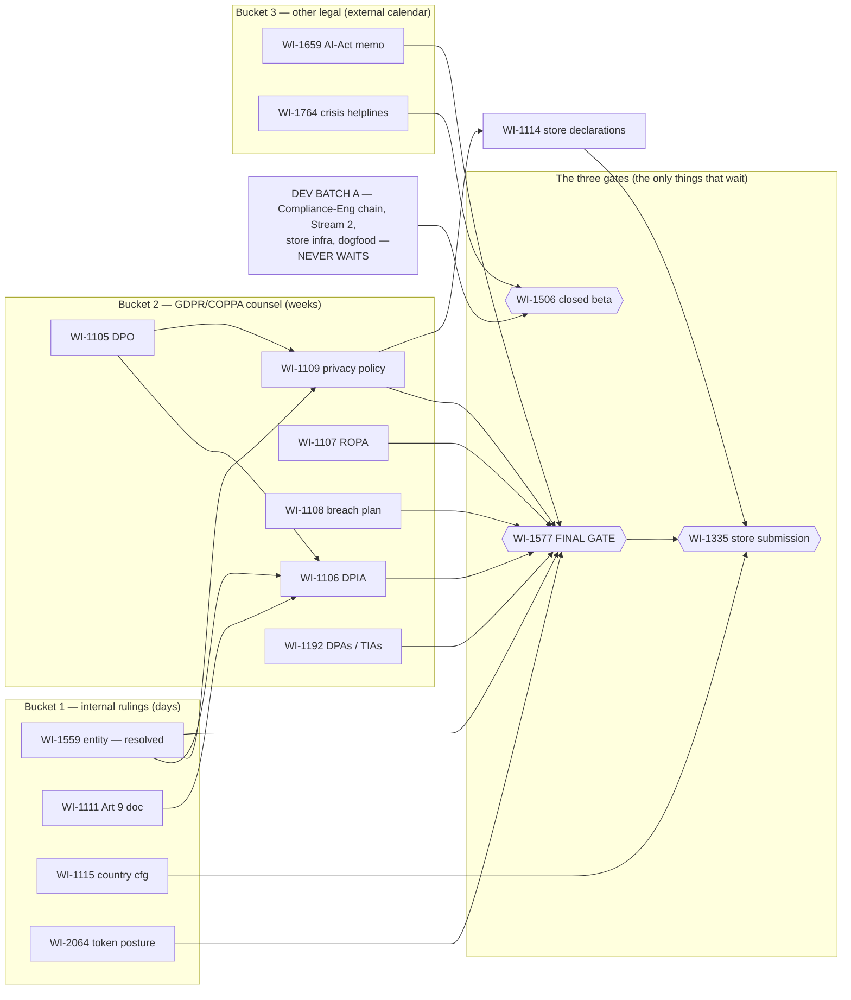
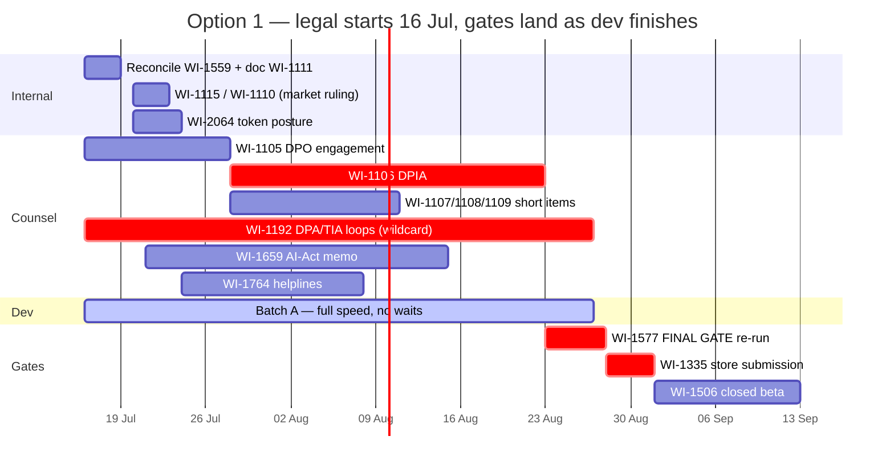
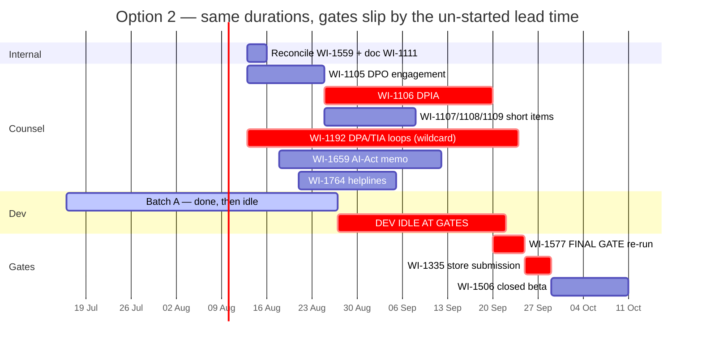

# LD2 options — visual

**The dependency graph is identical under both options** (it's now live in Cosmo). The only thing that changes is *when the legal clocks start* — so the graph once, then the two calendars.

> **Status update 2026-07-21:** WI-1559's controller identity is resolved as ZWIZZLY AS, org.nr 811696072, Fiskekroken 3B, 0139 Oslo, Norway, with Norwegian Datatilsynet as lead authority; the active-document reconciliation is complete. The graph below preserves the dependency edge until lifecycle review closes the item.

## Dependency graph (both options)

## Option 1 — adopt spine + register, clocks start this week

*Durations illustrative (DPO retainer ~2 wks, DPIA ~4 wks, DPA loops the wildcard).*

## Option 2 — spine only, register advisory (legal starts "whenever" — shown as +4 wks drift)

**Read:** under Option 2 the red "DEV IDLE AT GATES" band is pure calendar loss — dev finishes late Aug either way; only the legal start date decides whether the gates are ready to receive it. The Datatilsynet prior-consultation tail risk (months) attaches to the DPIA bar in both charts.
