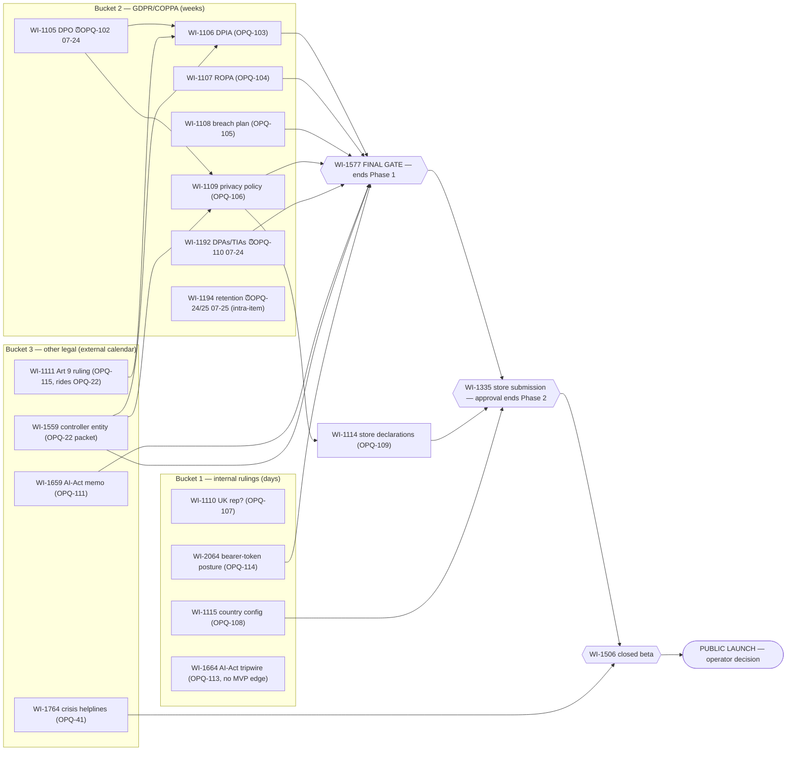

# Roadmap visualization — mermaid fallback (2026-07-16)

> ⚠ **Comprehension artifact — no plan authority** (standing orders, sequencing sitting 2026-07-16). Map, not terrain: premise-check before every batch kickoff. Live state is Cosmo. Interactive version: `roadmap-viz.html` (regenerate data with `bash viz-export.sh`).

## View A — HITL buckets → gate chain

Counsel blocks **gates, not dev** (legal register §0). Deadline badges: ⏰ = OPQ clock-start deadline.

**Negative space:** ~155 open items across Dev-Infra, Compliance-Eng, Identity Cutover, Safety & Eval, Core Learning Loop, Mobile UX, Supporter & Linking, Four Strands, Store/Billing, Launch Readiness, Stream 2, V2 tail, QA factory run at full speed with **zero counsel input**. (No edges: WI-1110 falls away or trivially parallel; WI-1663/1664 have no MVP-gated downstream.)

## View B — phase × executor (gate-bounded phases, SEQ-1)

| Executor | Phase 1 · Full Parallel *(→ WI-1577 pass)* | Phase 2 · Submission *(→ store approval)* | Phase 3 · Beta & Launch |
|---|---|---|---|
| **Counsel/DPO** | DPO → DPIA · ROPA · breach · policy · DPAs · AI-Act memo · OPQ-22 packet | — (paper consumed by gate) | — |
| **Jørn** | Kickoff sitting: clock-starts OPQ-22/102/110 + row burn-down; Bucket-1 rulings; premise-check per batch | Console actions, submission (OPQ-60) | Beta go / launch decision |
| **Zuzka** | Kickoff sitting: OPQ-40 (gates 5 trust builds), OPQ-118 (Challenge) | Listing copy | Beta feedback (scope authority) |
| **Fleet W1** | Dev-Infra (preview fixes W1-critical) · Compliance-Eng (paces exit) · Identity Cutover · Safety & Eval · factory drain | Release hardening, review-fix turnaround | Beta-blocking QA only |
| **Fleet W2** *(at first premise-check)* | Core Learning Loop · Mobile UX & Nav · Supporter & Linking · Four Strands · Store/Billing agent-side | ↑ | ↑ |
| **∥ Stream 2** | autonomous, D-gate cadence (OPQ-95) — not phase-coupled | | |
| **∥ V2 tail** | S5/S6 + soak gates; launch coupling only via WI-2059 release-ADR edge | | |
| **∥ QA factory** | severity-gated intake (SEQ-5); rolling drains; unfixed at beta → severity re-look → pen | | |
| **Pen (off-axis)** | ~84 items, unsequenced; promotion only by explicit ruling at a premise-check | | |

Waves are capacity lenses over Phase 1's feasible set, not batches; batches form at kickoff sittings by co-execution affinity (SEQ-6) as **Delivery Batch pages** (ZDX ruled live 2026-07-16 — Batches DB `39f8bce9-1f7c-8103-987c-de2ace74ac8a`).
