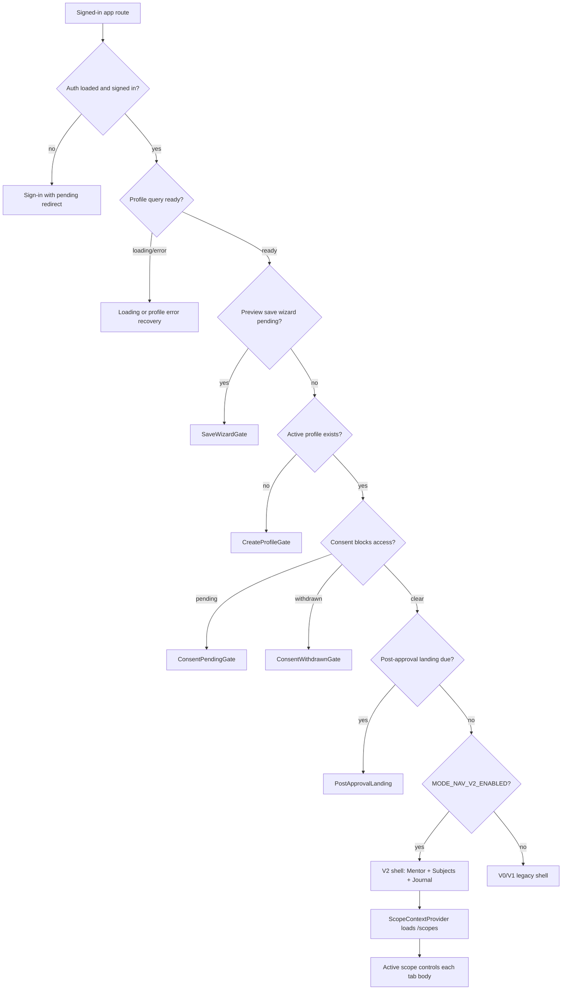
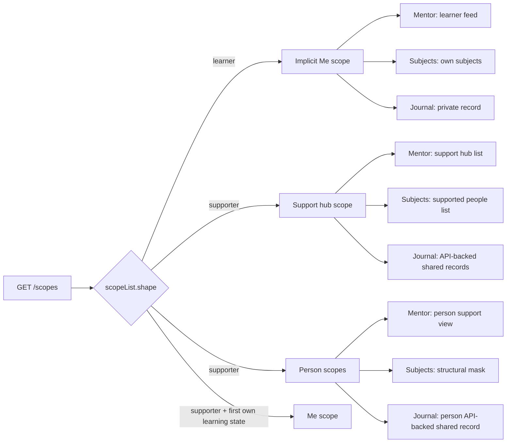
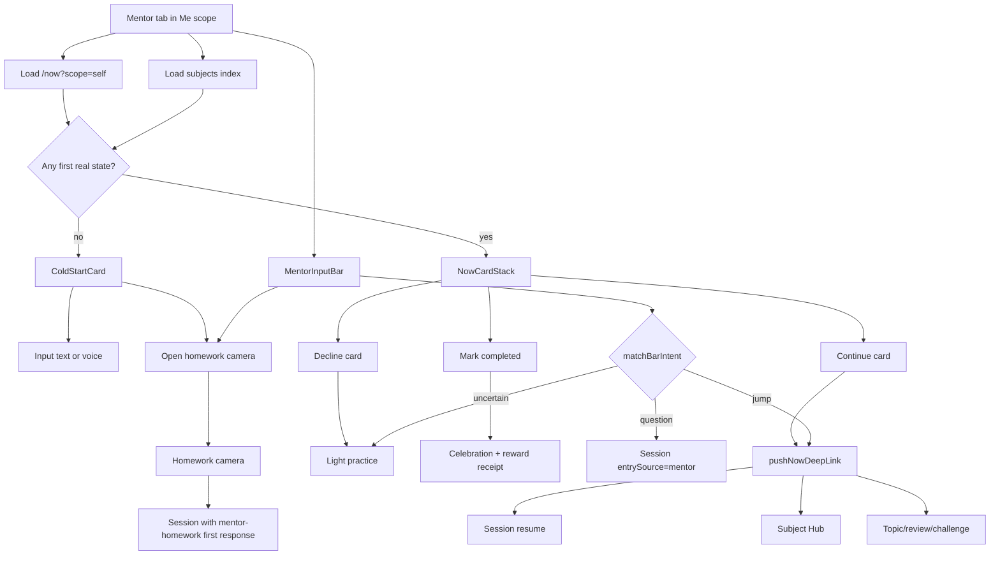
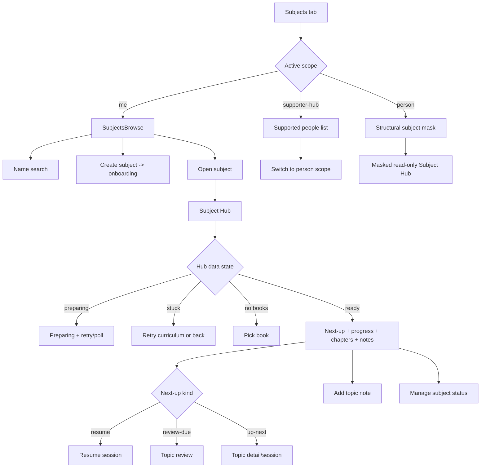
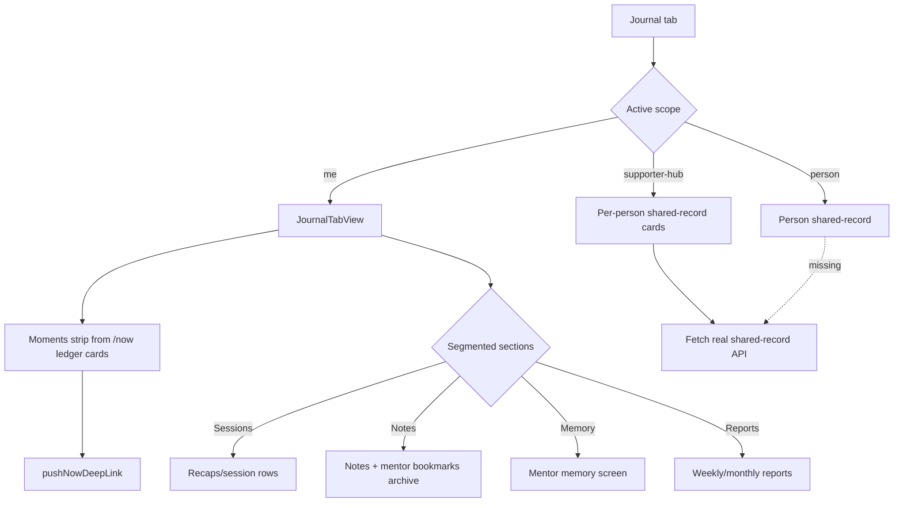

# V2 Trigger Flow Logic Map

**Last verified:** 2026-07-01  
**Purpose:** Review why users move between V2 surfaces. This complements `06-screen-function-access-map.md` by mapping triggers, decision points, and access boundaries.

## Source Legend

- `CODE` means current implementation exists.
- `PARTIAL` means current implementation is present but incomplete versus V2 intent.
- `PLAN` means the flow is specified but not fully implemented.
- `OPEN` means a concrete build gap remains.

## Visual Flow: V2 Shell Entry

**Code anchors:** `(app)/_layout.tsx:453-621`, `feature-flags.ts:32`, `use-navigation-contract.ts:185-194`, `scope-context.tsx:127-151`.

## Visual Flow: Scope Lenses

**Code anchors:** `scope-resolution.ts:71-83`, `ScopeChip.tsx:40`, `mentor.tsx:370-381`, `subjects.tsx:23-33`, `journal/index.tsx:15-27`.

## Visual Flow: Learner Mentor

**Code anchors:** `mentor.tsx:85-181`, `:225-347`, `use-now-feed.ts:29`, `bar-intent-match.ts:21-96`, `now-deep-link.ts:24-49`, `homework/camera.tsx:498`, `session-route-params.ts:110-114`.

## Visual Flow: Subjects And Subject Hub

**Code anchors:** `subjects.tsx:15-65`, `SubjectsBrowse.tsx:19-185`, `subject-hub/[subjectId]/index.tsx:35-319`, `use-subject-hub.ts:228-553`, `PersonScopeStructuralSubjects.tsx:18-83`.

## Visual Flow: Journal

**Code anchors:** `journal/index.tsx:10-27`, `JournalTabView.tsx:24`, `:44`, `:214`, `:406`, `:470`, `:593`, `:845`, `SupportHubJournalTab.tsx:33-65`, `PersonScopeJournalPlaceholder.tsx:9-42`, `visibility.ts:175-188`.

## Trigger Matrix

| Trigger | Lands on | Decision point | Why | Access/source |
|---|---|---|---|---|
| App opens after auth/profile/consent | V2 shell, intended Mentor tab | Layout gates clear, V2 flag on. | First actionable object should be Mentor, not another setup surface. | `CODE` shell; `PLAN` exact post-auth Mentor landing copy: spec lines `131-135`. |
| Tap Mentor tab | Mentor tab body for active scope | `activeScope.kind` chooses self/supporter/person view. | One tab, multiple lenses. | `CODE`: `mentor.tsx:370-381`. |
| Tap Subjects tab | Subjects body for active scope | `activeScope.kind` chooses own browse, supporter people list, or structural mask. | Same IA for learner and supporter, with server mask. | `CODE/PARTIAL`: `subjects.tsx:23-65`. |
| Tap Journal tab | Journal body for active scope | `activeScope.kind` chooses private Journal or API-backed shared record. | Private record for self; transparent shared record for supporter edges. | `CODE`: `journal/index.tsx`, `SupportHubJournalTab.tsx`, `PersonScopeJournalPlaceholder.tsx`, `use-shared-record.ts`. |
| Tap scope chip option | Same tab, different scope body | `setActiveScope()` accepts only known scopes and persists key. | Avoid shell switching and proxy impersonation. | `CODE`: `ScopeChip.tsx:40-70`, `scope-context.tsx:84-118`. |
| `/now` returns unfinished session | Mentor card -> session resume | Card deep link route `session.resume`. | Continue where left off outranks browsing. | `CODE`: `mentor.tsx:48-55`, `now-deep-link.ts:24-27`. |
| `/now` returns subject/topic/review/challenge | Mentor card -> Subject Hub/topic/review/challenge | `pushNowDeepLink()` follows optional chain first. | Feed proposes, persistent screen handles. | `CODE`: `now-deep-link.ts:28-45`, `mentor.tsx:125-132`. |
| `/now` returns ledger moment | Journal moments strip and/or Mentor reward receipt | `card.kind === ledger_moment`; Journal renders moment text and deep-link. | Achievement/progress becomes a moment, not a gallery. | `CODE`: `mentor.tsx:59-76`, `JournalTabView.tsx:214-292`. |
| Learner has no first real state | ColdStartCard | `hasFirstRealState()` false across active subjects/feed/completed exchanges. | Avoid blank feed and avoid subject-picker first. | `CODE`: `first-real-state.ts:7-16`, `mentor.tsx:105-116`, `:225`. |
| Mentor text input is a question | Session with `entrySource=mentor`, `mode=freeform`, `rawInput`. | `matchBarIntent()` returns `mentor`. | Open-ended ask enters tutor engine directly. | `CODE`: `bar-intent-match.ts:17-96`, `mentor.tsx:161-178`. |
| Mentor text input names known route tokens | Deep link to session/subject/topic/review/challenge. | `matchBarIntent()` returns `jump`. | Let explicit navigation language work without making user browse. | `CODE`: `bar-intent-match.ts:29-86`, `mentor.tsx:161-166`. |
| Mentor text input is uncertain or thin feed | Light practice affordance. | `matchBarIntent()` uncertain or feed has <=1 card. | Offer low-pressure practice instead of dead-ending. | `CODE`: `mentor.tsx:181-195`, `:347-356`. |
| Camera/homework from Mentor | Homework camera -> session with mentor-homework frame. | Params include `entrySource=mentor`, `returnTo=mentor`; session detects `mentor-homework`. | Dedicated capture, same conversation continuity. | `CODE`: `mentor.tsx:78-82`, `homework/camera.tsx:498`, `session-route-params.ts:110-114`, `SessionAccessories.tsx:529-556`. |
| First V2 Mentor session closes | In-thread first-session wrap-up. | `isV2MentorEntry && isFirstSession`. | Replaces separate exit funnel before S6 deletes it. | `CODE`: `session/index.tsx:1068`, `:1424`; S6 deletion remains `PLAN`. |
| Subject row pressed | Subject Hub | `SubjectsBrowse` calls `onOpenSubject(subjectId)`. | Browse leads to the persistent subject workspace. | `CODE`: `SubjectsBrowse.tsx:146`, `subjects.tsx:59-64`. |
| Subject Hub Next-up pressed | Resume, review, or topic. | `nextUp.kind` controls route. | One next action per subject. | `CODE`: `subject-hub/[subjectId]/index.tsx:162-178`, `use-subject-hub.ts:228-276`. |
| Person scope Subjects opened | Structural masked subject list; tapping a subject opens a masked read-only Subject Hub backed by the same structural response. | Fetch `GET /scopes/:personId/subjects`, then local subject selection adapts the masked data into `SubjectHub` with `canStudy=false`. | Supporter sees only shareable structure plus safe due-review/mastery signals. | `CODE`: `PersonScopeStructuralSubjects.tsx`, `scopes.ts:25-35`, `supporter-structural-mask.ts`. |
| Supporter Journal opened | API-backed shared-record projections. | Mobile fetches `GET /visibility/reports/:personId/shared-record`; API projects weekly report, recap-presence, and milestone facts through `projectSharedRecord`. | Visibility contract record with reportable facts only. | `CODE`: `SupportHubJournalTab.tsx`, `PersonScopeJournalPlaceholder.tsx`, `use-shared-record.ts`, `visibility.ts`, `shared-record-read-model.ts`. |
| Supporter requests attention report | Appeal affordance below the curated shared-record card. | `AppealButton` posts `POST /visibility/reports/:personId/appeal`; endpoint requires the caller to be the supporter of an accepted contract, so this is supporter-facing, not a supportee dispute mechanism. | Lets a supporter escalate past the curated summary to an artifact-verified report when it seems surprising or incomplete. | `CODE`: `SharedRecordView.tsx`, `AppealButton.tsx`, `use-shared-record.ts` (`useAppealVisibility`), `visibility.ts`, `supporter-report.ts`. |
| Start support sharing request | Link ceremony create screen. | `/link/new` receives `supporteePersonId` + relation, then posts `POST /visibility/links`. | A supporter can create the pending visibility contract before either side accepts. | `CODE`: `app/(app)/link/new.tsx`, `visibility.ts`, `linking-ceremony.ts`. |
| Open support sharing agreement | Link ceremony contract screen. | `/link/[contractId]` fetches `GET /visibility/links/:id/contract`, derives active side from the signed-in person, then posts accept/revoke as allowed. | Both sides review the same trust contract; accepted supportees can end sharing. | `CODE`: `app/(app)/link/[contractId].tsx`, `ContractCard.tsx`, `visibility.ts`, `supportership-revocation.ts`. |
| Avatar tapped | Account admin sheet. | `AccountAvatar` pushes `/account`. | More/account admin re-homed out of bottom tabs. | `CODE`: `AccountAvatar.tsx:22-37`, `account/index.tsx:10-32`, `AccountAdminSheet.tsx:23-174`. |

## Failure Modes — Supporter Appeal

| State | Trigger | User sees | Recovery |
|---|---|---|---|
| Idle | Supporter opens a shared-record card that has facts. | Appeal button (`AppealButton`, "Request attention report"). | N/A. |
| Pending | Supporter presses the appeal button. | Loading indicator in place of the button. | Resolves automatically to the report or the error state. |
| Report ready | `POST /visibility/reports/:personId/appeal` succeeds. | Artifact-verified attention report replaces the button. | N/A. |
| Request failed | The appeal mutation rejects (network/API error). | `ErrorFallback` with a retry action. | Retry re-fires the same mutation. |
| Scope switched mid-state | Supporter switches to a different supportee without the component unmounting (e.g. selecting another card while the hub stays mounted). | Appeal state resets to idle for the newly active scope; no stale report/error from the prior supportee leaks through. | `useAppealVisibility` resets its mutation state on `scope.personId` change. |

## Current Gaps To Review Before Calling V2 Complete

| Gap | User-visible risk | Owner phase |
|---|---|---|
| Support hub is still mostly list/placeholder UI. | Parent/supporter cannot yet answer the full "what should I do now?" job from V2 alone. | S4 |
| Person-scope Subjects masked Subject Hub drill-in now exists; keep reviewing privacy copy and masked aggregate language during publish-readiness QA. | Supporters can inspect masked structure, but QA still needs end-to-end product review before V2 publish. | S4/S5 |
| Shared-record Journal data depends on available report/recap/milestone rows. | Supporters see honest empty state until reportable facts exist; private notes/chat text stay outside the record. | S5 |
| Visibility ceremony depends on upstream anchors. | Link/accept/revoke/trust-contract flows now have mobile routes; remaining work is wiring S4 cold-start/Approve anchors into `/link/new` or existing contract IDs. | S4/S5 |
| No V2-native forward trigger reaches the standalone `/(app)/practice` history hub (WI-1173 finding). | Mentor's light-practice affordance pushes directly to `/(app)/quiz` or `/(app)/dictation`; `/(app)/practice` itself is only reached as a `router.replace`/`goBackOrReplace` return destination from quiz/dictation completion, or via the legacy V0/V1 Progress tab (`LearnerScreen.tsx`). No test can honestly prove a V2 forward trigger that does not exist in code. | S4/S5 |
| S6 deletion is deferred and irreversible. | Old shells/screens must remain until product explicitly retires V0/V1 and replacement parity is verified. | S6 |
| Legacy-Progress-only concrete signals (CEFR vocabulary browser, full milestone history list, live global engagement glance — streak/sessions/minutes/recall-queue) have no V2-native home; see `06-screen-function-access-map.md` → "Concrete Progress Ownership Split (WI-1172)". | Learner loses these views only if/when Progress is retired before a V2 home exists. | S6, consumed by WI-1174's retirement-gate audit |

## V2 Publish-Readiness Smoke Set

See `06-screen-function-access-map.md` → "V2 Publish-Readiness Smoke Set (WI-1173)"
for the enumerated test citations (existing + newly-added) proving each trigger
above, plus the re-run command.
