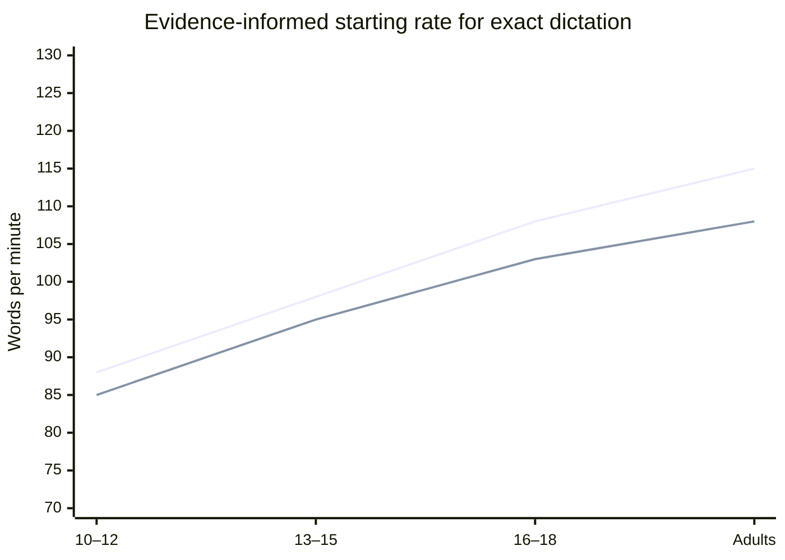
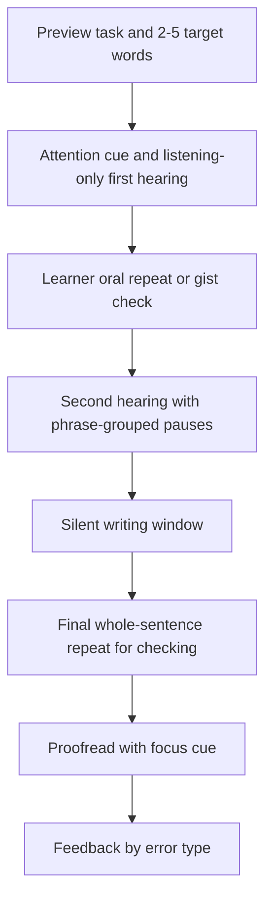

# Dictation Pacing, Text Length, and Pause Design for Learners Aged Ten and Older

## Executive summary

The strongest usable evidence does **not** support either “normal conversational speed” or “ultra-slow, word-by-word dictation” as the default for teaching writing, grammar, or foreign-language listening-to-write tasks. By late childhood, articulation rate is often broadly adultlike, but adolescents still show ongoing development in spontaneous timing, pausing, and strategic clarity adjustments; at the same time, sentence length and linguistic complexity often matter more than small age differences within the 10–14 range. For dictation, the most defensible default is therefore **natural clear speech**: slightly slowed relative to ordinary conversation, with normal stress and intonation, short inter-word timing, audible phrase grouping, and somewhat expanded sentence-final pauses. citeturn4search0turn28search3turn29view0turn21search5turn21search8

For pause design, the best direct evidence comes from speech-timing and pause-perception studies. In read speech, many non-sentence-final boundaries are marked by very short pauses under 250 ms, often under 100 ms, whereas most sentence-final pauses exceed 250 ms and commonly fall between about 450 and 1000 ms. In English speech-perception experiments, listeners rated speech as most natural when punctuation pauses were around **0.6 s within sentences** and **0.6–1.2 s between sentences**. Those values are excellent anchors for educational dictation because they preserve prosody while adding enough processing time to support writing. citeturn10view2turn35view0

For foreign-language learners, “slightly slower” appears to help more than “much slower.” In a junior-high EFL study, **98 wpm** improved listening comprehension relative to **116 wpm**, while **58 wpm** did not add benefit. In adult EFL research, both natural and slowed exposure improved comprehension, but prolonged exposure to natural rate could outperform slow-rate exposure, and mechanically manipulated slowness with inserted long pauses was not clearly advantageous. In practice, that means dictation for L2 learners should usually begin around a **moderately slowed but still natural** rate, not a stretched or syllable-by-syllable delivery. citeturn12search2turn12search4turn24view0turn24view1

For learner differences, the best-supported adjustments are not “diagnosis-specific magic numbers” but changes in **load**, **segmentation**, **response time**, and **mode of support**. Gifted or clearly advanced learners generally need **less repetition, less routine practice, and more compacting of mastered material**. Learners with ADHD tend to benefit from **clear brief instructions, chunking, written support, breaks, and extra time**. Autistic learners often benefit from **explicit structure, visual supports, predictable routines, extra processing time, and reduced sensory load**, while some also show prosodic differences that make explicit boundary cueing useful. When auditory-language processing is a major weakness, simultaneous listening and writing may itself be the wrong construct to assess without accommodations. citeturn27view0turn27view1turn14search2turn14search7turn14search9turn15search5turn15search9turn22search16

The tables below therefore present **evidence-informed starting bands**, not fixed norms. That is an explicit assumption of this report, because direct peer-reviewed studies specifying “optimal dictation word counts and pause schedules” for every age and profile from 10+ are sparse. The numerical recommendations are synthesized from peer-reviewed speech-rate studies, L2 listening studies, pause-perception research, gifted-education guidance, and clinical/educational accommodation guidance. citeturn4search0turn28search3turn35view0turn12search4turn24view0turn27view0turn14search2turn15search5

## Scope, assumptions, and evidence base

This report assumes the age bands requested by the user: **10–12, 13–15, 16–18, and adults unspecified**. It covers two main use-cases: **dictation for writing/grammar in the learner’s stronger school language** and **dictation/dictogloss-style input for foreign-language learners**. Wherever the literature gives direct measurements of speaking rate or pause duration, I report them as evidence. Wherever the literature does **not** provide direct “optimal dictation” cutoffs, I identify the recommendations as **synthesized starting ranges** rather than empirical norms. citeturn4search0turn29view0turn35view0turn12search4

Several evidence anchors are especially important. Mahr et al. reported that articulation rate in typical children increases through childhood and is “generally adultlike by 10 years of age.” Logan’s review of school-age speaking-rate work similarly summarizes 8–12-year-olds as averaging about **2.7–3.3 syllables per second** in speech-rate measures. But Hazan and Pettinato found continuing development in articulation rate and pausing through adolescence into adulthood, which matters because dictation depends on controlled, listener-oriented timing rather than raw articulatory speed alone. citeturn4search0turn28search20turn40search2turn29view0

Within the 10–14 range, sentence length and task demands may matter at least as much as age. Darling-White and Banks found in typically developing 10–14-year-olds that speech rate and articulation rate rose with sentence length, while proportion of pause time did not show the same simple increase; they also did **not** find a main age effect within that band. That is one reason the recommendations below increase mostly by **task complexity and learner profile**, not by age alone. citeturn28search3turn28search0

For dictation in the foreign-language classroom, the practical evidence base comes mainly from listening-comprehension and dictogloss studies. Chiu’s junior-high EFL study compared **116, 98, and 58 wpm** and found the slight slowdown to **98 wpm** helpful, but the very slow condition was not. Dictogloss research and teaching scholarship based on Wajnryb’s work typically uses a **short text**, **normal-speed readings**, and **two hearings**, with a preparation stage that includes topic activation and vocabulary preview. citeturn12search2turn12search4turn32search6turn32search8turn31search9

Clinical and educational guidance fills in the learner-profile adaptations. CDC, CHADD/Barkley-style ADHD accommodation guidance, autism evidence reviews, National Autistic Society communication guidance, language-disorder support guidance, and APD guidance converge on a common set of supports: **brief explicit instructions, chunking, written and visual backup, repetition/rephrasing, longer processing time, reduced noise, and extra time**. These are highly relevant to dictation because dictation combines listening, working memory, transcription, punctuation, and error monitoring in real time. citeturn14search2turn14search7turn14search9turn15search5turn15search9turn18search5turn22search16

Key inline sources for the report include Mahr et al. on articulation-rate growth, Darling-White and Banks on sentence length effects, Hazan and Pettinato on adolescent timing development, Liu et al. on English pause naturalness, Chiu on junior-high EFL speech rate, Hayati on adult EFL rate exposure, NAGC on compacting for advanced learners, and CDC/NAS/language-disorder/APD guidance on instructional accommodations. citeturn4search0turn28search3turn29view0turn35view0turn12search4turn24view0turn27view0turn14search2turn15search9turn18search5turn22search16

## What the evidence says about rate, pauses, and naturalness

A crucial distinction is between **speech rate** and **articulation rate**. Speech rate includes pauses and disfluencies; articulation rate excludes them. Logan’s review emphasizes that speech-rate values are slower than corresponding articulation rates for the same sample, and forensic/phonetic work makes the same distinction explicit. Educationally, this matters because a teacher can preserve an acceptable articulation rate while increasing phrase and sentence pauses to make dictation more writable. citeturn40search2turn6search3

Natural speech is faster than most learners can comfortably transcribe in real time. General adult speaking-rate estimates in the literature commonly span about **120–200 wpm**, and normal English is often described as roughly **150–180 wpm** in listening research. By contrast, slightly slowed classroom delivery for young EFL learners around **98 wpm** can be facilitative, while a much slower **58 wpm** does not appear to add value. That gap between ordinary speech and pedagogical dictation is why dictation should not copy spontaneous conversation. citeturn6search0turn12search1turn12search2turn12search4

At the same time, dictation should not become artificial. Hayati’s adult EFL study notes that mechanically slowed speech with inserted long pauses is a questionable aid, and Liu et al.’s pause work shows that listeners perceive increasingly long pauses as slower speech even when the utterances themselves do not change. Clear-speech research also shows that intelligibility gains come from a **bundle** of features—slower rate, longer segments, meaningful pauses, and hyperarticulated vowels—rather than from crude stretching alone. Over-slowing can reduce naturalness and, in some studies, intelligibility. citeturn24view1turn35view0turn21search5turn21search8turn19search5

Pause placement is as important as rate. Volskaya and colleagues found that in read speech many clause/phrase-boundary pauses are extremely short: **71.9%** of non-sentence-final pauses were below **250 ms**, and **55%** were below **100 ms**. By contrast, **88%** of sentence-boundary pauses were above **250 ms**, most between **450 and 1000 ms**. In English pause-perception experiments, punctuation pauses around **0.6 s** were rated natural, with within-sentence pauses typically shorter than between-sentence pauses and real-world physical averages often around **0.38–0.67 s** for commas and **0.81–1.24 s** for periods. citeturn10view2turn35view0

Children also tend to pause longer than adults in spontaneous narrative speech. In Redford’s child–adult storytelling comparison, average pause duration was longer for children than adults, with values reported around **1416 ms vs. 993 ms** in one storytelling condition. That does **not** mean teachers should imitate child pausing. It does mean that younger learners, or learners with higher processing load, often need somewhat longer dictation pauses than adults even when their articulation is broadly age-appropriate. citeturn7search0

For pronunciation quality, the evidence favors **clear speech**, not “drawn-out” speech. Foreigner-directed-speech reviews identify **lower speech rate** and **vowel hyperarticulation** as the most consistent acoustic features, while pitch-range differences are more variable. Other clear-speech work shows that prosody and rhythm still matter: speech rhythm can influence perceived foreign accent even more than rate, and intonation helps listeners interpret timing differences. In practical terms, the model voice for dictation should be **calm, well-articulated, stress-timed, and phrase-grouped**, not robotic or syllable-chopped. citeturn21search3turn21search5turn20view3

The chart below converts that evidence into recommended **starting** delivery bands for **exact dictation**. These are not speech norms. They are pedagogical starting points synthesized from the studies above, with the explicit assumption of classroom prose averaging roughly 1.3 syllables per word when syllables-per-second equivalents are displayed. citeturn12search4turn24view0turn35view0turn4search0turn29view0

## Recommended parameters by age group and learner profile

Because direct trials specifying ideal dictation lengths for every age band above 10 are limited, the table below is a synthesis. It combines child/adolescent rate-development studies, L2 listening studies, pause-naturalness research, and accommodation guidance. Treat the values as **starting bands for one dictation cycle**; then adjust using actual learner performance, especially if errors cluster around memory load rather than spelling or grammar knowledge. citeturn4search0turn28search3turn29view0turn35view0turn12search4turn24view0

| Age group | Typical writing/grammar dictation | Foreign-language exact dictation | Sentence length starting band | Total text length starting band | Practical note |
|---|---:|---:|---:|---:|---|
| 10–12 | **80–95 wpm**; approx. **1.7–2.1 syll/s** | **80–95 wpm** for novice/intermediate L2 | **8–14 words** per sentence | **15–30 words**, usually **1–2 sentences**, about **1–3 lines** | Keep syntax simple; one new demand at a time |
| 13–15 | **90–105 wpm**; approx. **2.0–2.3 syll/s** | **90–100 wpm** for novice/intermediate L2; up to **110** if strong B1+ | **10–18 words** | **25–45 words**, usually **2–3 sentences**, about **2–4 lines** | Slightly denser clauses are acceptable if vocabulary is known |
| 16–18 | **100–115 wpm**; approx. **2.2–2.5 syll/s** | **95–110 wpm** for most L2 learners; up to **120** if advanced | **12–22 words** | **35–65 words**, usually **2–4 sentences**, about **3–5 lines** | Increase complexity before greatly increasing speed |
| Adults unspecified | **105–125 wpm**; approx. **2.3–2.7 syll/s** | **95–115 wpm** for beginners/intermediate; **110–130** if advanced | **12–25 words** | **45–85 words**, usually **3–5 sentences**, about **4–6 lines** | Adults can comprehend much faster speech, but writing and memory still cap exact dictation speed |

These starting bands are intentionally well below ordinary adult conversational speech and somewhat below the rates many adolescents can comprehend in listening-only conditions, because exact dictation adds auditory memory, punctuation monitoring, and motor transcription. They are also intentionally **not** ultra-slow, because both L2 speech-rate studies and pause-naturalness studies indicate that excessive slowness can reduce naturalness and may not improve outcomes. citeturn6search0turn12search2turn24view0turn24view1turn35view0

The next table shows learner-profile modifications. These are best used as **relative adjustments** to the age-band starting values above.

| Learner profile | Rate adjustment | Pause adjustment | Text-length adjustment | Repetition strategy | Best scaffolds |
|---|---|---|---|---|---|
| Typical | Use age-band default | Phrase **0.4–0.7 s**; sentence **0.8–1.4 s** | Use age-band default | One full reading + one exact repeat is usually enough in practice | Brief preview of target punctuation or vocabulary |
| Bright/gifted or clearly mastered content | **+5 to +15 wpm** *or* keep rate stable and increase complexity | Reduce sentence-end pause by about **10–20%** if accuracy stays high | Increase text by about **25–50%** *or* compact repetitive items | Often **one hearing + one confirmatory repeat** is enough | Pre-assess, compact mastered material, use richer syntax/vocabulary |
| ADHD | **−5 to −15 wpm** if attention or working memory is the bottleneck | Expand phrase/sentence pauses by about **20–40%**; add micro-breaks between items | Reduce by about **20–30%** at first | Use fixed routine; one exact repeat plus visual check cue | Written directions, chunking, visible timing, short sets, breaks |
| Autistic | Often **−5 to −20 wpm** if processing, prosody, or sensory load is an issue; but individual variation is large | Expand phrase/sentence pauses by about **20–50%**; maintain highly predictable boundary cues | Reduce by about **20–40%** unless learner is advanced and enjoys complexity | Exact repeat first; rephrase in practice only after the scored attempt | Visual supports, predictable script, reduced noise, explicit punctuation and boundary cueing |
| Twice-exceptional bright/gifted + ADHD/autistic | Do **not** assume the gifted profile cancels the accommodation need | Use the support profile first, then increase complexity | Keep length moderate but increase interest and challenge | Flexible; fewer repetitions if content is mastered, more structure if memory is weak | Compact repetition while preserving supports |

The gifted adjustments reflect a robust body of gifted-education guidance: advanced learners frequently benefit from **curriculum compacting** and less repetitive practice, with NAGC summarizing evidence that **24%–70%** of curriculum may be compacted for some high-ability learners without harming performance, and that removing **40%–50%** of already-mastered work did not reduce achievement. The ADHD adjustments reflect guidance emphasizing **brief explicit instructions, chunking, written backup, repetition, breaks, and extra time**, alongside research linking ADHD with writing difficulties, slower processing speed, and working-memory burdens. The autistic-learner adjustments reflect evidence favoring **explicit instruction, visual supports, manageable steps, extra processing time, and sensory accommodations**, plus research showing that prosodic phrasing and stress can differ in some autistic adolescents and adults. citeturn27view0turn27view1turn14search2turn14search7turn14search9turn23search1turn23search23turn15search5turn15search9turn33search5turn33search20

Pause selection deserves its own table because timing errors often cause more difficulty than raw speech rate.

| Pause type | What it is | Natural evidence anchor | Recommended educational use |
|---|---|---|---|
| Intra-word | Silence inside a word or morpheme | Natural speech contains only brief articulatory gaps of the kind discussed in phonetic timing work, not pedagogical breaks inside ordinary words | **Avoid in ordinary dictation.** Use only in explicit morphology/spelling teaching, and keep any morpheme break very brief |
| Inter-word | Tiny boundary between words | Many non-sentence-final boundaries in read speech are below **250 ms**, often below **100 ms** citeturn10view2 | Usually **0.05–0.20 s**; stretch toward **0.20–0.30 s** only for dense unfamiliar wording |
| Phrase | Pause at a comma, clause boundary, or prosodic chunk | English punctuation studies place common within-sentence pauses around **0.38–0.67 s**, with **0.6 s** especially natural citeturn35view0 | Usually **0.4–0.7 s**; use these where punctuation or syntactic grouping is being taught |
| Sentence | Pause at full stop or complete sentence boundary | Common between-sentence values cluster around **0.81–1.24 s**; many sentence-final pauses in read speech are **450–1000 ms** or longer citeturn35view0turn10view2 | Usually **0.8–1.4 s** for typical learners; **1.2–2.0 s** when younger or when processing support is needed |
| Paragraph or item break | Pause between dictation items | Longer than ordinary discourse boundary; mainly pedagogical | Usually **2–5 s** between items, depending on proofreading demand |

Taken together, the best practical hierarchy is simple: keep inter-word timing short, make phrase boundaries audible, give sentence boundaries real space, and reserve long silences for proofreading or between-item resets. That arrangement matches both prosodic naturalness and processing support. citeturn10view2turn35view0

## Practical protocols, scripts, and scaffold design

The central scaffolding rule is that **complexity matters more than mere length**. Working-memory research shows that processing complex language depends on limited cognitive resources, and research on verbal working memory suggests that complexity can affect performance even more than raw length. That is why pre-teaching vocabulary, reducing clause density, and chunking sentences are often more effective than simply slowing the teacher’s voice. citeturn26view0turn13search0

Pre-teaching is especially defensible when the goal is writing, grammar, or content access rather than surprise listening. Dictogloss procedures classically begin with preparation and vocabulary work. Language-disorder and APD guidance also recommends pre-teaching materials, written instructions, and visual cues. For autistic learners and many ADHD learners, previewing key vocabulary and showing the task structure in advance reduces avoidable memory and sensory load so the dictation measures the intended target skill more cleanly. citeturn31search9turn32search8turn22search16turn18search5turn15search5turn15search9

A useful general classroom sequence is shown below.

### Script for exact dictation in writing and grammar lessons

A highly workable default for a **12-word sentence** with a learner group aged 10–15 is this: give a brief attention cue; read the entire sentence once at the target rate; allow a short silence; have learners repeat the sentence aloud or subvocally; read it again with phrase-grouped pausing; allow writing time; then give one final full-sentence repeat for checking. The oral repeat is pedagogically helpful because sentence repetition supports temporary retention and reveals when the task is failing at the memory/comprehension level before writing even begins. citeturn32search1turn32search2turn17search0turn17search19

An example script, for a typical 13–15 group, would look like this:

| Stage | Teacher action | Timing guide |
|---|---|---|
| Cue | “Listen first. No writing yet.” | **2 s** |
| First hearing | Read whole sentence at **90–105 wpm** with natural stress | For 12 words, about **7–8 s** |
| Processing gap | Silence | **1 s** |
| Oral hold | Learners repeat quietly or to a partner | **3–5 s** |
| Second hearing | Read again, with one clause/phrase pause around **0.5–0.7 s** | About **8–9 s** |
| Writing window | Students write | **10–20 s**, depending on handwriting speed and sentence length |
| Check hearing | Final full-sentence repeat at same rate | **7–8 s** |
| Proof stage | “Check capitals, punctuation, endings.” | **5–10 s** |

For **10–12-year-olds**, add about **20%** more writing time and slightly longer sentence-final pauses. For **16–18/adults**, reduce the writing window if the group is writing fluently and accuracy remains high. For **gifted learners**, shorten the repetition cycle before increasing rate; for **ADHD/autistic learners**, keep the routine constant and expand the silent writing window before making the text longer. citeturn29view0turn27view0turn14search9turn15search9

### Script for foreign-language exact dictation and dictogloss

For foreign-language learners, it is often better to separate **gist hearing** from **exact transcription** or **reconstruction**. Dictogloss research explicitly recommends a short text, normal or near-normal delivery, and typically **two hearings**, preceded by vocabulary preparation. That makes dictogloss preferable to slow, repeatedly segmented dictation when the goal is grammar noticing, form–meaning mapping, or collaborative reconstruction. citeturn32search6turn32search8turn32search17turn31search9

A practical L2 dictogloss protocol is:

| Stage | Teacher action | Timing guide |
|---|---|---|
| Preparation | Preview topic, meaning, and 3–6 key words or a target structure | **2–5 min** |
| First read | Read whole text once for gist at **near target natural clear speech**; no writing | **20–45 s** depending on text length |
| Gist pause | Students say main idea or key words | **15–30 s** |
| Second read | Read again at the same or slightly slower rate; students jot key words only | **20–45 s** |
| Reconstruction | Pairs/groups rebuild the text | **1–4 min** |
| Optional third read | Practice only, not scored assessment | **20–45 s** |
| Compare and analyze | Highlight grammar, collocation, punctuation, or spelling | **2–6 min** |

For **junior-high L2 learners**, the evidence supports starting close to **98 wpm** rather than around **116 wpm** or at dramatically slower rates. For adults, a moderate slowdown is still often appropriate for dictation, but long-term listening development should not remain trapped at slow rates alone. citeturn12search2turn12search4turn24view0

### Repetition and rephrasing strategy

Repetition and rephrasing should be treated differently. **Exact repetition** preserves the target and is appropriate in practice and, if standardized, in some assessments. **Rephrasing** changes the lexical and syntactic demand, so it is excellent as a scaffold during instruction but should usually be avoided in any assessment intended to sample precise spelling, punctuation, or morphosyntax from auditory input. Dictogloss procedures, for example, emphasize repeated hearings of the same text rather than paraphrased re-deliveries. Accommodation guidance for ADHD, autism, language disorder, and APD supports repeating and rephrasing **for access**, but that shifts the construct from strict auditory dictation toward supported language access. citeturn32search6turn32search8turn14search9turn15search9turn18search5turn22search16

### Pronunciation style to model

The most defensible performance style is: clear consonant releases, stable vowel targets, preserved sentence stress, ordinary connected-speech rhythm, and meaningful phrasing. Avoid three common mistakes: dragging every syllable equally, inserting spaces inside words, and flattening intonation. Clear-speech and foreigner-directed-speech research indicates that intelligibility gains come from clearer articulation and lower rate **within a natural prosodic frame**, not from monotone stretching. citeturn21search5turn21search8turn20view3

## Assessment implications

Dictation is useful as **assessment for learning**, but only if the teacher knows what the score is actually measuring. The Hong Kong dictation handbook explicitly frames dictation as a tool for phonics, listening, writing, note-taking, and assessment for learning. ASHA’s written-language guidance likewise treats written spelling and written expression as multi-component language outcomes, not single-skill products. A low dictation score can therefore reflect spelling knowledge, auditory memory, morphosyntax, punctuation knowledge, handwriting fluency, attention regulation, or the interaction among them. citeturn11view0turn18search1turn18search4

That has several practical consequences. If a learner fails after the first hearing but succeeds after a standardized exact repeat, the bottleneck is often **pace or working memory**, not core spelling knowledge. If punctuation is consistently omitted while words are correct, the learner may need explicit teaching of **prosodic phrasing** and punctuation-boundary mapping. If a learner’s performance improves sharply when vocabulary is previewed, the problem may be lexical access rather than “carelessness.” If a learner with ADHD or autism improves materially when written supports, reduced noise, or extra processing time are added, then a raw unaccommodated dictation score is likely underestimating the learner’s underlying language or grammar knowledge. citeturn26view0turn35view0turn14search2turn14search9turn15search5turn15search9turn22search16

For language profiling, error coding is more informative than a single percentage correct. A rigorous dictation rubric should separate at least five domains: **orthography**, **morphology/inflections**, **function-word omissions**, **punctuation/capitalization**, and **boundary errors** such as spacing or chunk confusion. Sentence-repetition research is highly relevant here: sentence repetition tasks are widely used and are considered reliable markers for identifying language difficulties, especially developmental language disorder. Repeated collapse on sentence-level dictation despite adequate single-word spelling should therefore prompt consideration of broader language assessment, not only more drill. citeturn17search0turn17search19turn17search16

Accommodation policy should also be explicit. In a **strict dictation assessment**, the teacher should standardize the number of hearings, the pause structure, and whether oral repetition is allowed. In a **supported-access assessment**, the teacher may add written cues, vocabulary preview, extra processing time, or chunked delivery. Both can be legitimate, but they do **not** measure precisely the same construct. For advanced or gifted learners, pre-assessment should determine whether ordinary dictation is already a ceiling task; if so, compact routine items and assess richer syntax, denser vocabulary, or editing/proofreading accuracy instead. citeturn27view0turn27view1turn11view0

The most defensible bottom line is therefore this: use **natural clear speech**, keep **phrase pauses audible and sentence pauses generous**, scale **text density more carefully than raw length**, and let learner profile determine how much support is needed around attention, processing time, vocabulary, and sensory load. For most groups aged 10+, dictation works best when the teacher sounds like a careful, expressive speaker—not like a fast conversational talker, and not like a slow-motion robot. citeturn35view0turn21search5turn12search4turn14search9turn15search9