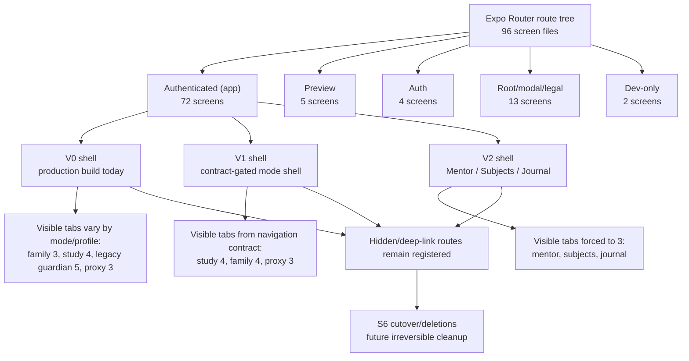
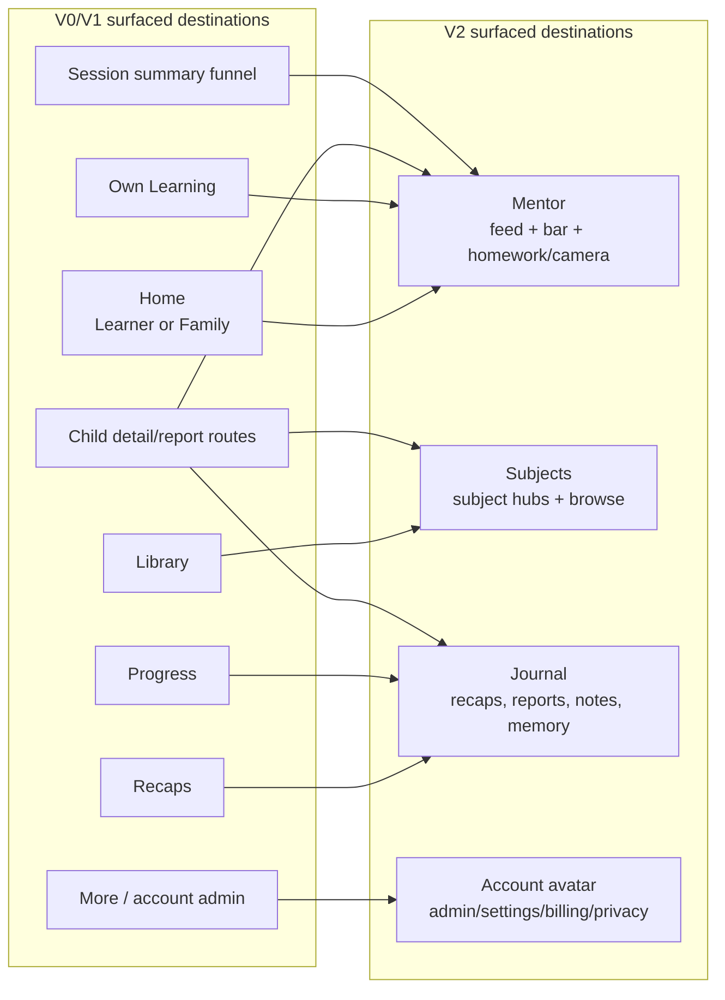

# Mobile Route Shell Map

> **STATUS (2026-07-14): SNAPSHOT STALE; REGENERATION REQUIRED.** The same counting rule now finds 100 route screens rather than 96, and the map predates newer link, billing, V2 shell, and support routing surfaces.

Snapshot: 2026-06-30. Source of truth is the Expo Router filesystem under
`apps/mobile/src/app/**`, plus the shell gates in
`apps/mobile/src/hooks/use-navigation-contract.ts`,
`apps/mobile/src/lib/navigation-contract.ts`,
`apps/mobile/src/lib/legacy-navigation-contract.ts`, and
`apps/mobile/src/app/(app)/_layout.tsx`.

## Count

Route screen files: **96**.

Counting rule:

- Include `.tsx` route screens under `apps/mobile/src/app`.
- Exclude co-located tests, `+html.tsx`, `_layout.tsx`, and files under
  underscore helper directories such as `_components`, `_hooks`, `_lib`,
  `_subscription`, and `_view-models`.
- Include `+not-found.tsx` as the not-found screen.
- Include `dev-only/*` because the route files are present in the route tree;
  exclude them mentally for production user-facing count.

Bucket count:

| Bucket | Count | Notes |
|---|---:|---|
| Authenticated `(app)` shell | 72 | Main signed-in route tree. |
| Root/modal/legal | 13 | Root redirect, profile gates, legal pages, summaries, transcripts, not-found. |
| Preview onboarding | 5 | Pre-signup trial/preview funnel. |
| Pre-auth `(auth)` | 4 | Welcome, sign-in/up, forgot password. |
| Dev-only | 2 | Seed helper routes. |
| **Total** | **96** | Registered screen files by the counting rule above. |

Production-facing count if dev-only and not-found are excluded: **93**.

## Shell Relationship

The physical routes are mostly **shared**. V0, V1, and V2 are shell/visibility
contracts over the same route tree, not three separate route trees.

Evidence anchors:

| Claim | Source |
|---|---|
| Mobile flags are build/env-derived | `apps/mobile/src/lib/feature-flags.ts:30-32` |
| Production build enables V0 only | `apps/mobile/eas.json:14` |
| Dev/preview builds enable V0, V1, and V2 | `apps/mobile/eas.json:25-27`, `apps/mobile/eas.json:43-45` |
| V2 shell forces `mentor`, `subjects`, `journal` | `apps/mobile/src/hooks/use-navigation-contract.ts:22`, `apps/mobile/src/hooks/use-navigation-contract.ts:185-194` |
| V0/V1 tab sets live in legacy and contract helpers | `apps/mobile/src/lib/legacy-navigation-contract.ts:4-31`, `apps/mobile/src/lib/navigation-contract.ts:151-168` |
| Hidden non-tab routes remain registered with `href: null` | `apps/mobile/src/app/(app)/_layout.tsx:87-100`, `apps/mobile/src/app/(app)/_layout.tsx:859-863` |
| S6 is not started and must not delete V0/V1 paths without product ruling | `docs/plans/v2-plan/2026-06-10-s6-cutover-deletions.md:11-22` |

## Version Map

| Shell | Flag state | Visible tabs | Route ownership |
|---|---|---|---|
| V0 production | `MODE_NAV_V0_ENABLED=true`, V1/V2 false in `eas.json` production | Family-capable owner: family mode `home`, `progress`, `more`; study mode `home`, `library`, `progress`, `more`. Other learner-style users get `home`, `library`, `progress`, `more`; legacy guardian fallback can expose `home`, `own-learning`, `library`, `progress`, `more`. | Shared `(app)` routes. Non-tab routes are registered and hidden from the tab bar. |
| V1 | `MODE_NAV_V1_ENABLED=true` and V2 false | Study: `home`, `library`, `progress`, `more`; family: `home`, `recaps`, `progress`, `more`; proxy: `home`, `library`, `progress`. | Shared `(app)` routes plus `canEnter` / `isSurfaced` route gates. Family child routes are gated to linked-child family shape. |
| V2 | `MODE_NAV_V2_ENABLED=true` | Always `mentor`, `subjects`, `journal`; scope/content changes by user relationship. | Shared `(app)` routes still exist. V2 overrides visible tabs, suppresses `ModeSwitcher`, adds scope/account chrome, and keeps legacy routes available as hidden/deep-link surfaces until S6. |
| S6 target | Product ruling pending; not started | V2 becomes default; V0/V1 shell paths removed. | Deletes or re-homes legacy surfaces after replacement parity: old tabs, `ModeSwitcher`, `More`, `Library` tab, `ParentHomeScreen`, child proxy routes, session-summary exit funnel, and old nav contracts. |

## Surface Collapse View

## Route Inventory

Routes below are URL paths after dropping route-group segments like `(app)` and
`(auth)`.

| Route | File |
|---|---|
| `/` | `index.tsx` |
| not-found fallback | `+not-found.tsx` |
| `/account` | `(app)/account/index.tsx` |
| `/child/[profileId]` | `(app)/child/[profileId]/index.tsx` |
| `/child/[profileId]/curriculum` | `(app)/child/[profileId]/curriculum.tsx` |
| `/child/[profileId]/mentor-memory` | `(app)/child/[profileId]/mentor-memory.tsx` |
| `/child/[profileId]/report/[reportId]` | `(app)/child/[profileId]/report/[reportId].tsx` |
| `/child/[profileId]/reports` | `(app)/child/[profileId]/reports.tsx` |
| `/child/[profileId]/session/[sessionId]` | `(app)/child/[profileId]/session/[sessionId].tsx` |
| `/child/[profileId]/subjects/[subjectId]` | `(app)/child/[profileId]/subjects/[subjectId].tsx` |
| `/child/[profileId]/topic/[topicId]` | `(app)/child/[profileId]/topic/[topicId].tsx` |
| `/child/[profileId]/weekly-report/[weeklyReportId]` | `(app)/child/[profileId]/weekly-report/[weeklyReportId].tsx` |
| `/consent` | `consent.tsx` |
| `/create-profile` | `create-profile.tsx` |
| `/create-subject` | `create-subject.tsx` |
| `/dashboard` | `(app)/dashboard.tsx` |
| `/delete-account` | `delete-account.tsx` |
| `/dev-only/seed-pending-redirect` | `dev-only/seed-pending-redirect.tsx` |
| `/dev-only/seed-preview-state` | `dev-only/seed-preview-state.tsx` |
| `/dictation` | `(app)/dictation/index.tsx` |
| `/dictation/complete` | `(app)/dictation/complete.tsx` |
| `/dictation/history` | `(app)/dictation/history.tsx` |
| `/dictation/playback` | `(app)/dictation/playback.tsx` |
| `/dictation/review` | `(app)/dictation/review.tsx` |
| `/dictation/text-preview` | `(app)/dictation/text-preview.tsx` |
| `/forgot-password` | `(auth)/forgot-password.tsx` |
| `/home` | `(app)/home.tsx` |
| `/homework/camera` | `(app)/homework/camera.tsx` |
| `/journal` | `(app)/journal/index.tsx` |
| `/library` | `(app)/library.tsx` |
| `/mentor` | `(app)/mentor.tsx` |
| `/mentor-memory` | `(app)/mentor-memory.tsx` |
| `/more` | `(app)/more/index.tsx` |
| `/more/accommodation` | `(app)/more/accommodation.tsx` |
| `/more/account` | `(app)/more/account.tsx` |
| `/more/celebrations` | `(app)/more/celebrations.tsx` |
| `/more/help` | `(app)/more/help.tsx` |
| `/more/notifications` | `(app)/more/notifications.tsx` |
| `/more/privacy` | `(app)/more/privacy.tsx` |
| `/more/security-sessions` | `(app)/more/security-sessions.tsx` |
| `/my-notes` | `(app)/my-notes/index.tsx` |
| `/my-notes/[kind]` | `(app)/my-notes/[kind].tsx` |
| `/onboarding` | `(app)/onboarding/index.tsx` |
| `/onboarding/language-setup` | `(app)/onboarding/language-setup.tsx` |
| `/onboarding/pronouns` | `(app)/onboarding/pronouns.tsx` |
| `/own-learning` | `(app)/own-learning.tsx` |
| `/pick-book/[subjectId]` | `(app)/pick-book/[subjectId].tsx` |
| `/practice` | `(app)/practice/index.tsx` |
| `/practice/assessment` | `(app)/practice/assessment/index.tsx` |
| `/practice/assessment-picker` | `(app)/practice/assessment-picker.tsx` |
| `/preview` | `preview/index.tsx` |
| `/preview/both` | `preview/both.tsx` |
| `/preview/intent` | `preview/intent.tsx` |
| `/preview/topic` | `preview/topic.tsx` |
| `/preview/value-prop` | `preview/value-prop.tsx` |
| `/privacy` | `privacy.tsx` |
| `/profiles` | `profiles.tsx` |
| `/progress` | `(app)/progress/index.tsx` |
| `/progress/[subjectId]` | `(app)/progress/[subjectId]/index.tsx` |
| `/progress/[subjectId]/sessions` | `(app)/progress/[subjectId]/sessions.tsx` |
| `/progress/milestones` | `(app)/progress/milestones.tsx` |
| `/progress/reports` | `(app)/progress/reports/index.tsx` |
| `/progress/reports/[reportId]` | `(app)/progress/reports/[reportId].tsx` |
| `/progress/saved` | `(app)/progress/saved.tsx` |
| `/progress/vocabulary` | `(app)/progress/vocabulary.tsx` |
| `/progress/weekly-report` | `(app)/progress/weekly-report/index.tsx` |
| `/progress/weekly-report/[weeklyReportId]` | `(app)/progress/weekly-report/[weeklyReportId].tsx` |
| `/quiz` | `(app)/quiz/index.tsx` |
| `/quiz/[roundId]` | `(app)/quiz/[roundId].tsx` |
| `/quiz/history` | `(app)/quiz/history.tsx` |
| `/quiz/launch` | `(app)/quiz/launch.tsx` |
| `/quiz/play` | `(app)/quiz/play.tsx` |
| `/quiz/results` | `(app)/quiz/results.tsx` |
| `/ready` | `ready.tsx` |
| `/recaps` | `(app)/recaps/index.tsx` |
| `/recaps/[recapId]` | `(app)/recaps/[recapId].tsx` |
| `/session` | `(app)/session/index.tsx` |
| `/session-summary/[sessionId]` | `session-summary/[sessionId].tsx` |
| `/session-transcript/[sessionId]` | `session-transcript/[sessionId].tsx` |
| `/shelf/[subjectId]` | `(app)/shelf/[subjectId]/index.tsx` |
| `/shelf/[subjectId]/book/[bookId]` | `(app)/shelf/[subjectId]/book/[bookId].tsx` |
| `/sign-in` | `(auth)/sign-in.tsx` |
| `/sign-up` | `(auth)/sign-up.tsx` |
| `/sso-callback` | `sso-callback.tsx` |
| `/subject-hub/[subjectId]` | `(app)/subject-hub/[subjectId]/index.tsx` |
| `/subject/[subjectId]` | `(app)/subject/[subjectId].tsx` |
| `/subjects` | `(app)/subjects.tsx` |
| `/subscription` | `(app)/subscription.tsx` |
| `/terms` | `terms.tsx` |
| `/topic` | `(app)/topic/index.tsx` |
| `/topic/[topicId]` | `(app)/topic/[topicId].tsx` |
| `/topic/recall-test` | `(app)/topic/recall-test.tsx` |
| `/topic/relearn` | `(app)/topic/relearn.tsx` |
| `/vocabulary` | `(app)/vocabulary/index.tsx` |
| `/vocabulary/[subjectId]` | `(app)/vocabulary/[subjectId].tsx` |
| `/welcome` | `(auth)/welcome.tsx` |
