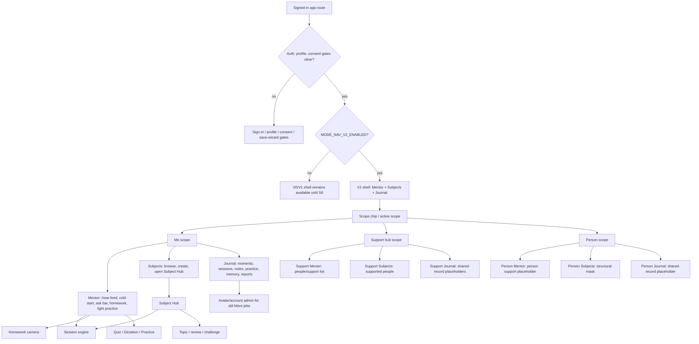
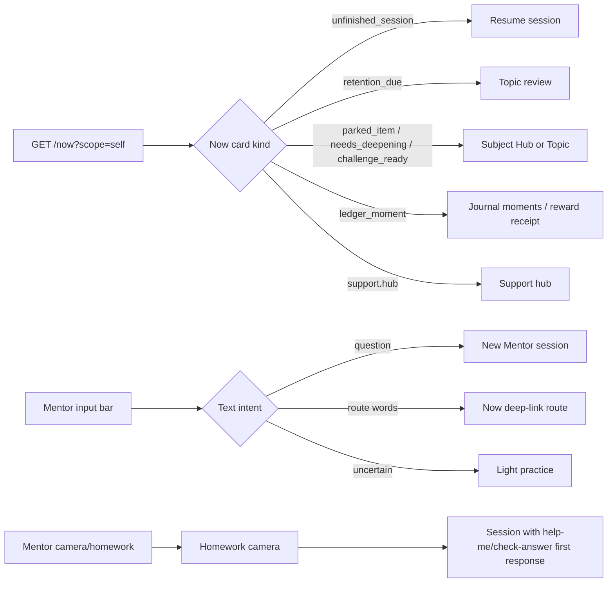

# Mentor-Is-The-App — Shell Redesign Spec

> **STATUS (last verified 2026-07-22): PARTIALLY SHIPPED THROUGH S5; S4
> CO-LEARNING DEFERRED; S6 NOT CLEARED.** Supporter cold-start (`e00baa7be`, PR
> #2400), supporter self-learning / Me-scope coexistence (`a394d68ae`, PR #2448),
> and the linking ceremony (`eccae5a9f`, PR #2080) are landed with code and tests.
> `a394d68ae` does not implement contextual supporter co-learning: **WI-1136 (S4:
> build supporter-co-learning service + CoLearningDoorway (T19))** remains
> Ready/Parked and is OUT/fast-follow in the MVP definition. This header does not
> decide whether that post-MVP deferral clears an S6 heir-completeness gate. S6
> remains explicitly OUT/deferred: `ModeSwitcher.tsx`,
> `legacy-navigation-contract.ts`, and V0/V1/V2 flag plumbing still exist, and no
> status correction authorizes their deletion. The live successor is
> `docs/plans/v2-plan/2026-06-10-s6-cutover-deletions.md`, whose product-ruling and
> explicit-human-confirmation gates remain mandatory.

**Status:** Partially shipped through S5; S4 co-learning deferred; S6 not cleared · original design 2026-06-09 · last verified 2026-07-22 · **Profile:** design
**Problem source:** ~90 screens exist; most users never discover more than ~10. This is a **discovery problem, not a navigation problem** — the goal is to serve users what they don't know exists, at the right time. **Evidence caveat:** the "<10 screens" figure is inferred from the [codebase atlas](../audit/2026-06-09-codebase-atlas/INDEX.md) (a code inventory), **not** from production usage telemetry — the app is pre-launch. The discovery thesis is a hypothesis to validate, not a measured fact; §11 treats S1–S2 as the bet that *buys* the evidence (S2→S3 evidence gate).
**Inputs:** [30-agent codebase atlas](../audit/2026-06-09-codebase-atlas/INDEX.md) · the one-screen second opinion and the interim DIRECTION-one-surface record (both fully dissolved into this spec — §2/§2.1/§3.1/§3.2/Annex D — and deleted 2026-06-10; the second opinion is recoverable from git history, the DIRECTION record was never committed and lives on only here) · ratified identity model (`_wip/identity-foundation/`, person-based, edge-scoped mentor) · [audience matrix](../audience-matrix.md)
**What this spec is:** the converged product direction from the 2026-06-09 brainstorm — vision, shell, scope model, privacy contract, backend primitives, strangle sequencing. It is **not** an implementation plan; each phase in §11 gets its own plan under `docs/plans/` before build.
**ADR obligations:** §12 lists the ADR-class decisions inside this spec. None is ratified until its `MMT-ADR` lands in lockstep with the canon change (per MMT-ADR-0000). Until then this document is direction, not law.

---

## 1. Vision

**The mentor is the app.** Today the app is ~90 rooms and the mentor lives in one of them. The redesign inverts this: the user's primary surface is the mentoring relationship, and screens exist only where a persistent surface genuinely beats a conversation moment. Target: ~90 screens → ~25 (the ~25 is **aspirational**, pending the per-phase collapse inventory in §11/Annex A — not a committed count).

Executed as a **strangle, not a greenfield rewrite**: every step in §11 is independently shippable, independently reversible, and independently valuable. The existing ~90 screens remain the deterministic floor until evidence retires them.

## 2. Principles (acceptance criteria, not vibes)

Each principle has a mechanism and a checkable form:

| # | Principle | Mechanism | Checkable as |
|---|---|---|---|
| P1 | **Mentor drives, user steers** — at every layer the mentor proposes, the user can always decline or redirect | `GET /now` ranked feed + ever-present input bar | Every proposal surface has a decline; the input bar is reachable from every scope |
| P2 | **Moments, not screens** — value arrives as a moment in the feed, not a destination to discover | Activity ledger rows → feed cards | No new feature ships as a destination screen if its value is a moment |
| P3 | **Park-and-return is the magic** — "I don't get this, later" is honored and comes back | Existing primitives (parking lot, due-queue, `needs_deepening_topics`) surfaced through the feed + conversation | Park-and-return scenarios in the eval harness (`pnpm eval:llm`) **before** the exit funnel is dissolved; one scenario asserts a parked item surfaces within its window **even while higher-priority cards compete for the ≤3 feed slots** (backed by the §8.1 overflow affordance, EU-3); deterministic backstop in `/now` ranking (§8.1) |
| P4 | **The mentor narrates the invisible machine** — the 58+ Inngest functions become visible as mentor activity | Activity ledger, **template-rendered by default; LLM only when genuinely personal** | Every ledger `templateKey` renders without an LLM call; LLM narration is an explicit opt-in per row kind |
| P5 | **One input, two fates** — the bar and the mentor chat are one field; typed/spoken text is intent-matched **locally first** (confident match → instant deterministic jump, zero LLM/quota/latency; miss → mentor turn). The LLM never stands between the user and their data or a feature | Local intent-matcher in front of the bar; jumps resolve through the closed route catalog (§8.1); safety tripwire + metering tax only the conversational path | Every capability keeps a deterministic tap-path; bar jumps cost no LLM call; intent classification falls back to buttons when uncertain |
| P6 | **Module discipline is a hard budget** — the feed is one anchor + ≤2 modules (the §8.1 ≤3 highlight ceiling), and **every module is an action, not an announcement** ("You were shaky on X" is banned; "Patch up X — 5 min" is a module). Non-actionable narration goes to the ledger, never the feed | `/now` ranking + overflow affordance (§8.1); ledger (§8.2) for narration | No card ships that cannot be phrased as a tappable next step; **the anchor is visually unique** — no module, *especially* the quota/upgrade module (the 402 path), ever shares its color, size, or focal position (for a minors product this is a compliance posture — vulnerable-consumer exploitation — not taste; Wizz's same-magenta "Add auto check-in" upsell is the canonical violation) |
| P7 | **Reward real learning, not compulsion** — motivation comes from earned learning receipts plus a true state change witnessed by someone who remembers (§2.1) | Earned private rewards (§2.1): reflection bonus, practice points/XP, quiz scores/personal bests, mastery counts, weekly momentum + the noticing loop: suggestion-loop closure, visible journey advancement, audible plan upgrades, momentary mentor-voiced celebration | Rewards are private, deterministic, learning-linked, and forgiving; no leaderboards, public comparison, guilt streaks, loss-framed pressure, or engineered-random reward schedules; every reward traces to a real learning event |

P2 and P4 share one mechanism (the ledger): P2 is what the user experiences, P4 is how the machine produces it.

P3 is the one principle the deterministic floor cannot protect — re-weaving lives in the conversation layer and degrades silently. Hence the eval-coverage gate and the deterministic backstop.

> **Superseded idea (recorded so it isn't re-proposed):** an earlier direction draft had the LLM ranking the feed ("LLM as mastermind"). §8.1's adversarially-reviewed ruling stands: **no LLM in the ranking path** — ranking is deterministic and template-rendered; the LLM's home is the teaching conversation. LLM-assisted ranking could only ever return as a later, separately-ruled rung.

### 2.1 Earned rewards + the noticing loop (P7 expanded) — amended 2026-06-13

The motivation model has two layers, and both are intentional:

1. **Earned learning receipts** — concrete, private, deterministic rewards for real learning behavior: reflection bonus, practice points/XP, quiz scores, personal bests, mastery counts, weekly progress deltas, and forgiving rhythm/momentum signals.
2. **The noticing loop** — the mentor explains what changed, why it matters, and how the learner's own choice changes the next plan.

This is **earned motivation**, not gamification-as-compulsion. The reward is allowed because it marks a true learning event; the mentor's noticing gives it meaning. Four noticing channels, all backed by data that already exists:

1. **The mentor closes its own suggestion loop with specific, memory-based noticing.** *"I asked you to patch up photosynthesis — you did, and it held. Last week you needed three hints; today, none."* Generic praise is worthless and kids smell it; specificity — proof someone was paying attention — is the kick. (The suggestion is in the activity ledger; the before/after is in retention data.)
2. **The journey moves under their finger.** Complete the suggested review and the anchor card's arc advances *at that moment* — the node lights, "review due" steps toward "mastered." Not points: the real learning object changing state. Competence made visible can't be hollow, because it isn't a token *about* the learning — it *is* the learning.
3. **Following advice audibly upgrades the plan.** *"Since that held, we can skip the easy run and go straight at the hard part Thursday."* Trust compounds visibly: doing what the mentor suggested makes the next suggestion better, and the learner is told why.
4. **An embodied micro-celebration — the mentor visibly delights.** Warmth comes from the *mentor*, not system confetti: confetti is the app paying you; the dance is someone being happy about you. One-shot, tied to the event. Interim carrier (no avatar exists): the conversation surface itself — the celebratory message *arrives joyfully* (bubble motion, a small warm burst around the mentor's words) in the same beat as the journey node lighting. **Ruled: a mentor character WILL be built** — it grows out of the logo, requirement *"real and feel alive"*; owner: Zuzana, as a separate deliberate brand project, never a side effect of a feature. Two constraints ride into that brand work: (a) **"alive" means truth-caused** — the character's delight and reactions must be caused by real learner events; randomized idle cuteness pretending to be reaction kills "real"; (b) **the character never performs guilt, sadness, or disappointment to compel behavior** (the Duolingo owl's dark side = the minors-manipulation floor, DSA Art 25/28 / AADC). It may celebrate, think, wonder, wait — it does not sulk.

**Credit flows to the learner, always.** Praise attributes the win to the learner's **own choice** — *"you decided to tackle it today; that was your call, and it paid off"* — never to obedience ("good job doing what I said"). The mentor celebrates *with*, never *at*, and gives the credit away every time; the learner should leave feeling "I make good choices," not "I follow instructions well."

**Governing law:** rewards are **earned, private, deterministic, learning-linked, and forgiving**. Allowed: XP/practice points, reflection bonuses, personal bests, quiz scores, mastery counts, concrete weekly deltas, and rhythm/momentum indicators. Forbidden: leaderboards, public comparison, guilt copy, "you lost your streak" pressure, randomized variable-ratio rewards, reward prompts that mimic paywall urgency, or any reward whose trigger is not a real learning event. Truth-based feedback is pedagogy; reward schedules engineered for compulsion are not.

**Supersessions amended:** the calm **"on track" / momentum signal replaces pressure-style streak display** on the new shell, but streak/rhythm data may still feed forgiving progress copy. The **XP/practice-points system is retained and re-homed under the earned-reward law**, not killed. **Correction (2026-06-10, code-verified; product amendment 2026-06-13):** XP is live and UI-wired (Practice-hub `totalXp`, session-summary reflection-bonus copy, topic-status readers; see the v2-plan `01-codebase-anchors.md` §6). The old "kill XP" ruling is superseded. The new rule is: keep rewards where they support learning, remove only coercive or confusing reward presentation, and never let rewards become the Mentor feed's main object. The shipped V0/V1 reward UI must not be torn out before its host surfaces retire; S6 re-homes or retires each reader only after its V2 heir preserves the learning value (reflection bonus, quiz rewards, concrete progress). **Dial-independence:** the assertiveness dial (§13.7) changes how firmly the mentor *proposes*; rewards and warmth remain available in every dial state — strict mode never withholds warmth and never turns rewards into pressure.

### 2.2 Lost V1 learning flows to carry forward — amended 2026-06-13

The V2 shell may remove clutter, but it must not lose already-built learning and retention loops by omission. These are explicit carry-forward requirements:

1. **Learner-written reflection + 1.5x bonus survives the exit-funnel dissolve.** V1's "Your Words" prompt asks the learner to write what they learned and applies the 1.5x reflection bonus. V2's wrap-up may be conversational, but the last turn must still ask the learner to explain the session in their own words. The mentor can recap first; the learner must actively produce the summary before the reflection reward is applied. The learner-authored text is saved as the Session Summary / mentor-memory signal, with the reward framed as an earned receipt: *"Reflection bonus earned; I can use this next time because you said it in your own words."*
2. **Standalone quiz games remain discoverable.** Capitals and Guess Who are already-built engagement content. They do not become permanent Mentor-feed clutter, but V2 must expose a "something lighter?" / "light practice" affordance from the bar, from relevant Subjects/Practice context, and as a low-pressure feed card when the system has a fatigue/re-entry signal. Quiz scores, personal bests, and practice points remain private earned rewards.
3. **Parent/supporter self-learning is prominent, not a consolation prize.** A supporter who has not started studying still defaults to the Support hub, but the hub must include a persistent, positive "learn something yourself" doorway. Once they start, the Me scope is equal to Support hub/person scopes and defaults by last-active or user preference (§4.2), not by a hardwired supporter default. In addition, person-scope Subjects must expose a contextual co-learning doorway on the supportee's subject/topic structure — "learn this yourself" — so an engaged child's active learning can motivate the adult to study without waiting for the child to stall.
4. **Self-directed users get an escape hatch.** The ≤3-card feed guides; it must not confine. Subjects provides "show me all my learning structure"; Journal provides "show me everything I saved"; both are scannable browse surfaces, not search-only fallback.
5. **Concrete progress numbers survive.** V2 does not restore a full stats dashboard on the Mentor feed, but it must retain compact, useful numbers in the right places: "4 topics mastered, +2 this week", "3 reviews due", practice points earned, quiz personal bests, and supporter-facing weekly deltas. Numbers live in Subject/Journal/Progress-style contexts and small feed receipts, not as the entire home.

## 3. The shell — three tabs, every scope, no exceptions

Everyone sees the same three tabs. Tab *shape* never varies by role, age, mode, or ownership; only scope *content* varies.

| Tab | Job | Content |
|---|---|---|
| **Mentor** | Home. The conversation spine. | The `/now` card stack (1–3 ranked next actions, declinable) · moment cards from the activity ledger · the ever-present input bar with **camera button and Homework quick-chip** |
| **Subjects** | One hub per subject. | Per subject: "Next up" block, chapter sections, topic mastery, subject-scoped notes (§5) |
| **Journal** | The paper trail of the relationship. | Recaps · **My Reports** (my weekly/monthly progress reports) · notes (cross-subject view) · mentor memory ("what the mentor knows about me") — per-scope semantics in §6.3 |

**Account/admin lives behind the avatar (top corner), never in a tab:** settings, language, billing, security, privacy/GDPR, add-child/linking admin. Owner gating applies inside the avatar sheet. Rationale: nobody browses admin; it's an errand, and the avatar→account pattern is a universal convention with zero discovery cost. This dissolves today's "More" tab and the You-tab hodgepodge.

**Two entry channels on the Mentor tab, by information origin:**

- **The feed** proposes *app-known* work (due cards, unfinished sessions, parked items, challenge-readiness, ledger moments). Mentor drives.
- **The bar (+ camera + Homework chip)** receives *world-known* work the app cannot know about — above all **homework** (a first-class session mode today: photo upload, `help_me` vs `check_answer`, homework-state sync, dictation-homework). User drives. Homework is the most frequent weekday reason a school kid opens the app and gets a permanent one-tap affordance, never discoverability-through-typing.

**App-open lands on the Mentor tab as a card feed** (deterministic, instant), not auto-opened into chat. This rules the second-opinion doc's open fork as **option A** — the proposal is glanceable and the conversation is opt-in per session, preserving the deterministic floor.

**Layout floor for the homework affordance (EU-5).** Option A foregrounds *app-proposed* work, but homework is the homework-kid's actual reason for opening the app (§4.1) — so the input bar's **camera + Homework chip must be reachable without scrolling past the feed** on app-open (pinned input bar; on a school-day / weekday-evening heuristic the Homework chip may surface above the card stack). The glanceable proposal and one-tap homework coexist; the feed must never bury the bar beneath the app's own agenda.

### 3.1 Cold start — learner (ruled 2026-06-10)

Day one, the **cold-start card takes the anchor slot** — one container (the Wizz one-card-one-live-object pattern) holding the input bar and three example chips as a single unit. With zero state the conversation *is* the best next action; the anchor slot is never empty and never shows a fake proposal. **Self-destruction is keyed to *first real state created*** (first subject or first completed exchange) — **not** to first app-open and not to "zero state": the kid who opens, stares, and closes gets the same warm elicitation tomorrow; once real state exists the card dies forever and proposals own the slot (an established learner who later archives everything is *not* re-greeted as a newbie — they have history, and the feed speaks to emptiness in its own voice).

```
        Hi — what do you want to work on?

  ┌───────────────────────────────────────────┐
  │  ┌─────────────────────────────────────┐  │
  │  │ 🎤  Tell me anything…           [→] │  │
  │  └─────────────────────────────────────┘  │
  │   Not sure? Try one of these — or just    │
  │   type:                                   │
  │   [ 📷 Homework help ]                    │
  │   [ ✨ Learn something ]                  │
  │   [ 💬 Ask a question ]                   │
  └───────────────────────────────────────────┘
    one card = the anchor; input and chips
    visually equal weight inside it
```

Rules (inline teaching, never a modal/coach-mark wall):

1. **One card, equal weight inside — permitted *only because* chips fill, never fire.** Tapping a chip types its words into the input and lights the send arrow; the kid completes the send themselves — type-then-send enacted with training wheels. Under fill-semantics the chips are pre-typed phrases of the *one* control (autocomplete made visible), so equal size is honest. If chips ever became direct navigation, equal weight would silently turn the card into a four-way first-screen choice — the Duolingo failure this direction is built on. **The two decisions are coupled; never decouple them.**
2. One caption: *"Tell me anything — homework, a question, or something you want to learn. I'll take you there."*
3. The chips sit under an explicit *"…or just type"* — so chips read as **examples**, not as the boundary of what's possible.
4. The chips **persist until the cold-start state dies** (first real state) — not a one-shot splash that vanishes on first tap or first keystroke.
5. **Voice input everywhere** — the mic sits on this input and on every input in the product (typing is a barrier for exactly the audience the elicitation serves). Compliance invariant rides along: **voice is transcription-only — never tone/emotion analysis** (AI Act Art 5(1)(f) posture).

**Homework path (the fill-don't-fire stress test).** "📷 Homework help" fills and sends like the others; the mentor's reply is **instant and dual-path**: *"Sure thing — snap a picture of it 📷. Or if you'd rather just ask, tell me about it here."* — camera as a big tappable affordance inside the reply, chat continuing underneath, so the kid taps the camera *or* keeps talking. No conversational preamble before the camera is offered ("what subject is it?" first = the failure mode). **Latency/directness here is an acceptance criterion, not styling**: slow, this is a worse homework app than a direct camera button would have been; fast, it *is* the thesis enacted — say what you need, the mentor takes you there.

**Teaching durability (one demo is not assumed sufficient) — three ambient reinforcements, none modal:**

1. **Chips fill, cards fire — forever.** Proposal cards (the anchor) stay one-tap direct actions — fill-friction there would be wrong. But any small suggestion chip near the input, on any day, fills — later with state-aware content (*"Review photosynthesis"* appearing as words in the box). The mechanic recurs for the life of the product; the kid sees their own situation phrased as something *they could have typed* every week, not once.
2. **The placeholder rotates examples, including navigational ones** (*"Try: show my progress"*) — the breadth lesson, the only part chat doesn't teach by itself: after one session the kid knows they can type *to the mentor*; the placeholder teaches that the box also *goes places*.
3. **The mentor says it once, in character, at the natural moment** — end of the first session: *"next time, just tell me what you need — anything."* Conversational, never a coach-mark.

**Pre-committed tripwire (feeds the §11 S2 evidence gate):** the bet is named — *relationship-formation over job-completion at first touch* (a blank-box-first screen, against the Duolingo choice-hurts evidence). Measure cold-start activation: time-to-first-action + freeze-bounce rate (opened, no action, closed). If 13-year-olds stall at the box, the correction is **pre-agreed and limited**: an emphasis flip (chips become the visual lead, typing stays the escape) — not a redesign.

Onboarding is thereby the product itself: the first subject is created through the first conversation, not a setup form.

**Post-auth / consent handoff (no-surprises dossier GAP 1, folded 2026-06-13).** After sign-up, profile creation, or a consent gate clears, V2 does **not** insert a welcome tour, setup wizard, subject picker, or "choose your path" screen. The handoff is one confirmation beat at most, then the learner lands directly on the Mentor tab with the cold-start card in the anchor slot. The first actionable object after the legal/auth gate is the mentor input card above, not another onboarding surface. This closes the gap between "consent done" and "what does the learner see first."

**Homework camera round-trip in V2 terms (no-surprises dossier GAP 2, folded 2026-06-13).** The dedicated homework camera remains the capture surface, but the V2 experience is described as a single conversation thread: the camera is opened from the mentor reply or pinned bar, the captured image lands back in the session as the learner's image bubble, and the mentor's first response offers the two existing homework intents as buttons: **help me solve this** / **check my answer**. The learner never feels handed from Mentor into a separate maze of homework screens. OCR/upload/retry internals stay owned by the existing homework flow; V2 owns the thread framing, return target, and "same conversation" continuity.

**First-session wrap-up (no-surprises dossier GAP 3, folded 2026-06-13).** The first session ends in the conversation, not in a separate three-screen exit funnel. The final mentor turn contains: an honest one-line recap, credit attributed to the learner's own choice, the once-only teaching line (*"next time, just tell me what you need — anything"*), the learner-written **Your Words** prompt required by §2.2, the 1.5x reflection receipt when they write it, and the small truth-caused celebration from §2.1. This is the heir that must exist before S6 deletes `session-summary/[sessionId].tsx`.

### 3.2 Cold start — supporter (ruled 2026-06-10)

Branch on the child's **account state, not just type** — the managed/credentialized tier distinction (§6.2) is a real, deterministic fact the cold start reads for free: no LLM, no topology guessing, fully inside the deterministic floor. Three variants, each rendering **one anchor action**:

| Child's account state | What it means | Supporter cold-start anchor |
|---|---|---|
| **Managed** | Profile the supporter created under their own account — no separate login, this device, profile-switch; consent granted inline at creation, never pending | **Handoff — a standing state, not an expiring command.** "Emma's all set — whenever she's ready, hand her the phone" (tap switches to Emma's learner scope; she lands on her own learner cold start, §3.1). Phrased as standing so the parent setting up while the child is at school hits no dead-end anchor; the card persists until Emma's first session. Remote-kickstart is meaningless — the child uses this device. |
| **Credentialized · consent pending** | Child self-registered with own login/device; waiting on the parent's GDPR/COPPA approval | **Approve.** "Emma's waiting — approve her account so she can start →" — the legally-blocking action outranks everything and must be the anchor. (Fixes the atlas finding that consent actions hide behind buried screens.) |
| **Credentialized · granted · no activity** | Own login/device, approved, hasn't started | **Remote kickstart + reassurance.** "Help Emma get started" + the honest line "Her recaps and progress appear here once she begins." **Kickstart never creates state in the child's account**: it sends a suggestion/encouragement into the kid's own feed, which the kid can act on or ignore — a parent-built subject in a teen's account would be the same agency violation Handoff guards against, one tier up. |

Once a credentialized child has activity it is no longer cold start — the warm hub feed takes over. Rules baked in:

- **No topology bet.** Don't pick a dominant device topology and optimize for it — detect the account state and serve the matching variant.
- **Still one anchor per child** — the branching is server-side and invisible; the supporter always sees a single clear action (the P6 budget holds). The complexity lives in the selector, not the surface.
- **Handoff hands off cleanly.** The managed child getting the phone gets their *own* learner elicitation, never a journey the parent pre-built — pre-picking the kid's subject quietly removes the learner agency the whole direction protects. (Optional supporter-side secondary: "…or set up her first subject first" — subordinate, never the anchor.)
- **The branch is per child, not per supporter.** A supporter can have a managed 9-year-old and a credentialized 15-year-old; the hub composes one card per child, each with its state-appropriate action — these cards are just the empty-state instances of the hub's per-person modules, under the §8.1 per-edge fairness rule.
- *Launch note:* per §6.2, only the credentialized tier is live at the 13+ launch, so **Approve** and **Kickstart** are the day-one variants; **Handoff** ships with managed-tier activation.

**Variant zero — the supporter with no child yet** (the true day-one screen; this is §4.2 lifecycle state 1 made concrete). One anchor: add your child. Trust copy is **positive-only** — say what they get, never what they don't:

```
        Hi — who are you supporting?

  ┌───────────────────────────────────────────┐
  │            [ + Add my child ]             │   ← the anchor
  │                                           │
  │  You'll see her recaps, progress          │
  │  and wins. And she always knows           │
  │  what you see.                            │
  └───────────────────────────────────────────┘
```

The artifact wall ("never her chats/notes") is deliberately **not** stated at the door — the full visibility contract, wall included, is disclosed in the **linking ceremony** (§6.2), where informed consent actually lives. Door sells, ceremony informs; nothing hidden, just sequenced.

- **Parent-language tier dispatch.** Inside the add-child flow, one plain question does the managed/credentialized branch: *"Does Emma use her own phone and login?"* → yes → invite (→ linking ceremony → consent-pending card); no → create a profile on this device (managed path; ships with managed-tier activation). The parent never sees the words "managed" or "credentialized."
- **One morphing card per child, not three screens** — the Wizz flight-card lifecycle: the same live object advances `invite sent → "Emma's waiting — review & approve" → "Help Emma get started" → warm feed (recaps)`. One card per child, one anchor on it, the anchor morphing with state.
- **Approve reads as *review & approve*.** Urgency lives on the card ("Emma's waiting" — it genuinely blocks her); deliberateness lives in the flow: the tap lands in the linking ceremony (both sides shown the same contract), never a one-tap consent.
- **Kickstart composes with the chips law (P5/§15.15).** "Help Emma get started" opens a short composer — pick/write/speak an encouragement, optionally attach a subject suggestion — delivered into **Emma's cold-start card as one more fillable chip**: `[ 💛 Zuzana suggested: French ]`, labeled with the **supporter's display name as established at the linking ceremony** (supporters are relationship-agnostic: parent, grandparent, coach — never assume "Mum"). Tapped, it types *"I want to learn French"* into **her** input for **her** to send: visible, warm, entirely hers to ignore. Kickstart creates a **chip, not a subject**. Existing nudge rate limits (4/24h, quiet hours) apply unchanged.
- **Ghost preview in the empty state.** Alongside the reassurance line, one greyed sample recap card clearly labeled *"Example — this is what you'll see after her first session"* — teaches the value proposition at the moment the parent wonders what they signed up for, without faking data.
- **Relation captured at linking (supporter-onboarding TO-DO).** The add-child/linking flow asks one more question: *"What's your relation to Emma?"* — **Parent / Sibling / Teacher / Other**. Stored as structured metadata **per-edge** (one person can be parent to one child and teacher to another; the identity-foundation edge model carries this for free). The child sees the claimed relation at the linking ceremony (*"Zuzana wants to support you as your teacher"*), which is what validates it. Uses: warmer kid-side rendering (*"Zuzana — your teacher — suggested: French"*), mentor context, disambiguation among several supporters; display name is the carrier for **Other** and the universal fallback. **Not wired to permissions or reporting tiers** — capture now; gating by relation would be a separate ruled decision.

**Stale-idle arc — the card de-escalates; the screen's energy redirects to the supporter.** When a credentialized child stays inactive, escalation would route pressure through the parent onto the kid and poison the relationship the product depends on. Instead, by **visit count** in the granted-idle state:

- **Visit 2–3 — status honesty, Wizz-style.** *"Your encouragement reached Emma. She hasn't started yet — most teens start within the first week, usually when homework gets hard."* Honest, expectation-setting, quietly coaching the parent on the realistic trigger. The nudge button is **not** re-armed as the anchor.
- **Visit ~3 — "Start together."** *"Next time you're with her, open her first session side by side."* Converts the stalled remote kickstart into the Handoff pattern's co-presence move — the only honest escalation available.
- **Visit 4 — "Try the learning experience yourself — and help Emma get on board."** The parent's own trial framed as helping Emma: they experience exactly what she'll see and become a credible advocate.
- **Visit 5+ — keep redirecting energy toward the supporter's own learning.** *"Keep learning yourself while Emma finds her moment."* Their first session activates their **Me scope** (§4.2 state 3) and converts them into the adult self-directed learner persona (§4.1). This is not the only place adult learning appears: the Support hub carries a persistent, positive "learn something yourself" doorway from day one.
- **Throughout and after — the quiet promise.** *"We'll let you know the moment Emma starts"* — and a push genuinely fires on her first session, so the parent doesn't need to keep checking an empty app. The ghost preview stays.
- **Granularity is binary.** The parent sees only "hasn't started yet" — never "opened the app and bounced." Peek-level telemetry about a kid who hasn't entered the relationship reads as surveillance, invites "I saw you opened it!" confrontations, and brushes the chilling effect the §6 contract exists to prevent. The system may use the distinction **silently** to pick which guidance to show; it is never reported.
- **Never:** guilt copy, streak-style pressure, an escalating nudge ladder, or the card growing louder with age.

## 4. Scope model — the chip

**A scope is not a person's world — it is a relationship lens.** Me scope = my relationship with my own learning. Emma scope = my relationship with *Emma's* learning. Its **structural layer** (subjects, mastery, activity, next-up) is read **live from Emma's data through a server-enforced permission mask** — not a separate edge-replicated copy — and **never her artifacts** (notes, Journal, mentor memory, chats), for which **no supporter read path exists on any edge**. The phrase "never from Emma's private space" scopes precisely to those artifacts, not to the grades layer (this resolves the §4↔§6.3 tension; see §6.1). Scope-switching is never impersonation and never proxy. Same chip, same three tabs in every scope; only the lens changes.

### 4.1 Two account shapes, one shell

| Shape | Chip | Default scope |
|---|---|---|
| **Learner** (solo **adult self-directed learner**, solo child, or credentialized teen) | No chip (single implicit Me) | Me |
| **Supporter** | `[ Support hub ] [ <person> ]… [ Me — after first real self-learning state ]` | Support hub |

Today's matrix — guardian/learner tab shapes × V0/V1 × proxy mode × isOwner branching — collapses into chip scopes. "Supporter" is role-generic (parent, grandparent, any adult with an edge to a "charge" in the identity canon's terms); nothing in the model assumes "family".

**The adult self-directed learner is a first-class persona, not an afterthought.** A motivated adult (language, exam/cert prep, upskilling) is the segment with the most standalone and revenue value, and is served *worst* by today's family/guardian-shaped matrix (they get a degraded family layout). In this model they are simply a Learner shape, no chip, default Me — full Mentor/Subjects/Journal. This persona is the **primary justification for keeping Subjects and Journal as full, persistent tabs** (§3): adults navigate to subjects deliberately and revisit their own notes/Journal as a matter of course. The homework-kid persona naturally collapses into Mentor-tab-only usage and harmlessly ignores the other two tabs — so one shell serves both without forcing either (this is the resolved one-surface-vs-three-tab fork; see §15.11).

### 4.2 Supporter lifecycle (three states)

1. **Signed up, nothing linked.** Chip shows Support hub only; the hub's content *is* the linking flow ("who are you supporting?" → invite/link). No Me scope, no empty learner furniture.
2. **Linked.** Hub + one scope per linked person. Hub = everything *addressed to the supporter*; person scopes = the relationship lens on each person (§6). The hub never duplicates a person's world; a person's scope never contains things addressed to the supporter.
3. **Supporter starts studying.** A **Me** scope appears in the chip — full learner experience. **Default scope = last-active scope (or a user-set preference), not a hardwired Support-hub default (EU-4).** The "supporter who only dabbles" still lands in the hub because that is where they last were; the **adult who is both a serious learner and a supporter** (the §4.1 high-value persona) lands in Me without paying a scope-switch tax on their own studying at every app-open. If they stop studying, Me persists (their Journal record remains) but goes quiet.

**Ruled: a supporter has no personal learner space until they actively start studying — but the doorway is first-class.** "Parent is a learner too by default" was rejected as behaviorally false — most supporters won't study, and a default scope with empty learner furniture is the design apologizing for itself. The correction is not to bury adult learning: every Support hub carries a persistent, positive "learn something yourself" affordance, separate from child-stalled fallback copy. It activates Me scope on first real learner state and becomes an equal scope thereafter.

**Contextual co-learning is the connection-motivated doorway.** The persistent self-learning door is broad; the higher-conversion parent path is tied to the supportee's visible structure. In a person scope, a subject/topic may offer **"learn this yourself"**. It starts a real Me-scope learning session for the supporter on the same curriculum topic, using only shared structural curriculum fields (title/description/book/chapter/mastery state) and never the supportee's artifacts (notes, Journal, mentor memory, chats, answers). If topic rows are owner-scoped rather than globally shared, the server clones only the structural topic into the supporter's own Me scope with provenance (`sourceSupporteePersonId`, `sourceTopicId`, `sourceEdgeId`) and writes nothing to the supportee's learning space. After the supporter completes the topic, any child-facing payoff is opt-in, dismissible, and teen-safe: a fillable chip such as "Zuzana learned this too — want to explain it back?" may be offered through the existing Kickstart/nudge rail, never as "your parent is quizzing you" and never auto-sent. The more playful "surprise her / question game" variant is deferred with the younger-child tier; the 13+ launch version is gentle, supporter-name labeled, rate-limited, and under the same chips-law fill-not-fire invariant.

Keep hub and person scopes separate even with a single linked person — the hub answers "what should I, the supporter, know or do?" (addressed to me); the person scope answers "what is my relationship with Emma's learning?". Collapsing them re-creates parent-flavored re-renderings that drift.

**Cross-scope attention in Me scope — a pointer, not a duplicate.** The dual-role adult (serious learner + supporter) who lands in Me by last-active default (state 3 above) must not *miss* a struggling child by virtue of studying diligently. Reconciliation: the Me feed may carry one compact **pointer module** — *"1 thing needs you in the Support hub"* — under the standard P6 budget, linking into the hub. It points, never duplicates, so the hub/Me separation holds while the signal can't be starved. (This resolves the earlier direction-draft idea of blending family-attention items directly into the Me feed — superseded by the hub model + pointer.)

**Link revocation is a fourth lifecycle state (EU-7).** Because a credentialized person owns their own rights (§6.2), they can **end sharing** at any time — and today the *only* revocation path in code is guardian-initiated for managed under-13 accounts (`apps/api/src/inngest/functions/consent-revocation.ts`), so kid-initiated revocation is net-new for the 13+ tier. When a supportee revokes: the supporter sees a plain hub card ("Emma ended sharing") — **never a silent disappearance** — the person scope retires from the chip, and an S5-specced grace/notice window governs the handoff. The supportee-side flow (kid-initiated unlink, confirmation, exactly what the supporter will be told) is an S5 deliverable and a **safety/autonomy** surface, not merely an admin action. Managed-tier revocation stays guardian-initiated per the existing consent-revocation flow.

## 5. The Subjects tab — hub anatomy

One hub per subject, merging today's shelf + `progress/[subjectId]` + scattered per-subject surfaces. **Max depth 2, with structure** (the existing data model is subject → books/chapters → topics; the hub keeps it):

1. **"Next up" block on top** — the computed continuation (same source as the `/now` card), so a learner who just wants to keep going never reads the tree.
2. **Chapter sections below** — collapsible sections on the hub screen (not separate screens), topics inside with mastery state and a compact chapter progress line such as "4 / 7 mastered".
3. **Topic detail = sheet**, slid up over the hub, with the topic description, mastery state, notes, and actions.
4. Subject-scoped notes live on the hub; the cross-subject notes view lives in Journal. **One store, two origins (my notes vs saved-from-mentor, authorship always visible), two views.** The Journal cross-subject view is **browsable, not search-only (EU-6)** — a scannable "everything I've saved" surface — since the Library tab's demotion to search-first (§7) otherwise drops the *browse* mode the adult self-directed learner relies on (§4.1). Search serves "I know what I want"; it does not serve "show me everything I have."
5. If a subject grows past ~10 chapters / ~50 topics, the hub gains a search/filter line; the structure holds.
6. The hub carries compact quantified progress, not a stats dashboard: mastered / learning / total topics, due reviews, recent practice points where relevant, and weekly delta copy when available. These numbers are earned learning receipts, not public scoreboard elements.

The Mentor-feed card never lists topics — it shows exactly one next action. Twenty physics topics never float anywhere.

## 6. Privacy & visibility — the supporter contract

The brainstorm's strongest ruling: **the supportee must never feel a supporter poking around their space** — even with chats walled off, browsable access to notes/journal/memory makes the kid perform instead of confess, and confession of confusion is the raw material of the product.

### 6.1 The contract

- **Structural data ("the grades layer") — visible to supporters:** subjects, mastery per chapter, streaks, activity level, next-up. Kids already live under this contract at school. **Mechanism (resolves the §4↔§6.3 tension):** the supporter scope reads this layer **live from the supportee's own tables through a server-enforced permission mask** — the same hub component, server-filtered to the structural columns. It is *not* an edge-replicated shadow copy the mentor maintains (no duplication, no sync burden). The "edge-data the mentor maintains" framing applies to *interpretation/reports* (below), not to the structural read.
- **Artifacts — never reachable in everyday UI, on any edge:** the supportee's notes, Journal content, mentor memory, chat transcripts. Not "hidden by default" — **no read path exists** on any supporter edge on which these render. This is the only sense in which "never from the supportee's private space" holds; the grades layer above *is* read from their space, masked.
- **The mentor is the channel — with a release valve (EU-2):** the supporter's input bar in a person scope talks to the *supporter's own mentor* about that person ("how is Emma really doing in math?") and gets a curated, pedagogically-relevant answer from her data — interpretation, not raw exhaust. Because the supporter has *no* path to the underlying work, a supporter who distrusts the curated read (mentor keeps saying "fine," the grades say otherwise) must have an **appeal affordance**: a deliberate, logged "request a detailed attention report" that still respects the artifact wall — richer *structural* detail plus a fuller mentor write-up, never raw notes/chats/memory. Without it, "no browse" reads as "no recourse," which is a churn/trust failure. The appeal affordance is an S5 acceptance criterion.
- **Two-way transparency — same facts, side-appropriate rendering:** everything the mentor reports to a supporter about a person, that person can also see. The shared record is the **same underlying facts** read from two sides (§6.3), **rendered for each audience** — the supporter sees the advisor-framed report; the supportee sees the same facts in their own voice/framing. It is *not* necessarily byte-identical text (adult-framed curation should not be shown verbatim to a child), but **nothing is reported about you that you cannot see the substance of**. The render-equivalence guarantee is an S5 acceptance criterion.
- **The sealed-confession class — reportability is narrower than the artifact wall (EU-1):** the artifact wall and two-way transparency protect *browsing*, but they do not by themselves stop the confession space from being chilled. If the mentor narrates the supportee's emotional disclosures upward ("Emma is anxious about the exam / avoiding the topic"), the supportee — *by the transparency guarantee itself* — sees that what they confided became a supporter-facing report, and learns that confiding in the mentor is a channel to their supporter. That re-creates the perform-don't-confess behavior the whole contract exists to prevent, caused by the transparency mechanism, not by browsing. So the contract draws a line *inside* what the mentor knows: **mastery, effort, and observable engagement are reportable; the supportee's confided affect and self-doubt (confession-of-confusion) are never reported in the first place** — not merely walled from browsing. Two-way transparency then means "everything *reported* is mirrorable," over a deliberately narrowed reportable set. This **non-reportable class is an S5 acceptance criterion** alongside render-equivalence, enforced server-side at report-generation time.
- **Safety escalations cross every wall**, regardless of account type or contract — the existing tripwire design (escalate-not-refuse). Kid-visible contract wording: "your space is private, *unless you're not safe*."
- **Rights-exercise ≠ everyday visibility:** a guardian's GDPR rights on a managed account (export, deletion) live in the admin layer (avatar → privacy), deliberate and logged — never as ambient daily browsing.

### 6.2 Account types carry the visibility tier

Two account types replace any age-banded permission matrix:

> **Launch-audience note:** the **managed** tier exists for under-13 users, but the ratified launch floor is **13+** (`docs/canon/identity/prd.md`; memory `project_age_floor_launch_13plus_defer_11plus` — block US under-13, serve non-US 10–12 later under lighter GDPR). So at launch the **only live tier is credentialized**; managed-tier *activation* is gated on the separate 10–12 audience decision (§13.5), even though S5 builds the tier mechanism. Don't read "two account types" as "both live day one."

| | **Managed** (under-13: managed only; **activation deferred — see launch-audience note**) | **Credentialized** (13+, own login; **the only live tier at launch**) |
|---|---|---|
| Created by | Supporter; supporter holds consent + full admin | The person themselves |
| Contract event | Account creation *is* the ceremony | **Linking ceremony** — both sides see and accept the same visibility contract |
| Reporting tier | Richer default (fuller recaps, more granular attention items) | Strict edge model as in §6.1 |
| Artifacts (notes/chats/memory) | Still not in everyday UI (pedagogy is age-independent) | Never |
| Rights | Guardian exercises via admin layer | Person's own |

**Graduation** (managed → credentialized) is a designed product moment, not just an account migration: the visibility contract visibly upgrades, the kid is told exactly what their supporter sees from now on, and the mentor narrates it ("this is now your own space") — a natural activity-ledger moment.

### 6.3 What the three tabs render per scope

| Tab | Learner Me scope | Supporter — Support hub | Supporter — person scope (e.g. Emma) |
|---|---|---|---|
| **Mentor** | My feed (`/now` + moments) + my bar | Support cockpit: aggregated feed across all my people (attention items, milestones, family-wide recap), one V1-family-home-derived card per person, conversation starters, co-learning prompts, and a bar to my mentor as advisor | *My feed about Emma* (attention items, milestones for her) + bar to *my* mentor *about* her — never her conversations |
| **Subjects** | My hubs, full | Cross-person subject overview grouped by person (subject, health, chapter progress, last activity, conversation/co-learning affordances) — rows deep-link into person scopes | Emma's hubs in the **structural rendering** — same hub component, **server-masked to structural columns** (read live from her tables per §6.1): chapters, mastery, activity, next-up; no notes, no artifacts |
| **Journal** | My recaps, **My Reports** (my weekly/monthly reports), notes, mentor memory | Supporter record grouped by person: reports/recaps delivered to me, conversation starters, nudges, co-learning receipts, and mentor memory *of me as supporter* | **The shared record**: every report ever made to me about Emma — the **same facts mirrored on Emma's side, rendered for her** (§6.1 two-way transparency, not necessarily byte-identical) |

A person scope must *read* as "the mentor reporting to you about Emma" — never as a redacted copy of her app. The poking feeling returns or stays away on that rendering choice alone.

**Bottom tabs are scope-preserving.** Tapping Mentor / Subjects / Journal changes only the tab within the active chip scope. If the active chip is **Support hub**, the bottom tabs render Support-hub Mentor, Support-hub Subjects, and Support-hub Journal. The active scope changes only when the supporter taps a scope chip (for example, Emma) or an explicit deep link from a hub row. Therefore Support hub -> Subjects must never silently become Emma -> Subjects; Emma's person-scope tabs appear only after Emma is selected.

**Supporter-scope "decline" is acknowledge/snooze, not dismiss (EU-8).** P1 (§2) gives every proposal a decline; for a learner that is harmless, but a supporter attention item is a signal about a real person's struggle. Declining one **snoozes or marks-acknowledged** and re-surfaces while the underlying condition persists — it never silently clears a flag that the supportee is falling behind.

## 7. What dies (target state; nothing dies before §11 says so)

- The **ModeSwitcher** (Study/Family) and **proxy mode** — replaced by chip scopes.
- The **tab-shape matrix** (V0 5-tab guardian / V1 4-tab guardian / learner) — one shell.
- **`ParentHomeScreen`** as a special shell — its heir is the Support-hub Mentor feed.
- The **More tab** and the **You-tab hodgepodge** — admin moves behind the avatar.
- The **3-screen session exit funnel** — dissolves into the mentor's wrap-up conversation turn, **only after** P3 park-and-return eval coverage exists (§2).
- The **Library tab** as a destination — search-first archive surfaces inside Subjects hubs and Journal. **The tab dies, not the browse:** a scannable cross-subject archive survives inside Journal (§5.4, EU-6) so "show me everything I have" is never reduced to a search box.
- Most of the ~78 redundant front doors the atlas catalogued — the feed and bar are the front door; collapse follows usage evidence, not precedes it.

**Hard constraint until explicitly retired:** the V0 5-tab production shape (`MODE_NAV_V0_ENABLED=false` state) must not regress. The new shell rides behind its own flag (working name `MODE_NAV_V2_ENABLED`) alongside V0/V1, same staging pattern as the V1 guardian redesign. Retiring the constraint is a §13 open decision with a designated milestone, not a side effect.

## 8. Backend primitives (the only backend changes the shell needs)

### 8.1 `GET /now` — deterministic ranked feed

Server-computed, **no LLM in the ranking path**, template-rendered copy. Inputs per scope: unfinished session, due retention cards, parked items, challenge-readiness, ledger moments pending surfacing; for supporter scopes: attention items per edge. Output: 1–3 ranked cards `{ kind, templateKey, params, deepLink, scope }`. Deep links resolve through a **closed, server-validated route catalog** and push full ancestor chains (per the cross-stack-push rule).

**The ≤3 cap is a highlight ceiling, not a reachability ceiling (EU-3).** Two starvation modes fall out of a hard cap, and each gets a mechanism:

- *Learner park-and-return starvation:* parked items compete with due-work for the ≤3 slots and lose every active day, so the aging window becomes the *only* thing that ever surfaces them and P3's "magic" degrades to "eventually, by timeout." Mitigation: an **overflow affordance** under the card stack — a "more / everything waiting" entry so the ≤3 are the *highlight*, not the ceiling on what is reachable. The P3 eval (§2) asserts a parked item surfaces within its window even under card competition.
- *Supporter multi-person starvation:* a supporter's aggregated feed (§6.3) ranks attention items across all linked people through the same cap, so one person can permanently outrank another and the supporter concludes "no news" while a second child is struggling. Mitigation: a **per-edge fairness rule** — each linked person is guaranteed representation in the stack (or the overflow) before any one person takes a second slot.

**P3 deterministic backstop — names its two stores.** "Parked items" is two distinct tables with different lifecycles, and the backstop must cover both: `parking_lot_items` (`packages/database/src/schema/sessions.ts` — `explored` boolean, **no expiry**) and `needs_deepening_topics` (`packages/database/src/schema/assessments.ts` — `status` enum + **`pendingExpiresAt`**). The aging rule guarantees surfacing within a bounded window for `parking_lot_items`; for `needs_deepening_topics` it must **reconcile with the existing `pendingExpiresAt`** (surface *before* expiry rather than inventing a competing clock). The S0 `/now` plan specifies the exact window and the precedence between the two stores.

### 8.1a Review surfaces as a mentor-offered "quick check" — proposed at smart times, learner-overridable (ruled 2026-06-14)

The spaced-repetition engine (SM-2 over `retention_cards`; the free-recall test `processRecallTest`; relearn sessions; interleaved retrieval `POST /v1/sessions/interleaved`; verification overlays) is **kept and hardened by the S0-R gate** — V2 changes how review is *discovered*, not the engine. The discovery model:

- **The mentor offers a "quick check" at the spaced-repetition-right moment.** `nextReviewAt` already computes *when* a memory is best tested; the `retention_due` `/now` card is that moment surfaced — framed as an inviting, low-pressure check ("ready for a quick check on X?"), not a chore list. Completing it advances the real learning object at that moment (the §2.1 journey-moves-under-your-finger reward); the reward is the state change, never a token. This is the review-specific application of "the feed guides, it must not confine" (§4) — review becomes something the mentor *brings to you*, not a tab you must remember to visit.
- **The mentor's pick is a default, never a cage — the learner can override what gets tested.** If the learner disagrees with the proposed topic/set, the quick-check card carries a **"test something else" affordance** that opens a picker of their due/recent topics so they choose what to review. This is the §4 self-directed escape hatch and the never-lock-topics principle applied to review: *mentor proposes, learner disposes.* The card is both **declinable** (dismiss it) and **overridable** (swap the target).
- **Interleaving is an invisible batching default, not a user-facing mode.** When several topics are due, "review" may quietly batch them (pedagogically stronger than one-at-a-time) — but it is never presented as a "mix it up" mode competing with "review topic X." Default to **within-subject** batching (keeps the felt sense of "working on Rome"); **cross-subject** interleaving is used sparingly. The learner never has to choose a review *style*; they choose, at most, *what* to test via the override.

Build ownership: S0 (`retention_due` candidate + the `retention.review` deep link already exist), S1 (the quick-check card copy + the "test something else" override affordance), S2 (the Subject-hub due-review entry). The standalone recall-test screen and the cross-subject interleaved-retrieval front-door are S6 surface items, **now ruled in §15.21** (recall-test standalone screen deleted; interleaved front-door folded into the feed quick-check card) — the engines stay regardless of the screen dispositions.

### 8.2 Activity ledger — append-only mentor activity

One table (working name `mentor_activity_ledger`): `id, profileId, actorJob, kind, templateKey, params jsonb, visibility ('self'|'supporter'|'both'), createdAt, surfacedAt|null`.

> **Identity-column note (resolves the S0-vs-identity coupling).** S0 ships **against today's profile model** — the column is `profileId`, not `personId`/`edgeId`, which **do not exist in today's schema** (they are identity-foundation concepts; live model is `profiles` + `family_links`). Earlier drafts named `personId, edgeId|null`; that would make S0 secretly identity-coupled and break the §9 "identity-independent phases first" guarantee at step one. The S4 plan **repoints** `profileId → personId` and **adds `edgeId`** as part of the identity-foundation migration, not before. Until then, supporter-visibility on a row is carried by the `visibility` enum + `actorJob`/`params`, not by an edge column.

Every Inngest function that does user-relevant work writes a row through a best-effort helper: the insert is **Sentry-captured and non-throwing — the same posture as `safeSend`, applied to a DB write** (note: `safeSend` itself is for non-core *Inngest dispatch*, not DB inserts; this is the analogous pattern, not a literal `safeSend` call). A ledger write failure never breaks the job. The ledger feeds: feed moment cards, the supporter shared record (§6.3), GDPR-timer countdowns, and the graduation narration. **Rows render from `templateKey` + `params` with no LLM call; LLM narration is per-kind opt-in for genuinely personal moments only** — otherwise every background job becomes an LLM bill and a latency.

**Achievement milestones are moments, not a gallery.** The eight achievement milestones the app already detects (`milestoneTypeSchema`: vocabulary count, topics-mastered count, book completed, session count, streak length, learning time, subject mastered, topics explored) become **`milestone_reached` ledger rows**, emitted from the existing `storeMilestones()` detection path (driven by the daily snapshot) on the *newly-inserted* set only — so each milestone is announced once. They surface as moment cards in the Mentor feed and in the Journal moments strip (§5), and as supporter-facing milestone items per edge (§6.3) where visibility permits. This replaces the standalone Progress *milestones gallery screen*, which is deleted in S6 — the milestone **data, detection, and table are kept**; only the dedicated destination screen dies (the same re-home-before-delete posture as the XP/reward receipts). These are private earned receipts, never public-comparison scoreboards (P5).

**Reports have a durable home — "My Reports" under Journal (§5) — distinct from the ephemeral feed.** The existing weekly/monthly report generators (`weekly-self-reports` → learner, `weekly-progress-push` / `monthly-report-cron` → supporter, persisted in `weeklyReports` / `monthlyReports`) are **not** moment rows. Each finished report is a durable artifact listed in the scope-aware **My Reports** section of the Journal tab: in **Me** scope it lists the learner's own weekly/monthly reports; in a **person** scope it renders the §6.3 shared record (every report made to me about Emma, reportability-gated per §6.1/S5). This is the canonical answer to "what if the report is ready but the user never taps it" — nothing is lost, because the report lives permanently in My Reports (and, for supporters, was already delivered by push/email). If a `report_ready` moment card is later added to the feed as an *announcement*, it deep-links **into** the My Reports section and inherits the ordinary surface-once lifecycle — the card is the nudge, My Reports is the home. The report **content itself is never an LLM free-text blob shown raw to a supporter**: any LLM `highlights`/`nextSteps` cross the §6.1 reportability gate (S5) before a supporter sees them.

### 8.3 Retention gate — a core-SRS refactor, NOT a read-side change

`applyRetentionUpdate()` (a **new** function — it does not exist today) as a single chokepoint unifying the existing write paths into `retention_cards`, so the feed's due-work ranking has one consistent source of truth.

**Scope correction (do not under-read this).** This is **not** "read-heavy shell" work — it is a refactor of the spaced-repetition core with a large blast radius. There are **~9–10 distinct writers**, not ~5, across **7 files** — verified: `services/retention-data.ts` (`ensureRetentionCard`, recall-test cooldown + SM-2, `updateRetentionFromSession`), `inngest/functions/review-calibration-grade.ts`, `services/verification-completion.ts` + `services/evaluate-data.ts` (`evaluateDifficultyRung`), `services/retention-mastery.ts` (`masteredAt`), `inngest/functions/topic-probe-extract.ts` (seed). They carry SM-2 state, XP status, mastery stamping, and EVALUATE difficulty rungs. Consequences:

- It gets **its own implementation plan** with break-tests (red-green per finding) and a **`## Rollback` section** — it touches mastery/XP/review correctness, not just rendering.
- **It is carved OUT of the S0 validation slice (§11).** The discovery feed needs a consistent *read* of due-work — it does **not** strictly require collapsing every *writer* first. The gate ships on its own track (S0-R), not as a blocker on S1/S2. The feed reads `retention_cards` as-is in the interim; the gate hardens consistency afterward.

Everything else backend stays as-is. The shell change is read-heavy **except** for the retention gate, which is explicitly the one write-side refactor and is sequenced to not block the validation bet.

## 9. Identity coupling

The scope chip, edges, managed/credentialized types, and the visibility contract **require the identity-foundation model to land** (person-based, edge-scoped mentor). The early strangle steps deliberately do not: `GET /now`, the activity ledger, the subject hub, and the Journal/avatar split all work against today's profile model. Sequencing in §11 keeps identity-independent phases first so the redesign never blocks on (and never blocks) the identity runway.

**Concrete contract for "identity-independent."** The S0 ledger uses `profileId` (not `personId`/`edgeId`) precisely so it ships before identity-foundation (§8.2). The only identity-foundation touch in the early phases is a **mechanical column repoint** (`profileId → personId`, add `edgeId`) folded into the S4 identity migration — no early phase reads or writes `person`/`edge`/`membership` tables, which do not yet exist in code (they are ratified *design only* in `docs/canon/identity/`; execution is blocked on the baseline reset + `WI-530`). If any S0–S3 deliverable is found to need an edge/person read, it is **misclassified** and must move to S4.

## 10. Rulings imported from the second-opinion / DIRECTION lineage

The frequencies synthesis (and the interim DIRECTION-one-surface record that consolidated it; both dissolved into this spec and deleted 2026-06-10) is adopted whole: proposal+chat is the product, the registry/route-catalog is the engine, the palette is demoted to search-first Library surfaces, progressive disclosure is hygiene, Pulse-style proactive outreach waits (passive cards only — pushing nudges at minors brushes the DSA Art 25/28 manipulation floor; rung-2 proactive outreach is deferred with its own future consent/annoyance budget, and rung-1 passive cards do **not** assume it). Its open fork (A: Home-with-card vs B: open-into-chat) is **ruled A** by this spec (§3). Annex D records the evidence base and the two superseded ideas from that lineage.

## 11. Strangle sequencing

Each phase ships independently, behind flags, and is valuable alone. Per-phase implementation plans go to `docs/plans/` before build.

| Phase | Ships | Identity-coupled? | Independently valuable because |
|---|---|---|---|
| **S0** | Activity ledger table (`profileId`-keyed, §8.2) + writer helper; `GET /now` endpoint reading `retention_cards` as-is. Dark — no UI change. | No | Ledger starts accumulating history immediately; `/now` testable against real data |
| **S0-R** | Retention gate (`applyRetentionUpdate()` core-SRS refactor, §8.3) — **own plan, break-tests, rollback**. Parallel track, **does not block S1/S2**. | No | Consistency hardening of due-work source; sequenced off the critical path because the feed only needs reads |
| **S1** | New Mentor home (card feed + bar + camera/homework chip) behind `MODE_NAV_V2_ENABLED`, as "screen #89" — old nav untouched | No | The single highest-frequency surface; cheapest validation of the whole direction |
| **S2** | Subject hub (shelf + progress merge, §5) — also linkable from the *current* nav | No | Kills the worst redundancy cluster even if nothing else ships |
| **— EVIDENCE GATE —** | **S1+S2 ship behind the flag and are *measured* before S3+ proceeds** (see gate note below) | — | Buys the data that justifies the expensive, identity-blocked back half |
| **S3** | Journal tab + avatar admin split; park-and-return eval scenarios into `pnpm eval:llm` | No | You-tab hodgepodge dies; P3 gate satisfied |
| **S4** | Scope chip, Support hub, person scopes, structural rendering mask | **Yes** — needs identity-foundation | Mode/proxy/tab-matrix collapse |
| **S5** | Visibility contract surfaces: linking ceremony, two-way transparency views, managed/credentialized tiers, graduation moment | **Yes** | The trust layer |
| **S6** | Cutover & deletions: exit funnel dissolves (gated on S3 evals), old tabs retire, V0 constraint retirement **ruling executed** (§13) | — | The ~25-screen end state |

### 11.1 V2 App Map

These drawings are the review entry point for "which screen does what, when is it triggered, why does it exist, and who can access it." The code-backed screen matrix lives in [`../plans/v2-dossier/06-screen-function-access-map.md`](../plans/v2-dossier/06-screen-function-access-map.md); the trigger-level logic map lives in [`../plans/v2-dossier/07-trigger-flow-logic-map.md`](../plans/v2-dossier/07-trigger-flow-logic-map.md).





**Evidence gate (S2 → S3) — justify per-phase, not the whole program.** The discovery thesis is a hypothesis sourced from a code atlas, not usage telemetry (§Problem source), and the program's most valuable phases (S4/S5: chip collapse, privacy contract) are *blocked* on the identity runway anyway. So the program is **not** committed as a unit. S1+S2 are the cheap bet that buys evidence: ship them behind `MODE_NAV_V2_ENABLED` and evaluate them through an **observed cohort** while pre-launch telemetry is unavailable. Minimum bar: 3–5 friendly families with a 13+ teen; pass means (a) the teen returns unprompted at least twice in week one and engages a feed/Subject action that is not only the camera, and (b) the parent can answer "what did my kid work on this week?" from the app alone in under one minute. **S3–S6 proceed only on that evidence** (and, for S4+, identity-foundation landing). If the feed does not move discovery, the redesign stops at a validated S2 having spent two phases, not six; the pre-committed correction is to demote the feed and keep a camera-first shell rather than continue the full redesign on vibes. This is the strangle's whole point made explicit — the back half must earn its commitment, it is not pre-authorized by this spec.

## 12. ADR obligations

ADR-class decisions in this spec (per the MMT-ADR-0000 significance gate), to be written in lockstep with their canon changes before the affected phase builds:

1. **One-shell/scope-chip model replacing mode/proxy/tab-shape matrix** (affects S4) — supersedes parts of the navigation-contract design.
2. **Supporter visibility contract** (edge-data only, mentor-as-channel, two-way transparency, safety exception) (affects S4/S5).
3. **Managed/credentialized as the visibility-tier carrier; under-13 managed-only; graduation** (affects S5) — may partially belong to the identity canon; reconcile with `_wip/identity-foundation/CANONICAL-SET.md` rather than duplicating.
4. **Activity ledger as the narration/moments substrate with template-first rendering** (affects S0) — borderline; write it if the ledger becomes load-bearing for compliance timers (it does, per §8.2 GDPR countdowns).

## 13. Open decisions (block the affected phase, not the spec)

1. **V0-preservation constraint retirement** — when (which S6 evidence threshold) does the `MODE_NAV_V0_ENABLED` no-regress constraint formally retire? Owner: product (Zuzana). Blocks S6 only.
2. **Identity-foundation sequencing confirmation** — S4/S5 assume the ratified `_wip/identity-foundation/` model lands first; confirm the runway's own timeline tolerates this consumer. Blocks S4.
3. **Managed-tier reporting richness** — exactly which extra granularity managed supporters get over credentialized (specced per-phase in S5's plan; the §6.1 artifact wall is not negotiable within it).
4. **Journal naming + trust copy (EU-9)** — "Journal" vs "Notebook" (kid-test at S3; default Journal). **Test the name together with the kid-facing trust copy** ("your space is private, unless you're not safe," §6.1) — the privacy promise only lands if the kid reads the named surface as legibly *theirs*.
5. **Managed-tier launch activation** — the managed (under-13) tier is *built* in S5 but its **go-live is gated on the separate 10–12 audience decision** (launch floor is 13+; §6.2 launch-audience note). Owner: product. Blocks managed-tier *activation*, not the S5 build.
6. **Evidence-gate threshold (S2 → S3)** — the gate is an observed-cohort evidence bar while pre-launch telemetry is unavailable: 3–5 friendly families, teen returns unprompted at least twice in week one and uses a non-camera feed/Subject action, parent can answer "what did my kid work on this week?" from the app alone in under one minute. Owner: product. Blocks S3, not S0–S2. Formal pass/fail is recorded in the Bet Sheet / decision log before S3 starts.
7. **Assertiveness dial** — the default tone of the mentor's proposals and who moves it. Recommendation on the table (not yet ruled): **calm default** (invitation, not summons — no deadline means "study now" reads as nagging); a **two-position user-set dial** (*relaxed / push me*) set conversationally — the mentor asks at a natural moment ("want me to be strict with you?") — and mirrored in settings; **never age-inferred** (profiling-adjacent for minors); mechanics are dial-independent (honesty, P6 budget, no guilt copy — and per §2.1, strict never withholds warmth). Two positions, not a slider: each extra position multiplies copy templates across 10 conversation languages. Owner: product (Zuzana). Blocks S1 copy templates only.

## 14. Failure modes

| State | Trigger | User sees | Recovery |
|---|---|---|---|
| Feed unavailable | `GET /now` errors or >2s | Cached last feed + a deterministic local "continue where you left off" card; tabs fully functional | Pull-to-refresh; standard `ErrorFallback` (retry primary, Subjects secondary) |
| Empty feed | New account, nothing started | Onboarding proposal card ("let's set up your first subject") | Tap into onboarding conversation |
| LLM down | Provider outage | Bar replies with honest unavailable message; feed, hubs, Journal, review flows all still work (deterministic floor) | Automatic when provider recovers; nothing else degrades |
| LLM down — supporter scope (EU-2) | Provider outage while in a person/hub scope | Structural layer (mastery, attention items, milestones) still renders, but the **interpretive channel** (bar Q&A — the supporter's primary value-add) returns an honest "I can't give you a read right now" instead of silently degrading to bare grades | Automatic when provider recovers; the structural feed never went down |
| Homework photo fails | Upload error / offline | Photo retained locally, inline retry on the card | Retry; or continue by typing |
| Parked item never re-woven | Conversation layer fails to resurface it **— or the backstop fires but loses the ≤3 feed slots to higher-priority cards every active day (EU-3)** | Item still appears within the bounded aging window via the §8.1 backstop; the **overflow affordance** (§8.1) keeps it reachable before the window expires | None needed — backstop + overflow are automatic |
| Ledger write fails | DB/transient error in an Inngest job | Nothing — the job's core work completes; the moment card is simply absent | Sentry capture per safe-non-core pattern; no user action |
| Supporter, no links yet | Fresh supporter account | Support hub = linking flow, not an empty dashboard | Send/re-send invite |
| Link invite expired/declined | Time or supportee action | Hub card stating status plainly | Re-invite; or remove pending link |
| Supportee ends sharing (credentialized) | Supportee revokes the link (EU-7) | Plain hub card ("Emma ended sharing") — **never** a silent disappearance; person scope retires from the chip after the S5 grace/notice window | None forced; re-invite is possible but requires a fresh linking ceremony |
| Multiple people, one starves the feed | Supporter has ≥2 linked people, one consistently outranks another (EU-3) | Per-edge fairness guarantees each person representation in the stack or the overflow; no person is invisible because another ranks higher | None needed — fairness rule is automatic |
| Supportee stops confiding | Mentor would narrate confided affect upward; supportee would see it via the transparency mirror (EU-1) | (Prevented by design) confided affect/self-doubt is in the **non-reportable class** (§6.1) — only mastery/effort/engagement is reportable, so confiding never becomes a supporter-facing report | None needed — the reportability line is enforced server-side at report-generation; non-reportable class + render-equivalence are S5 acceptance criteria |
| Person-scope fetch fails | Edge-data endpoint error | Scope-level `ErrorFallback`: retry primary, "back to Support hub" secondary | Retry |
| Turned 13, not yet graduated | Birthday passes on a managed account | Managed experience continues unchanged; graduation prompt card for supporter + child | Run graduation flow when ready; no forced cutover |
| Safety escalation, supporter unreachable | Tripwire fires, no reachable supporter channel | (Internal) escalation follows existing tripwire fallback policy | Per tripwire design; out of this spec's scope |
| Old nav regression risk | Any S1–S5 PR | Nothing — V0 5-tab mode is flag-isolated and test-guarded | Hard constraint per §7; CI test required per navigation-contract spec |

## 15. Ruled-decision log (brainstorm, 2026-06-09)

For traceability — all ruled in conversation with the product owner:

1. Direction = "core reframe" (mentor-is-the-app), executed as a strangle; ranked #1 over Vipps-modular-home, keep-88+registry, moments-reframe, research stack, intent-card hub, collapse-to-3, graph-DB (rejected outright).
2. Four principles adopted as acceptance criteria with mechanisms (§2), incl. template-first narration discipline.
3. Tabs = Mentor / Subjects / **Journal**; admin behind avatar (You-tab hodgepodge rejected).
4. Homework = first-class world-known entry: permanent camera + Homework chip on the bar.
5. Subject hub keeps chapter structure; Next-up block; topic sheets; max depth 2; no floating topic clouds.
6. Supporter has **no Me scope until they actively study**; Support hub is the supporter default ("person-first parent" rejected).
7. Scope = relationship lens, not impersonation; same three tabs in every scope (mantra preserved after a near-miss collapse of person scopes).
8. Supporters never reach supportee artifacts (notes/Journal/memory/chats) in everyday UI; structural "grades layer" + mentor reports only; two-way transparency; safety crosses all walls.
9. Managed (under-13 only option) vs credentialized accounts carry the visibility tier; graduation is a designed moment.
10. App-open = Mentor tab card feed (second-opinion fork ruled A).
11. **One-surface vs three-tab fork — ruled three tabs (2026-06-10).** A minimal "Mentor surface only, with Subjects/Journal as mentor-summoned sheets" variant was considered and **rejected** on two grounds: (a) **build cost** — it is *more* expensive, not less; the content surfaces are built either way, but the sheet-summon chassis is bespoke and fights both the repo's cross-stack-push guardrail and the `GET /now` ancestor-chain deep-link design (§8.1), whereas three tabs use the platform's standard, already-spoken container; (b) **persona coverage** — the adult self-directed learner (§4.1) wants Subjects and Journal as full, persistent tabs. The homework-kid's "one surface" feel is delivered instead via **content/proactivity defaults** (let the feed carry everything; don't push the unused tabs), not via a custom chassis — user benefit without the engineering cost.
12. **Adult self-directed learner is a first-class persona (2026-06-10)** — not kid-plus-parent only; the segment served worst by today's family-shaped matrix and the primary justification for the three-tab shell (§4.1).
13. **Program is not committed as a unit (2026-06-10)** — S1+S2 ship-and-measure behind the flag; S3–S6 gated on discovery evidence + (for S4+) identity-foundation (§11 evidence gate). The discovery thesis is atlas-inferred, not telemetry-measured.
14. **Cold start — both sides ruled (2026-06-10).** Learner: one cold-start card — input bar + three example chips (📷 homework / ✨ learn / 💬 ask) at equal visual weight, chips **fill** the input rather than fire; homework chip answered by an instant dual-path mentor reply (camera affordance + keep-chatting, no preamble — latency is an acceptance criterion); self-destructs on **first real state created**, not first run. Supporter: per-child deterministic branch on account state — **Handoff** (managed; standing phrasing, persists until the child's first session) / **Approve** (consent-pending; the legally-blocking anchor) / **Kickstart** (granted-idle; **never creates state in the child's account**). Pre-committed S2 tripwire: freeze-bounce + time-to-first-action; correction limited to an emphasis flip. Fine-tuned same day: variant-zero add-child screen (parent-language tier dispatch — "does she use her own phone and login?"; **positive-only trust copy at the door**, full contract incl. the artifact wall disclosed at the linking ceremony); one **morphing per-child card** (Wizz flight-card lifecycle: invite → approve → kickstart → warm feed); Kickstart delivers a **fillable chip into the child's cold-start card** (creates a chip, not a subject); labeled ghost-preview recap in the empty state; relation captured at linking (Parent/Sibling/Teacher/Other, stored **per-edge**, child-validated at the ceremony, not wired to permissions). Full text: **§3.1 (learner) / §3.2 (supporter)**.
15. **"Chips fill, cards fire" is a permanent interaction law (2026-06-10)** — suggestion chips near the input always type into it (the teaching mechanic recurs with state-aware content for the life of the product); proposal cards stay one-tap direct actions. Equal chip/input visual weight is **coupled** to fill-semantics — never decouple. Placeholder rotates examples incl. navigational ones; the mentor teaches "just type anything" once, in character, at end of first session.
16. **Voice input everywhere (2026-06-10)** — a mic on every text input in the product; **transcription-only, never tone/emotion analysis** (AI Act Art 5(1)(f) posture).
17. **Motivation = earned rewards + noticing, not compulsion (2026-06-10; amended 2026-06-13, P7/§2.1–§2.2).** Reward for learning comes from earned private receipts plus a true state change witnessed by someone who remembers: reflection bonus, practice points/XP, quiz scores/personal bests, mastery counts, weekly deltas, the mentor closing its own suggestion loop with specific memory-based noticing, the journey arc advancing at the completion moment, following advice audibly upgrading the plan, plus a momentary mentor-voiced celebration (interim: lives in the conversation surface — message arrives joyfully; **ruled same day: a logo-derived mentor character WILL be built** — separate brand project, owner Zuzana, requirement "real and feel alive," constraints: emotions truth-caused only, never guilt/sulk-to-compel). **Credit always attributed to the learner's own choice, never obedience.** Governing law: earned/private/deterministic/learning-linked/forgiving; no leaderboards, public comparison, guilt/loss streaks, reward-randomization, or paywall-colored pressure. **Amendment:** the old "XP is killed, not wired" ruling is superseded. XP/practice points and the 1.5x reflection bonus are retained and re-homed; coercive presentation is removed. Dial-independent (strict ≠ cold; strict also ≠ punitive rewards).
18. **Supporter stale-idle arc (2026-06-10)** — when a linked child stays inactive, the per-child card **de-escalates by visit count** instead of escalating: status honesty (v2–3) → "Start together" (v3) → "Try it yourself and help her get on board" (v4) → nudge the supporter's own learning (v5+, activates their Me scope per ruling 6) → quiet card + "we'll tell you the moment she starts" push promise. Parent-visible state is **binary** ("hasn't started") — opened-vs-never-opened is never reported, only used silently to select guidance. No guilt copy, no nudge ladder. Full text: **§3.2**.
19. **Role-noun stays "mentor" everywhere; no age-split "mate" (2026-06-10).** An under-18 rename to "mate" was considered and rejected: the mentor/mate pun exists only in English (dies across the other 9 conversation languages → per-locale invented nouns or an English-only feature); "mate" claims peer-intimacy the product must *earn* through behavior (the §2.1 noticing loop) — teens are maximally try-hard-sensitive; and renaming the relationship's other party at the 18th birthday breaks the continuity the retention thesis rests on. The warmth the rename reached for is delivered instead by the **mentor character's name** (§2.1 — kids bond with named characters, not role-nouns); "mentor" remains the single role-noun in contracts, supporter copy, and settings. (The brand name **MentoMate** carries the pun globally as a *name*, where it needs no translation.)

20. **Proactivity frequency ceiling (2026-06-14)** — distinct from the §13.7 assertiveness *tone* dial (which governs *how* a proposal is phrased): a hard cap on *how often* the mentor reaches out unprompted. **Maximum one earned proactive touch per day**, fired **only by a real event** — a due review, a reply the learner left hanging, a genuine state change worth noticing — **never** a manufactured "we miss you", streak-bait, or loss-aversion nudge (governed by P7 / ruling 17, the anti-compulsion law). The cap is a product **dial**, but it only ever moves *down*: the feed/push layer may surface fewer touches, never more, and the cap is **dial-independent** — it binds at both `relaxed` and `push me` tone settings. Owner: product (Zuzana). Binds the feed ranking + push layers (S1/S4). Rationale: cadence, not just tone, decides whether the app feels alive or naggy; left unbounded it drifts toward the very compulsion loop P7 forbids.

21. **Review/report S6 surface dispositions (2026-06-14)** — three deferred-not-gating surface calls, resolving the open S6 wire/keep/delete items named in §8.1a. None blocks starting; all ride S6 (or need no build).
  - **Interleaved-retrieval front-door → folded into the feed; no standalone screen.** The cross-subject `POST /v1/sessions/interleaved` engine is surfaced as the §8.1a quick-check card ("review your due topics together") — one feed card batching due topics (within-subject default per §8.1a) — not a separate "mix it up" front-door. The standalone front-door screen is **not built / deleted**; the engine stays.
  - **Standalone recall-test screen → deleted; engine kept.** `processRecallTest` (free-recall) is load-bearing and remains, exercised inside review/quick-check flows; the orphaned standalone screen is removed (matches the dead-ends triage: screen dead, engine load-bearing).
  - **`report_ready` feed announcement → skipped (do not build).** No persist-until-read feed card for a finished report: **My Reports** (the durable Journal report home) already guarantees an untapped report is never lost. Report existence is discoverable in Journal, never pushed as an aging feed obligation.

  Owner: product (Zuzana).

---

## Annex A — Doc disposition: what parks if this spec is built

**Status:** Analysis · 2026-06-10 · produced by a 14-agent sweep of every doc in `docs/specs/` and `docs/plans/` (36 docs, excluding this spec), each classified against §3/§4/§7/§9/§11.

**Method.** Each doc was read in full alongside this spec and assigned exactly one relationship label. Classifications are evidence-cited per doc in the source sweep; this annex is the rolled-up ledger. It is **direction, not a status flip** — no doc's `status:` header is changed by this annex. Flipping headers (or annotating `epics.md`) is a follow-up action, owner: product.

**Headline.** Building this spec does **not** park the backlog wholesale. Because the redesign is a strangle that keeps the backend and data model (§8: "everything else backend stays as-is"), only the **shell / nav / parent-surface** docs die. The recurring shape for feature plans is *identity-independent slice ships now (S0–S3); proxy/parent/identity-coupled half folds into S4/S5*.

**Disposition tally:** 6 fully park · 15 partial · 1 folds in · 2 feed in as prerequisites · 11 survive untouched · 1 needs annotation (epics.md). (Some "partial" docs also carry a prerequisite half — counted once under partial.)

### A.1 — Fully park (superseded by §7 "what dies")

These design the exact constructs §7 demolishes (Study/Family ModeSwitcher, tab-shape matrix, `ParentHomeScreen` as a special shell, old `family_links`/org-membership RLS).

| Doc | Why it parks |
|---|---|
| `specs/2026-05-19-study-and-family-mode-navigation-FULL` | Study/Family mode + tab-shape matrix → replaced by scope chip (§4) |
| `plans/2026-05-19-study-and-family-mode-navigation-FULL` | Implementation of same; shipped infra (migration `0089`, recaps API) becomes an S4 strangle target, not a foundation |
| `specs/2026-05-13-parent-child-surfaces-information-architecture` | `ParentHomeScreen`-launcher model; heir is the Support-hub feed (§6.3) |
| `plans/2026-05-30-parent-home-mentor-briefing` | Redesigns the very `ParentHomeScreen` §7 deletes |
| `plans/2026-05-31-identity-t3-access-control-rls` | Built on the reverted old-identity `T1` org/membership schema; dead under the ratified `_wip/identity-foundation/` clean-cut |
| `plans/2026-04-15-S06-rls-phase-2-4-enforcement` | `family_links`-based RLS; the person/edge model removes `family_links` |

> Parking the two nav-mode docs does **not** mean deleting shipped V0/V1 nav — §7's hard constraint keeps `MODE_NAV_V0_ENABLED=false` from regressing until the §13 S6 retirement ruling. Park the *plan* ≠ delete the *flag-isolated shipped code*.

### A.2 — Partial (do-now slice survives; feature-half parks or folds to S4/S5)

| Doc | Survives now | Parks / folds |
|---|---|---|
| `plans/2026-06-09-more-off-nav-home-launched` | Practice-tab promotion | "More off-nav" — superseded by S3 avatar split |
| `plans/2026-05-09-progress-tab-currently-working-on` | backend helper + report-card bugfixes | new card + section reorder → S2 hub |
| `specs/2026-05-12-chat-notes-bookmarks` | Steps 1–4 (shipped) | Step 5 (Library search) → folds into Subjects/Journal |
| `_archive/specs/Done/2026-06-08-memory-task-review-continuity` (Flow 2+3 shipped PR #1546) | `retrieval_events` + relearn queue = prereq plumbing for `/now` | standalone "opener" surface → S3 |
| `plans/2026-05-31-product-continuity-low-hanging-fruit` | recap/mic copy items (Phase C) | proxy-coupled tasks (Phase B) park; copy layer folds into feed |
| `specs/2026-05-18-trial-intent-save-onboarding` | intent/preview/claim mechanics | parent-landing routing (§4.2) |
| `specs/2026-05-27-warm-chat-greeting` | greeting template (UI-only) | "auto-open into chat" framing → superseded by card-feed (§3 option A) |
| `plans/2026-05-31-notification-reachability-nudges` | reachability bugfix `T1`–`T3` | child→parent nudges `T4`–`T6` → S4/S5 |
| `plans/2026-05-31-billing-recovery-learner-capacity` | payment-failed alerts `T1`–`T2` | child-capacity/top-up `T3`–`T5` → S4/S5 |
| `specs/2026-04-07-epic-17-voice-first-design` | session-layer STT/TTS on the bar (Phase A/B) | home-entry framing superseded; hands-free/time-limits identity-coupled |
| `specs/2026-05-06-hidden-wins-phase-1-2-prereqs` | consent-redaction + push-classification (2A/2B, shipped) | Phase 1 `ParentHomeScreen` types superseded (already shipped) |
| `specs/2026-06-03-owner-impact-audit-top-10` | ~all items survive as backlog | 2 nav-collapse runners-up gate on S6 |
| `plans/2026-05-29-layered-codebase-risk-audit` | backend findings | `T9` parent/family/tab-matrix findings target soon-deleted screens |
| `plans/2026-05-30-topic-mastery-three-states` | backend (mastery columns/API) = prereq for S2 hub | library-UI tasks re-home into the S2 plan |

### A.3 — Feeds in (the spec needs these; doesn't replace them)

- `specs/2026-06-08-forever-notebook-north-star` — **folds in** as the design invariants for the Journal tab (S3) + Subjects-hub notes (S2).
- `specs/2026-06-08-concept-capture-layer-design` — **prerequisite** data layer (concepts/mastery tables) the Journal/Subjects note-states render; gated on the identity baseline reset.

### A.4 — Survives untouched (parallel, no shell coupling)

`_archive/specs/Done/2026-06-06-llm-routing-and-judge-architecture` (archived 2026-06-23 → `registers/llm-models/master.md`) · `_archive/specs/Done/2026-06-06-llm-routing-gpt-oss-cerebras-build` (archived 2026-06-23 → same) · `specs/2026-05-26-commit-pr-pipeline-gates` · `plans/2026-05-12-shared-test-utility-framework-plan` · `plans/2026-05-19-mobile-lab-macos-setup-plan` · `plans/2026-05-25-agents-claude-md-merge-plan` · `plans/2026-05-24-pending-notices-type-pgenum-migration` · `plans/2026-05-31-resumable-practice-state` · `plans/2026-05-31-profile-setup-personalization-corrections` · `plans/2026-06-08-note-correctness-and-challenge-draft` (already parked on identity, not by this spec) · `specs/2026-06-03-review-relearn-findings-and-high-impact-todos` (findings; survives as reference).

Already **done/shipped** (nothing to park): `plans/2026-05-31-learning-library-cleanup` · `plans/2026-06-08-identity-foundation-canon-shape-scrub`.

### A.5 — Needs annotation, not parking

- `specs/epics.md` (living register + frozen ARCH-N): annotate superseded items — Epic 12 (Home/Book/More target shell), Epic 4 parent-dashboard/UX-13, Epic 7 Library-as-tab, `FR6` ("switch into child's profile" — conflicts directly with the §6.1 artifact wall), `WEB-A` parent-control-center stories. Epics 15/16 (visible progress, adaptive memory) become *more* load-bearing as activity-ledger inputs (§8.2).

### A.6 — Sequencing signal

The clean split across all 36 docs: **proxy / parent-home / scope** work waits for identity-foundation (S4/S5); **backend-data or read-rendering** work can proceed now (S0–S3). Three docs are already parked for *identity* reasons independent of this spec (`note-correctness`, `resumable-practice` re-triage, `billing-recovery`) — this spec doesn't change their verdict, it gives them a destination.

---

## Annex B — 2026-06-10 adversarial-review amendments

Applied after a codebase-grounded challenge pass. Each finding cited to where it landed. No vision change — the edits make the document tell the truth about what's blocked, unmeasured, or write-heavy.

| ID | Severity | Issue | Resolved in |
|---|---|---|---|
| HIGH-1 | High | S0 activity ledger specced with identity-foundation columns (`personId`/`edgeId`) that don't exist today, yet ships first as "identity-independent" — broke the §9 sequencing guarantee | §8.2 (column → `profileId`, S4 repoint note), §9 (concrete "identity-independent" contract), §11 (S0 row) |
| HIGH-2 | High | Privacy contradiction: "never from Emma's private space" (§4/§6.1) vs "Emma's hubs, permission-masked, same component" (§6.3) | §4 (artifacts-only scoping), §6.1 (live-read-behind-mask mechanism), §6.3 (Subjects/Journal cells) |
| HIGH-3 | High | Retention gate framed as "read-heavy"; actually a core-SRS refactor of ~9–10 write paths (not ~5), `applyRetentionUpdate()` doesn't exist | §8.3 (relabel + count + rollback/break-test + carve-out), §11 (new S0-R off-critical-path track) |
| MED-1 | Medium | Managed tier (under-13) built for an audience deferred at a 13+ launch | §6.2 (launch-audience note), §13.5 |
| MED-2 | Medium | P3 backstop conflated two stores with different lifecycles (`parking_lot_items` vs `needs_deepening_topics`/`pendingExpiresAt`) | §8.1 (names both, reconciles aging with expiry) |
| MED-3 | Medium | "One document read from two sides" vs "curated interpretation for the supporter" tension | §6.1 (same-facts/side-appropriate render; render-equivalence = S5 criterion), §6.3 |
| LOW-1 | Low | Count drift (~88 vs ~90); ~25 target unsubstantiated | §Problem-source, §1 (~90; ~25 marked aspirational) |
| LOW-2 | Low | "wrapping `safeSend`" mislabel — `safeSend` is for Inngest dispatch, not DB writes | §8.2 (reworded to "same posture as `safeSend`, applied to a DB write") |
| STRAT-1 | — | Program presented as one commitment despite unmeasured premise + blocked back half | §11 (S2→S3 evidence gate), §13.6, §15.13, §Problem-source caveat |
| STRAT-2 | — | Adult self-directed learner absent as a first-class persona | §4.1 (persona added), §15.12 |
| STRAT-3 | — | One-surface-vs-three-tab fork unrecorded; minimal variant wrongly assumed cheaper | §15.11 (ruled three tabs; build-cost + persona reasoning), §4.1 |

---

## Annex C — 2026-06-10 end-user-lens amendments

Applied after an adversarial pass taken from the **learner's chair** and the **supporter's chair** (the codebase-grounded pass is Annex B). These findings are experiential — trust, dead-ends, persona coverage — not shipped bugs; the top tier is **HIGH** rather than CRITICAL because each names a failure mode whose Recovery column was previously unfillable, not a runtime defect. No vision change — the edits make the document honest about how the design *feels* to the two people who live in it.

**The throughline:** four design rulings quietly collide when you sit in a user's seat — (1) the confession wall vs the transparency mirror, (2) "no browse" for supporters vs "no appeal," (3) the 1–3 card cap vs park-and-return and multi-child fairness, (4) "first-class adult learner" vs the supporter-default scope. Each is now reconciled in-place.

| ID | Severity | Issue | Resolved in |
|---|---|---|---|
| EU-1 | High | Two-way transparency (§6.1) can chill the kid's confession the artifact wall is built to protect: confided affect narrated upward, then mirrored back, teaches the kid that confiding reaches the supporter | §6.1 (sealed **non-reportable class** — affect/self-doubt never reported, only mastery/effort/engagement; S5 criterion), §14 (prevention row) |
| EU-2 | High | Anxious supporter has no work-level visibility, no appeal against the curated interpretation, and loses the interpretation entirely on LLM outage — the deterministic-floor reassurance was written from the learner's seat | §6.1 (**appeal affordance** — logged "request detailed attention report," artifact wall intact), §14 (supporter-scope LLM-down row) |
| EU-3 | High | The 1–3 card `/now` cap starves park-and-return for active learners and starves the weaker child for multi-person supporters; the P3 eval never tested slot competition | §8.1 (**overflow affordance** + **per-edge fairness**), §2 P3 (competition assertion), §14 (amended park row + multi-person row) |
| EU-4 | High | The adult-who-also-parents — the §4.1 highest-value persona — is hardwired into the Support-hub default, reimposing the scope-switch tax the redesign removes for everyone else | §4.2 state 3 (default = **last-active / user-set** scope, not hardwired hub) |
| EU-5 | Medium | App-open foregrounds app-proposed cards; the homework kid must reach past the feed to the one thing they opened the app to do | §3 (layout floor — camera + Homework chip reachable without scrolling) |
| EU-6 | Medium | Demoting Library to "search-first" drops the *browse* mode the adult learner relies on; search ≠ "show me everything I have" | §5.4 + §7 (browsable cross-subject archive survives in Journal; only the tab dies) |
| EU-7 | Medium | Credentialized kid's right to revoke the link is unspecced; today's only revocation is guardian-initiated for managed under-13 (`consent-revocation.ts`) | §4.2 (fourth lifecycle state — kid-initiated unlink, non-silent supporter notice, grace window), §14 (ends-sharing row) |
| EU-8 | Low | Supporter "decline" (P1) semantics undefined — could silently clear a real attention signal | §6.3 (decline = acknowledge/snooze, re-surfaces while condition persists) |
| EU-9 | Low | Journal/Notebook name (§13.4) deferred separately from the kid-facing trust copy it has to carry | §13.4 (test name + trust copy together) |

---

## Annex D — Design evidence & DIRECTION-doc dissolution (2026-06-10)

The interim direction record (`docs/reviews/2026-06-09-codebase-atlas/DIRECTION-one-surface.md`) was fully dissolved into this spec on 2026-06-10 and deleted (it was never committed; this spec is its sole record). Disposition: its P1–P8 principles became §2 P5–P7 + §2.1 (P1/P3/P4 were already covered by §3/§8.1/§7); its cold-start rulings became §3.1/§3.2; its scope-model section was already §4 (its "deliberate blend" superseded by the §4.2 pointer module); its build order is subsumed by §11. Two ideas from that lineage are **superseded, recorded so they aren't re-proposed**: LLM-ranked feed (→ §2 note: ranking is deterministic) and family-attention items blended directly into the Me feed (→ §4.2 pointer module).

**Evidence base — what each researched app taught, and what we reject:**

| Pattern | Exemplar | What we take | What we reject |
|---|---|---|---|
| Server-driven **modular home** | **Vipps** | one anchor action + contextual modules, reorderable with no app release; rare stuff pushed away, not deleted | org-driven module free-for-all (their driver was team autonomy) |
| **Live-object home** | **Wizz Air** | home built around the one live journey-object + its single time-stamped next action ("Check in now · 2 days left"); status surfaced proactively ("on-time" → our "on track" badge); deep features inside the object; tiny nav; cheap warmth; the **morphing lifecycle card** (§3.2) | airline-grade upsell on the home ("Add auto check-in", same magenta as the real action — the §2 P6 anchor-uniqueness anti-pattern). *Limit of the analogy:* a flight is one linear object with a deadline; learning is many concurrent threads with none — so we must **rank which object is live** (Wizz gets it free) and **can't borrow its assertiveness** (no deadline = "study now" reads as nagging; see §13.7) |
| **Single guided path** | **Duolingo** | Home = one proposed next step, not a menu (they killed their explorable tree because choice hurt learners) | the curriculum prison / zero agency — our proposal is always escapable into conversation; and the owl's guilt mechanics (§2.1: the character never sulks) |
| **Command palette** | Notion / Linear / Slack | search-first archive surfaces; the *one-input* fusion (§2 P5) | palette as centerpiece — a desktop power-user pattern; on mobile for a 13-year-old it degrades to "a search bar" |
| **Contextual home + progressive disclosure** | super-apps / NN-g | show by relevance, hide by infrequency (admin behind the avatar, §3) | nothing — hygiene, adopted silently |
| **Proactive AI** | ChatGPT Pulse / Meta brief | passive cards drawn from data that already exists (rung 1) | unprompted push to **minors** — foundation-killer; rung-2 outreach deferred with its own consent budget (§10) |

The differentiator neither Duolingo nor ChatGPT has: **Duolingo's home without its prison** — a proposed next step that is always escapable into a steerable mentor relationship.
